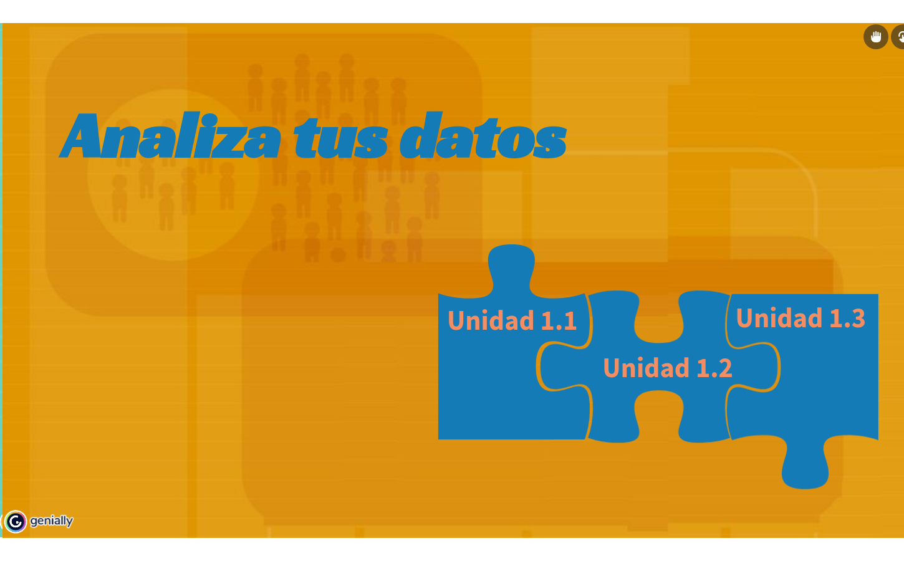
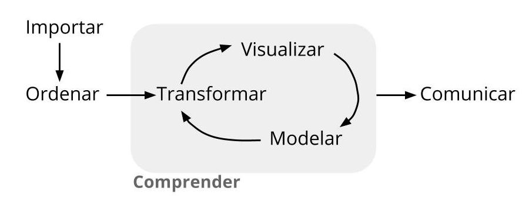

```{r setup, include=FALSE}
knitr::opts_chunk$set(echo = TRUE,comment = NA)

# colores
c0="#0DA5A6" # VERDE CLARO
c1="#E77C00" # NARANJA
c2="#6666FF" # AZUL  
c3="#4CBFBA" # VERDE CLARO  
c4="#E09600" # AMARILLO  
c5="#BC2B6A" # MORADO  

library(RColorBrewer)
library(readxl)
library(summarytools)
library(knitr)
library(readxl)
library(tidyverse)
bd0052 <- read_csv("data/datapye20212.csv")

```

# **Guía de aprendizaje 1.1**

```{r,eval=FALSE, echo=FALSE, out.width="100%", fig.cap=""}
knitr::include_url("pdf/Guia_de_aprendizaje_101.pdf", height="1000px")
```



<br/><br/>

## **Introducción**

En esta unidad se  presenta  la **Metodología Estadística** como  estrategia que  permite  visualizar las diferentes etapas presentes en una investigación  o análisis de  datos :

* Definición del problema
* Definición de los objetivos
* Definición de las variables de interés
* Diseño del experimento
* Recolección de la información
* Procesamiento de información
* Análisis descriptivo
* Inferencia estadística
* Recomendaciones y conclusiones

Haciendo especial referencia a la construcción, depuración  y documentación  de las bases de datos, acciones necesarias para un  buen  análisis de datos.

Con este ropósito se hará uso del portal **Bases de Datos Abiertos Colombia**,  de la hoja electrónica **Excel** y del lenguaje  **R**.

<br/><br/>

## **Objetivos de la unidad**

Al finalizar la unidad los estudiantes estarán  en  capacidad de  RECONOCER los  pasos de la Metodología Estadística y podrán ESTRUCTURAR, LIMPIAR y DOCUMENTAR una  base de datos con  el fin de  garantizar los elementos  necesarios  para  realizar  un  procesamiento  de  datos. Para ello seleccionaran una base de datos  del  portal de  Datos Abiertos Colombia. Adicionalmente propondrán un problema que les permita el desarrollo de la metodológica estadística. 

<br/><br/>

## **Duración**

La presente  unidad será desarrollada durante la  primera semana del semestre ( 26 de julio  al 01  de agosto de 2021). Ademas del material suministrado  contaran con el acompañamiento del profesor en tres sesiones (Lunes, Miércoles y Viernes) y de manera asincrónica con  foro de actividades académicas. Los entregables para esta unidad deberán ser entregados a través de la plataforma Brightspace hasta el  01 de agosto. 

Para alcanzar los objetivos planteados se propone realizar las siguientes actividades

<br/><br/>

## **Cronograma de trabajo**


|Actividad101   | Descripción                    | 
|:--------------|:-----------------------------  |
|Individual     |  **Metodología estadística:** : Formular un  problema que le permita  desarrollar un  ejercicio académico durante  el  semestre a través de  la recolección  de información (primaria o secundaria), Ademas deberá establecer los  objetivos y las  variables de  interés , para las  cuales  deberá  identificar el tipo de  variable  y su  escala  de medición.  El resultado  de esta actividad deberá se entregado  en archivo pdf con  nombre: **actividad101.pdf** |
| Recursos      | [**Metodología**](https://view.genial.ly/5f1ba8da1829700da368b4ab/horizontal-infographic-review-metodologia) |
| Fecha         | 01 de agosto de 2021 |
| Hora          | 23:59                |

<br/> 

|Actividad102   | Descripción                    | 
|:--------------|:-----------------------------  |
|Individual     |  **Base de datos** : Deberá  buscar una  base de  datos  de su interés  en el  portal  [Datos Abiertos Colombia](https://www.datos.gov.co/),  depuarla  y  documentarla  si es  necesario. A partir de la información  recolectada deberá construir la ficha técnica de  la base. El resultado  de esta actividad deberá se entregado  en archivo pdf con  nombre: **actividad102.pdf** |
| Recurso       | Video: [Como descargar datos abiertos](https://www.youtube.com/watch?v=lRftK2mL3Sw) 
|               | Formato ficha : [Ficha técnica](https://drive.google.com/file/d/1O1eaS8y6olf5o_42ehgDgVZ4q1dganbd/view?usp=sharing) |
|               | Excel |
|               | RStudio |
|Fecha          | 01 de agosto  2021 |
|Hora           |  23:59 hora local  |

<br/> 

|Actividad103   | Descripción                    | 
|:--------------|:-----------------------------  |
|Individual     |**Instalación de R y RStudio** : Para el  desarrollo  de las  actividades del curso deberá instalar las últimas  versiones  de [R CRAN](https://www.r-project.org/) y de  [RStudio](https://rstudio.com/). Para su correcta instalación  existen varios videos en  YouTube que le permitirán realizarlo de una manera correcta   | 
|Recursos       | [DESCARGAR e instalar R y RStudio 2021 -Video Rafa Gonzalez Gouveia](https://www.youtube.com/watch?v=Nmu4WPdJBRo) |
|               | [R download](https://cran.r-project.org/) |
|               | [RStudio download](https://rstudio.com/products/rstudio/download/) |
| Fecha         | 01 de agosto 2021 |
| Hora          | 23:59 hora local |

<br/><br/>

## **Criterios de evaluación**

* Reconocer la relación existente ente la  definición del problema, el planteamiento de los objetivos y la  definición de las variables de interés dentro de la  Metodología Estadística.

* Reconocer e identificar los diferentes tipos de variables  y sus respectivas escalas de medición.

* Identificar la estructura de una base de datos

<br/> 
Los entregables completos y enviados dentro de los tiempos establecidos  otorgarán 20 puntos por la actividad101 y 10 puntos por la actividad102, para un  total de 30 puntos. 


<br/><br/>

## **Entregables** 

| Entregable |  Descripción                    |
|:--------------|:-----------------------------|
|**actividad1.pdf** | Documento que contenga: Formulación de problema propuesto, definición  de los objetivos y definición de variables de interés. En este último caso detallar para cada variable su  tipo ( cualitativa o cuantitativa ) y su escala de medición ( nominal, ordinal, de intervalo o de razón).|
|**actividad2.pdf**| Ficha técnica de  la base seleccionada |
|||
|**Fecha** |Domingo 01 de agosto de 2021| 
|**Hora límite**| 23:59  hora  local|
|||

<br/><br/>

## **Presentaciones**

<br/>

#### [**Presentación 1 - 26-07-2021**](https://dgonzalez80.github.io/presentacionespye.io/punidad101.html#1)


#### [**Presentación 2 - 28-07-2021**](https://dgonzalez80.github.io/presentacionespye.io/punidad102.html#1)

#### [**Presentación 3 - 30-07-2021**](https://dgonzalez80.github.io/presentacionespye.io/punidad103.html#1)

<br/><br/><br/>

# **Recursos**

<br/><br/>

### **Que es Estadística ?**

Análisis de datos para la toma de decisiones

<br/><br/>

Con el fin de tener una idea inicial del propósito de este módulo, se presenta información relacionada con los estudiantes que toman el curso utilizando para ello gráficos e indicadores estadísticos, los cuales podremos interpretar al finalizar el módulo.

<br/><br/>

**Grupos Probabilidad y Estadística 2021-2**

```{r, echo=FALSE, message=FALSE, warning=FALSE}

attach(bd0052)
t1011=table(programa,grupo)
knitr::kable(t1011)

```

```{r, echo=FALSE, message=FALSE, warning=FALSE, fig.width=8, fig.height=8  }
rownames(t1011)=c("Biología", "Ing. Civil", "Ing. Mecánica", "Ing. Sistemas")
t1011
barplot(t1011,col = brewer.pal(6,"Set1"), las=1,legend = rownames(t1011))
```


**Promedio académico**

```{r, echo=FALSE, message=FALSE, warning=FALSE, fig.width=7, fig.height=7}
library(ggplot2)

p=ggplot(bd0052, aes(x=promedio))+
geom_density()
p      
```


```{r, echo=FALSE,fig.width=7, fig.height=7 }
p1012<-ggplot(bd0052, aes(x=grupo, y=promedio)) +
         geom_boxplot(fill = "palegreen", color = "blue4", 
                      size=0.5, outlier.color = "blue4", outlier.size = 2)+
         geom_jitter(color="black", size=0.4, alpha=0.9)
p1012  
```


```{r echo=FALSE, message=FALSE, warning=FALSE}
des=summarytools::descr(bd0052$promedio); 
des=round(des,3)
knitr::kable(des)
```


```{r echo=FALSE, message=FALSE, warning=FALSE}
p1013= ggplot(bd0052, aes(x=promedio))+
  geom_histogram(col="black", 
                 fill="blue", alpha=0.6,binwidth = 0.25)
p1013
```

<br/><br/>


## **Metodología estadística**
<br/><br/>

1. Definición del problema

2. Definición de los objetivos

3. Definición de las variables de interés

4. Diseño del experimento

5. Recolección de la información

6. Procesamiento de los datos

7. Análisis descriptivo

8. Inferencia estadística

9. Conclusiones y recomendaciones


<html>
<div class="container-wrapper-genially" style="position: relative; min-height: 400px; max-width: 100%;"><video class="loader-genially" autoplay="autoplay" loop="loop" playsinline="playsInline" muted="muted" style="position: absolute;top: 45%;left: 50%;transform: translate(-50%, -50%);width: 80px;height: 80px;margin-bottom: 10%"><source src="https://static.genial.ly/resources/panel-loader-low.mp4" type="video/mp4" />Your browser does not support the video tag.</video><div id="5f1ba8da1829700da368b4ab" class="genially-embed" style="margin: 0px auto; position: relative; height: auto; width: 100%;"></div></div><script>(function (d) { var js, id = "genially-embed-js", ref = d.getElementsByTagName("script")[0]; if (d.getElementById(id)) { return; } js = d.createElement("script"); js.id = id; js.async = true; js.src = "https://view.genial.ly/static/embed/embed.js"; ref.parentNode.insertBefore(js, ref); }(document));</script>
</html>


<br/><br/>

## **Base de datos**

<br/>

*Una base de datos es un conjunto de datos pertenecientes a un mismo contexto y almacenados sistemáticamente para su posterior uso.* Wikipedia


<br/><br/>

Una base de datos en estadística es un conjunto de información relacionada con una población organizada en filas y columnas. Las columnas corresponden a las variables y las filas están relacionadas con los individuos u objetos de estudio.

<br/>

Existen repositorio de bases de datos para uso general como: 

<br/>

+ dataset en RStudio

+ [Portal Bases de datos abiertos Colombia](https://www.datos.gov.co/)

+ [Datos Banco mundial](https://datos.bancomundial.org/)

+ [Portal de Datos Abiertos de Esri España](https://opendata.esri.es/)

<br/><br/>

**Base datos iris (dataset R)**

```{r ,warning=FALSE, message=FALSE}
head(iris)
```
Datos de iris (de Fisher o Anderson) 
+ longitud y ancho del sépalo 
+ largo y ancho de pétalos
+ especies: setosa,  versicolor y virginica.

<br/><br/>

Base de datos estadísticos : arreglo de filas y columnas (matriz) donde por lo general las columnas representan las variables y las filas los registros de los objetos de estudio


Una base de datos es un conjunto de datos pertenecientes a un mismo contexto y almacenados sistemáticamente para su posterior uso.

<br/>

Wikipedia

Una base de datos en estadística es un conjunto de información relacionada con una población organizada en filas y columnas. Las columnas corresponden a las variables y las filas están relacionadas con los individuos u objetos de estudio.

<br/><br/>

Existen repositorio de bases de datos para uso general

+ dataset en RStudio

+ [Portal Bases de datos abiertos Colombia](https://www.datos.gov.co/)

+ [Datos Banco mundial](https://datos.bancomundial.org/)

+ [Portal de Datos Abiertos de Esri España](https://opendata.esri.es/)

+ [kaggle](https://www.kaggle.com)

+ [FiveThirtyEight](https://data.fivethirtyeight.com/)

+ [Datos abiertos Cali](https://datos.cali.gov.co/)

+ [The home of the U.S. Government’s open data](https://www.data.gov/)

+ [World Bank Open Data] (https://data.worldbank.org/)

+ [Open data initiative of the Government of Spain](https://datos.gob.es/en)


[*] Open Data Barometer : https://opendatabarometer.org/4thedition/report/?lang=es]

<br/><br/>


```{r }
DT::datatable(head(iris, 150),fillContainer = FALSE, options = list(pageLength = 8))
```

**Base de datos estudiantes Probabilidad y Estadistica 2021-2**

<br/>

```{r }
var1=c(4,5,6)
DT::datatable(head(bd0052[var1],53),fillContainer = FALSE, options = list(pageLength = 8))
```

<br/><br/>

## **Etapas del proceso de datos**


<br/><br/>

[*] Imagen tomada de : https://bitsandbricks.github.io/ciencia_de_datos_gente_sociable/


<br/><br/>

## **Importar datos**

<br/><br/>

###  **Origen de los datos**

<br/>
+ Encuesta personal (datos primarios)

+ Online

+ Entrevista cara a cara

+ Entrevista telefónica

+ Investigación propia      

+ Sistema automático de recolección de datos

+ Fuente externa (datos secundarios)

+ DANE

+ Cámara de Comercio

+ Agremiaciones

+ Bancos de datos abiertos

+ Otros medios...

<br/><br/>

###  **Herramientas computacionales**

<br/>

+ Excel
+ SQL
+ Oracle
+ SAS

+ R 
+ RStudio
+ Python


Video: Importar datos en R  <br/>
por Rafa Gonzalez Gouveia<br/>
https://youtu.be/Bi0PoYq_gjE

<br/><br/>

## **Limpieza de datos**

<br/>

Es importante después de haber importado la base de datos, hacer una revisión de cada una de las variables con el fin de poder detectar:

+ Datos faltantes (NA)

+ Datos anómalos o raros

+ Etiquetas mal colocadas ( minúsculas, MAYÚSCULAS, Titulo...)


Existen metodologías para corregir estos problemas sin afectar la información contenida en la data


<br/><br/>

## **Ficha técnica**

<br/>

Las bases de datos debe estar acompañadas de una ficha técnica donde si indican sus principales características :

+ [Ficha tecnica](https://drive.google.com/file/d/1O1eaS8y6olf5o_42ehgDgVZ4q1dganbd/view) 

+ [Casos positivos de COVID-19 en Colombia](https://www.datos.gov.co/Salud-y-Protecci-n-Social/Casos-positivos-de-COVID-19-en-Colombia/gt2j-8ykr)

<br/><br/><br/>

## **Entornos R - RStudio**

<br/>


<br/>

*RStudio es un entorno de desarrollo integrado para R, un lenguaje de programación para gráficos y computación estadística. Está disponible en dos formatos: RStudio Desktop es una aplicación de escritorio normal, mientras que RStudio Server se ejecuta en un servidor remoto y permite acceder a RStudio mediante un navegador web.* Wikipedia

<br/>

**R** 

<br/>


<br/>

**RStudio**

<br/>


<br/>

|   |    ventana    |  función                      |
|:--|:--------------|:------------------------------|
|1. | Rscrip        |                               |
|2  | Consola       |                               |
|   | Terminal      |                               |
|   | R Mardown     |                               |
|   | Jobs          |                               | 
|3  | Environment   |                               |
|   | History       ||
|   | Connections   ||
|   | Build         ||
|   | Git           ||
|   | Tutorial      ||
|4  | Files         ||
|5  | Plot          ||
|6  | Packages      ||
|7  | Help          ||
|   | Viewer        ||
|   |               ||


<br/><br/>

## **Importar bases de datos**

<br/>

+ Desde el menú de RStudio

+ Desde la consola de R o RStudio

+ De manera automática 

<br/>

[**Ayudas:**](https://bookdown.org/gboccardo/manual-ED-UCH/gestion-de-bases-de-datos.html)

<br/><br/>

### **Importar datos desde la dataset de R**

```{r, echo=TRUE, warning=FALSE, message=FALSE}
data("mtcars")
head(mtcars, n=3)
```

<br/><br/>

### **Importar los datos en formato xlsx**

<br/>

+ RStudio usando ventanas : **File/ Import Dataset / From Excel...**

+ RStudio usando comandos : 

<br/><br/>

### **Importar datos en formato csv**

<br/>

El formato **csv** es uno de los mas utilizados para el almacenamiento de datos estructurados (agrupados en filas y columnas)  . El termino csv significa *"valores separados por comas"* 

+ RStudio usando ventanas : **File/ Import Dataset / From Text (base)...**

+ RStudio usando comandos : 

<br/>

```{r, warning=FALSE, message=FALSE}
bd0052 <- read_csv("data/datapye20212.csv")
var1=c(1,4,5)
bd0052=bd0052[,var1]
head(bd0052, n=3)
```


Otro ejemplo para importar una base de datos en formato csv :

+ Selecciono una base de datos de mi interés (portal **FiveThirtyEight**: https://data.fivethirtyeight.com/ - base de datos Predicción de clubes de  fútbol)

+ Descargo la base de datos y la guardo en la carpeta de trabajo

+ Importo la base a RStudio 

```{r, echo=TRUE, warning=FALSE, message=FALSE, results='hide'}
library(DT)
clasificacion=read.csv("data/spi_global_rankings_intl.csv")
DT::datatable(head(clasificacion, 218),fillContainer = FALSE, options = list(pageLength = 3))
```


<br/><br/>

### **Importar datos de manera automática**

<br/>

La API de datos abiertos de Socrata le permite acceder mediante programación a una gran cantidad de recursos de datos abiertos de gobiernos, organizaciones sin fines de lucro y ONG de todo el mundo. Haga clic en el enlace de abajo y pruebe un ejemplo en vivo ahora mismo.

https://dev.socrata.com/

Cargar la base de datos de COVID-19 Colombia

<br/>

```{r, eval=FALSE}
# install.packages("RSocrata")
 library(RSocrata)

 token ="ew2rEMuESuzWPqMkyPfOSGJgE"
 Colombia= read.socrata("https://www.datos.gov.co/resource/gt2j-8ykr.json", app_token = token)
 saveRDS(Colombia,"data/Colombia.RDS")
```

**Nota**: se requiere solicitar token en la pagina de los datos


<br/><br/><br/>

## **Actividades a realizar**
<br/><br/>
**A1 Metodología estadística** : Formular un  problema que le permita  desarrollar un  ejercicio académico durante  el  semestre a través de  la recolección  de información (primaria o secundaria), Ademas deberá establecer los  objetivos y las  variables de  interés , para las  cuales  deberá  identificar el tipo de  variable  y su  escala  de medición.  El resultado  de esta actividad deberá se entregado  en archivo pdf con  nombre: **actividad1.pdf**
<br/><br/><br/>

**A2 Base de datos** : Deberá  buscar una  base de  datos  de su interés  en el  portal  
[**Datos Abiertos Colombia**](https://www.datos.gov.co),  depuarla  y  documentarla  si es  necesario. A partir de la información  recolectada deberá construir la ficha técnica de  la base. El resultado  de esta actividad deberá se entregado  en archivo pdf con  nombre: **actividad2.pdf**
<br/><br/><br/>

**A3 Instalación de R y RStudio** : Para el  desarrollo  de las  actividades del curso deberá instalar las ultimas  versiones  de [**R CRAN**](\href{https://www.r-project.org/) y de [**RStudio**](https://rstudio.com/products/rstudio/download/)
	


