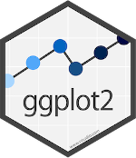

```{r setup, include=FALSE}
knitr::opts_chunk$set(echo = TRUE,comment = NA)

# colores
c0="#0DA5A6" # VERDE CLARO
c1="#E77C00" # NARANJA
c2="#6666FF" # AZUL  
c3="#4CBFBA" # VERDE CLARO  
c4="#E09600" # AMARILLO  
c5="#BC2B6A" # MORADO  

```

# **Guía de aprendizaje 1.3**

```{r,eval=FALSE, echo=FALSE, out.width="100%", fig.cap=""}
knitr::include_url("pdf/Guia_de_aprendizaje_101.pdf", height="1000px")
```


<br/><br/>

<br/><br/>

## **Introducción**

La representación grafica de información constituye una de las herramientas mas importantes de la estadística. Con ella podemos observar lo  ocurrido  en  el pasado, el  presente y lo que  podría ocurrir en el futuro y de esta forma orientar nuestras decisiones. 

Es necesario realizar una  correcta visualización de los datos y para ello requerimos seleccionar la gráfica o representación apropiada, conociendo el tipo de variable, su escala de medición y sobre todo lo que queremos resaltar en ella. 

Las gráficas pueden formar parte de un informe en un estudio, para lo cual es necesario conocer los lineamientos exigidos por las normas que los rigen AP, EEE, entre otros. En todos los casos los gráficos deben tener una  enumeración que los permita citar, titulo que permita visualizar lo que están  representando, fuente,  que indique de donde  son extraídos los datos que  la originan. En esta unidad se trataran las diferentes  formas de visualización de datos.

<br/><br/>

## **Objetivos de la unidad**

Al finalizar la unidad los estudiantes estarán  en  capacidad de  RECONOCER los  tipos de gráficos estadísticos y podrán REPRESENTAR e INTERPRETAR  información a  través  de las diferentes formas, que les permita complementar un  análisis de datos estadístico.

<br/><br/>

## **Duración**

La presente  unidad será desarrollada durante la  tercera semana del semestre ( 9 al 16 de agosto ). Ademas del material suministrado  contaran con el acompañamiento del profesor en tres sesiones (Lunes, Miércoles y Viernes) y de manera asincrónica. Los entregables para esta unidad podrán enviarse a través de la plataforma Brightspace hasta el  17 de agosto.

Para alcanzar los objetivos planteados se propone realizar las siguientes actividades

<br/><br/>

## **Cronograma de trabajo**


|Actividad105   | Descripción                    | 
|:--------------|:-----------------------------  |
|Trabajo individual | A partir de la base de datos trabajada en las dos unidades anteriores construya un **tablero** (Dashboard)  que contenga gráficos e indicadores de las variables estadísticas contenidas  en la base de datos seleccionada en la Actividad 1 de la unidad 1.1. Realice una descripción con los resultados obtenidos en el tablero. |
| Recurso       |  Código U1-3.R  y Tablero-M1 |
||[Resumen R base](https://www.i3s.unice.fr/~malapert/R/pdf/base-r.pdf)|
||[Dashboard en R](https://pkgs.rstudio.com/flexdashboard/)
||[Resumen ggplot2](https://www.maths.usyd.edu.au/u/UG/SM/STAT3022/r/current/Misc/data-visualization-2.1.pdf)|
||[Resumen RMarkdown](https://www.rstudio.com/wp-content/uploads/2015/02/rmarkdown-cheatsheet.pdf)|
|Fecha  | 17 de agosto de 2021 |
|Hora   | 23:59 hora local |

|Actividad106   | Descripción                    | 
|:--------------|:-----------------------------  |
|Trabajo individual |  Construya un **mapa mental** del Módulo 1  y adjunto el link del trabajo (en caso de ser construido en una herramienta en linea) o un pdf  que resuma los conceptos más importantes del Modulo 1.|
|	Recurso    |[Capitulo 1](https://github.com/dgonzalez80/presentacionespye.io/blob/main/pdf/Capitulo1.pdf)
|| Presentaciones y videos clases |
|Fecha  | 17 de agosto  de 2021 |
|Hora   | 23:59 hora local |

|Actividad107   | Descripción                  | 
|:--------------|:-----------------------------|
|[Taller M1](https://github.com/dgonzalez80/presentacionespye.io/blob/main/pdf/Taller_M%C3%B3dilo_1.pdf) |  Actividad que tiene como  finalidad preparar la primera evaluación parcial|
 
<br/><br/>

## **Criterios de evaluación**

+ Reconocer los principales elementos de un  análisis descriptivo de datos y su incidencia en la toma de decisiones.

+ Reconocer e identificar los diferentes tipos de representaciones gráficas y sus respectivas interpretación.

+ Utilizar herramientas computacionales para el procesamiento de la información.

<br/><br/>

## **Entregables** 

|               | Descripción                   | 
|:--------------|:------------------------------|
|**Entregable 1** | Actividad105.Rmd Tablero Acompañado de descripción de los resultados |
|**Entregable 2** | Actividad106.pdf Mapa mental |
|||
|Fecha       | Domingo 17 de agosto de 2021 |
|Hora límite | 23:59  hora  local |
|||

<br/><br/><br/><br/>

## **Presentaciones**

[Presentación 107 - 06-ago-2021 ](https://dgonzalez80.github.io/presentacionespye.io/punidad107.html#1)

<br/><br/><br/>

# **Recursos**

## **Introducción**

*Una gráfica o una representación gráfica o un gráfico, es un tipo de representación de datos, generalmente cuantitativos, mediante recursos visuales (líneas, vectores, superficies o símbolos), para que se manifieste visualmente la relación matemática o correlación estadística que guardan entre sí.*

Wikipedia

## **Paquetes de R para graficos**

R posee una serie de paquetes construido para la visualización de datos que hacen que tengan una excelente presentación. Empezando por funciones del núcleo base, hasta paquetes que elaboran gráficos interactivos


 


Elegir el gráfico adecuado es muy importante pues existen diferentes alternativos  y se debe escoger el apropiado para representar los datos. El tipo de dato determina el tipo de grafico asi:

|Tipo de variable  | Escala          | Gráfico                                   |
|:-----------------|:----------------|:------------------------------------------|
|Cualitativas      |                 |                                           |
|                  |Nominal          | torta                                     |
|                  |Ordinal          | barras                                    |
|                  |                 |                                           |
|Cuantitativas     |Intervalo-razón  | diagrama de tallos y hojas                |
|                  |                 | histograma                                |
|                  |                 | diagrama de tallos y hojas                |
|                  |                 | diagrama de cajas                         |
|                  |                 | diagrama de densidad                      |
|                  |                 | diagrama de puntos                        |
|                  |                 | diagrama de lineas                        |


### **Gráficos variables cualitativas con R base**

Gráfico de tortas

```{r, fig.height=6}
cc=c(20, 10, 20, 20, 20, 20, 20, 20, 20, 30, 20, 20, 20, 10, 30, 20, 20, 30, 20, 30, 30, 20, 10, 30, 20, 20, 30, 30, 10, 20, 10, 20, 20, 20, 10, 20, 10, 20, 20, 30, 30, 30, 10, 30, 20, 20, 20, 20, 20, 20, 10, 20, 30, 30, 10, 10, 10, 20, 10, 20, 10, 30, 20, 10, 20, 30, 10, 30, 30, 30, 20, 30, 30, 30, 30, 30, 30, 20, 10, 30, 10, 20, 20, 10, 20, 20, 20, 20, 10, 20); labs=c("Ing. Industrial","Administración ","Contaduría "); pct=round(table(cc)/sum(table(cc))*100); labs=paste(labs, pct);labs=paste(labs, "%", sep = " ") 
pie(table(cc), labels=labs, main=" Distribución por carrera")
```

### **Diagrama de barras**

```{r, fig.height=6}
ev=table(rbinom(90,5,0.80)); 
barplot(ev, col=c("red","yellow","orange","green","blue"), main = "Evaluación proceso de inducción")
```

### **Diagrama de barras dos variables**

```{r, fig.height=5.5}
counts <- table(mtcars$vs, mtcars$gear); rownames(counts)=c("Montor en linea", "Motor en V")
barplot(counts, main="Numero de cambios adelante por Tipo de motor",  xlab="Numero de cambios adelante ",col=c("dodgerblue3","orange"),
  legend = rownames(counts))
```


### **Graficas variables cuantitativas con R base**

### **Diagrama de árbol**

```{r}
nf=c(4.1, 2.7, 3.1, 3.2, 3.0, 3.2, 2.0, 2.4, 1.6, 3.2, 3.1, 2.6, 2.0, 2.4, 2.8, 3.3, 4.0, 3.4, 3.0, 3.1, 2.7, 2.7, 3.0, 3.8, 3.2, 2.2, 3.5, 3.5, 3.8, 3.5, 3.9, 4.2, 4.3, 3.9, 3.2, 3.5, 3.5, 3.7, 4.1, 3.7, 3.5, 3.6, 3.2, 3.1, 3.4, 3.0, 3.0, 3.0, 2.7, 1.7, 3.6, 2.1, 2.4, 3.0, 3.1, 2.5, 2.5, 3.6, 2.2, 2.4, 3.1, 3.3, 2.7, 3.7, 3.0, 2.7, 3.0, 3.2, 3.1, 2.4, 3.0, 2.7, 2.5, 3.0, 3.0, 3.0, 3.2, 3.1, 3.8, 4.1, 3.7, 3.5, 3.0, 3.7, 3.7, 4.1, 3.7, 3.9, 3.7, 2.0)
stem(nf)
```


### **Histograma**

```{r, fig.height=5}
h1=hist(nf, main = "Nota final matemáticas fundamentales", xlab = "nota", ylab="frecuencias absolutas", labels=TRUE, col="dodgerblue3", ylim = c(0,30))
abline(v=3,col="red")
grid()
```

<br/><br/>

### **Diagrama de densidad**

```{r, fig.height=5}
nf=c(4.1, 2.7, 3.1, 3.2, 3.0, 3.2, 2.0, 2.4, 1.6, 3.2, 3.1, 2.6, 2.0, 2.4, 2.8, 3.3, 4.0, 3.4, 3.0, 3.1, 2.7, 2.7, 3.0, 3.8, 3.2, 2.2, 3.5, 3.5, 3.8, 3.5, 3.9, 4.2, 4.3, 3.9, 3.2, 3.5, 3.5, 3.7, 4.1, 3.7, 3.5, 3.6, 3.2, 3.1, 3.4, 3.0, 3.0, 3.0, 2.7, 1.7, 3.6, 2.1, 2.4, 3.0, 3.1, 2.5, 2.5, 3.6, 2.2, 2.4, 3.1, 3.3, 2.7, 3.7, 3.0, 2.7, 3.0, 3.2, 3.1, 2.4, 3.0, 2.7, 2.5, 3.0, 3.0, 3.0, 3.2, 3.1, 3.8, 4.1, 3.7, 3.5, 3.0, 3.7, 3.7, 4.1, 3.7, 3.9, 3.7, 2.0)
plot(density(nf), main="Distribucion de las notas de matematias fundamentales", col="dodgerblue3")
```

<br/><br/>
  
### **Diagrama de cajas**

```{r, fig.height=5}
nf=c(4.1, 2.7, 3.1, 3.2, 3.0, 3.2, 2.0, 2.4, 1.6, 3.2, 3.1, 2.6, 2.0, 2.4, 2.8, 3.3, 4.0, 3.4, 3.0, 3.1, 2.7, 2.7, 3.0, 3.8, 3.2, 2.2, 3.5, 3.5, 3.8, 3.5, 3.9, 4.2, 4.3, 3.9, 3.2, 3.5, 3.5, 3.7, 4.1, 3.7, 3.5, 3.6, 3.2, 3.1, 3.4, 3.0, 3.0, 3.0, 2.7, 1.7, 3.6, 2.1, 2.4, 3.0, 3.1, 2.5, 2.5, 3.6, 2.2, 2.4, 3.1, 3.3, 2.7, 3.7, 3.0, 2.7, 3.0, 3.2, 3.1, 2.4, 3.0, 2.7, 2.5, 3.0, 3.0, 3.0, 3.2, 3.1, 3.8, 4.1, 3.7, 3.5, 3.0, 3.7, 3.7, 4.1, 3.7, 3.9, 3.7, 2.0)
boxplot(nf, main="Nota final matemáticas fundamentales",col="dodgerblue3")
abline(h=3, col="red")
```
  
<br/><br/>

### **Diagrama de cajas**

```{r, fig.height=4.5}
nf=c(4.1, 2.7, 3.1, 3.2, 3.0, 3.2, 2.0, 2.4, 1.6, 3.2, 3.1, 2.6, 2.0, 2.4, 2.8, 3.3, 4.0, 3.4, 3.0, 3.1, 2.7, 2.7, 3.0, 3.8, 3.2, 2.2, 3.5, 3.5, 3.8, 3.5, 3.9, 4.2, 4.3, 3.9, 3.2, 3.5, 3.5, 3.7, 4.1, 3.7, 3.5, 3.6, 3.2, 3.1, 3.4, 3.0, 3.0, 3.0, 2.7, 1.7, 3.6, 2.1, 2.4, 3.0, 3.1, 2.5, 2.5, 3.6, 2.2, 2.4, 3.1, 3.3, 2.7, 3.7, 3.0, 2.7, 3.0, 3.2, 3.1, 2.4, 3.0, 2.7, 2.5, 3.0, 3.0, 3.0, 3.2, 3.1, 3.8, 4.1, 3.7, 3.5, 3.0, 3.7, 3.7, 4.1, 3.7, 3.9, 3.7, 2.0)
cc=c(20, 10, 20, 20, 20, 20, 20, 20, 20, 30, 20, 20, 20, 10, 30, 20, 20, 30, 20, 30, 30, 20, 10, 30, 20, 20, 30, 30, 10, 20, 10, 20, 20, 20, 10, 20, 10, 20, 20, 30, 30, 30, 10, 30, 20, 20, 20, 20, 20, 20, 10, 20, 30, 30, 10, 10, 10, 20, 10, 20, 10, 30, 20, 10, 20, 30, 10, 30, 30, 30, 20, 30, 30, 30, 30, 30, 30, 20, 10, 30, 10, 20, 20, 10, 20, 20, 20, 20, 10, 20)
labs=c("Ing. Industrial","Administración ","Contaduría ")
boxplot((nf~cc),main="Nota final matemáticas fundamentales por carrera", col="dodgerblue3"); abline(h=3, col="red"); abline(h=4, col="blue")
```

<br/><br/>

### **Diagrama de dispersión**

```{r, fig.height=5}
ed=round(rnorm(90,18,1),1)
plot(ed,nf, main="Edad vs Nota final matemáticas fundamentales", ylim = c(0,5), xlab = "Edad", ylab = "Nota final",col="dodgerblue3",pch=19)
grid()
```


<br/><br/>

### **Gráfica de series de tiempo**

```{r, fig.height=5}
plot(AirPassengers, main="Numero de pasajeros por mes", col="dodgerblue3", lwd = 2)
```

<br/><br/>

### **Resumen**

```{r, eval=FALSE}
x=rnorm(100,100,20)
y=rnorm(100,100,25)
z=rbinom(100,4,0.30)
t=1:100
par(mfrow=c(2, 2))
pie(table(z))
barplot(table(z))
stem(x)
hist(x)
boxplot(x)
plot(x,y)
plot(t,y, type="l")
plot(density(x))
par(mfrow=c(1, 1))
```

https://rextester.com/CBC3320 <br/>
https://rextester.com/KBQL21515 <br/>
https://rdrr.io/snippets/
    


## **Gráficos con ggplot2**


+ **Data**: capa de los datos

+ **Aesthetics**: capa estética (**aes**), definimos las variables a utilizar en el gráfico

+ **Geometries**: capa de geometrías, se define el tipo de gráfica a realizar

+ **Facets**: capa de facetas, permite detallar la gráfica por categorías

+ **Statistics**: capa de estadística, permite agregar modelos

+ **Coordinates**: capa de coordenadas, permite ajustar las escalas de los ejes

+ **Theme**: capas de características del gráfico que no dependen de  los datos


<br/><br/>


[Visualizacion de datos con ggplot2](https://rstudio.com/wp-content/uploads/2015/03/ggplot2-cheatsheet.pdf)


```{r,fig.height=5}
library(readr)
library(ggplot2)
clasificacion=read.csv("data/spi_global_rankings_intl.csv")
ggplot(clasificacion, aes(x=off , y=def))
```


```{r,fig.height=5}
ggplot(clasificacion, aes(x=off , y=def))+
  geom_point()

```


```{r,fig.height=5}
ggplot(clasificacion, aes(x=off , y=def))+
  geom_point()

```


|                   |                    |                     |                      |
|:------------------|:-------------------|:--------------------|:---------------------|
|geo_point()        |geom_bar()          |geom_col()           |stat_count()          |
|geom_boxplot()     |stat_boxplot()      |geom_density()       |stat_density()        |
|geom_histogram()   |geom_violin()       |                     |                      |


```{r,fig.height=5}
ggplot(clasificacion, aes(x=off , y=def))+
  geom_point()+
  facet_wrap(~ confed)

```


```{r, message=FALSE, warning=FALSE,fig.height=5}
ggplot(clasificacion, aes(x=off , y=def))+  geom_point()+
  facet_wrap(~ confed)+ stat_smooth(method = "loess" , formula =y ~ x)
```


```{r, message=FALSE, warning=FALSE,fig.height=5}
ggplot(clasificacion, aes(x=off , y=def))+  geom_point()+  facet_wrap(~ confed)+ stat_smooth(method = "loess" , formula =y ~ x)+
  	coord_cartesian(ylim = c(0, 10))
```

---
```{r, fig.height=5}
library(ggplot2)
data=data.frame(grupo=c("A","B","F"),frecuencia=c(36,26,19))

ggplot(data, aes(x=grupo, y=frecuencia)) +
  geom_bar(stat="identity", fill="steelblue")+
  geom_text(aes(label=grupo), vjust=1.6, color="white", size=3.5)+
  theme_minimal()
```


```{r, message=FALSE, warning=FALSE,fig.height=5}
library(ggplot2)
ggplot(mtcars, aes(x=mpg, y=wt, colour = cyl)) + 
  geom_point()

```


```{r, message=FALSE, warning=FALSE,fig.height=5}
ggplot(iris, aes(Sepal.Length)) +
       geom_histogram(bins = 7,fill="#69b3a2", color="#e9ecef", alpha=0.9)+
       theme_minimal() +
       labs(x = "Nota", y = "n") +
       ggtitle(" Promedio acumulado estudiantes de PyE 2021-1")


```


```{r, message=FALSE, warning=FALSE, fig.height=4}
library(ggplot2)
bd0052 = read.csv2("data/bd0052.csv")
ggplot(bd0052, aes(x=promacum, y=grupo)) +
  geom_boxplot(fill="#313ae8",              # color de relleno
               color="#bf6f2e",             # color de lineas
               alpha=0.5)+
  geom_point(color="#b431e8",alpha=0.9) 
# Colour picker
```

[Anàlisis de datos con R Cap,7 ggplot2](https://rafalab.github.io/dslibro/ggplot2.html)<br/>
[ggplot2 resumen](https://rstudio.com/wp-content/uploads/2015/03/ggplot2-cheatsheet.pdf)


## **Graficos con highcharter**

https://jkunst.com/highcharter/

https://rstudio-pubs-static.s3.amazonaws.com/320413_6ab300527e8548b1a3cbd0d4c6200fcc.html

## **Graficos con plotly**


https://plotly.com/r/

https://plotly-r.com/


## **Graficos con Shiny**


+ [Genoma humano](https://shiny.rstudio.com/gallery/genome-browser.html)

+ [Paquetes de R](https://gallery.shinyapps.io/087-crandash/)

+ [Galeria](https://shiny.rstudio.com/gallery/)


### RMarkdown

[RMarkdown resumen](https://rstudio.com/wp-content/uploads/2015/02/rmarkdown-cheatsheet.pdf)<br/>

[R flexdashboard - ejemplo](https://rpubs.com/joscani/flexdashboard_examples)<br/>
[R flexdashboard - implementaciòn](https://geoprocesamiento-2020i.github.io/tutorial-flexdashboard/)


background-image: url("img/pujcali.jpeg")

Una imagen dice mas que mil palabras... 

Daniel Enrique González Gómez 

Imagen tomada de :https://javerianacali.edu.co/noticias/la-javeriana-bogota-y-cali-1-de-colombia


