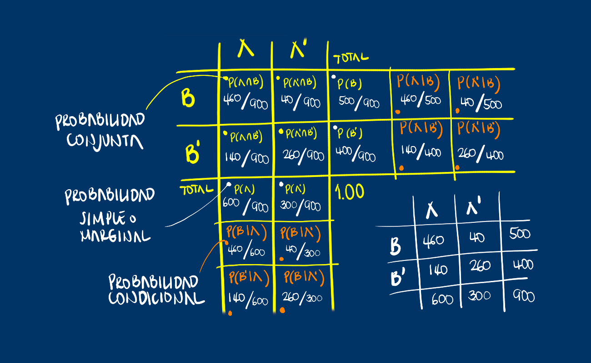
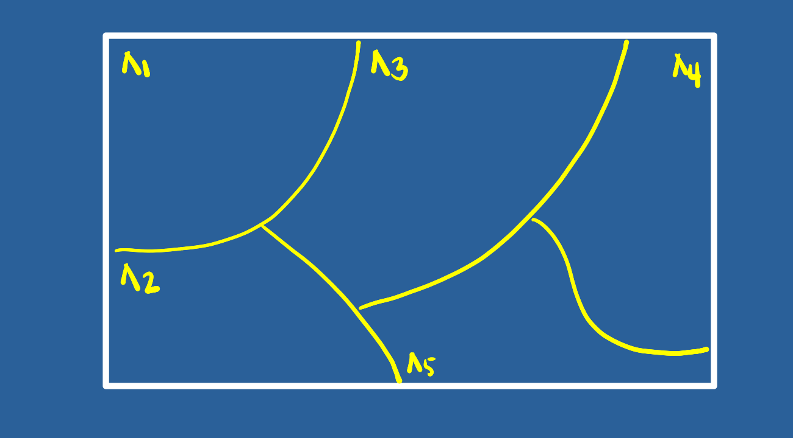
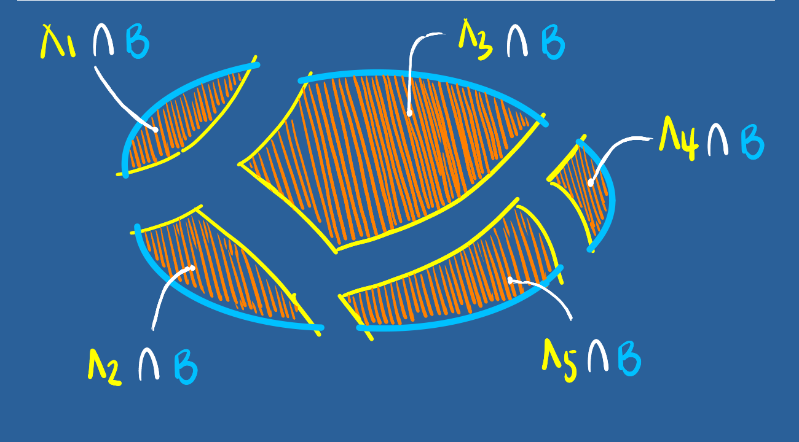

```{r setup, include=FALSE}
knitr::opts_chunk$set(echo = TRUE)

# colores
c0="#0DA5A6" # VERDE CLARO
c1="#E77C00" # NARANJA
c2="#6666FF" # AZUL  
c3="#4CBFBA" # VERDE CLARO  
c4="#E09600" # AMARILLO  
c5="#BC2B6A" # MORADO  

```


# **1.Guía de aprendizaje 2.2**

<div class="container-wrapper-genially" style="position: relative; min-height: 400px; max-width: 100%;"><video class="loader-genially" autoplay="autoplay" loop="loop" playsinline="playsInline" muted="muted" style="position: absolute;top: 45%;left: 50%;transform: translate(-50%, -50%);width: 80px;height: 80px;margin-bottom: 10%"><source src="https://static.genial.ly/resources/panel-loader-low.mp4" type="video/mp4" />Your browser does not support the video tag.</video><div id="5f4c855734dcc71ce637fbe4" class="genially-embed" style="margin: 0px auto; position: relative; height: auto; width: 100%;"></div></div><script>(function (d) { var js, id = "genially-embed-js", ref = d.getElementsByTagName("script")[0]; if (d.getElementById(id)) { return; } js = d.createElement("script"); js.id = id; js.async = true; js.src = "https://view.genial.ly/static/embed/embed.js"; ref.parentNode.insertBefore(js, ref); }(document));</script>

<br/><br/>

<br/><br/>

## **1.1. Introducción**

Como fue mencionado en la Unidad 2.1 el concepto de probabilidad es fundamental dentro de la Estadística, pues soporta los conceptos de variable aleatoria y de las funciones que las rigen. Entre sus principales aplicaciones está la valoración del riesgo en relación con la toma de decisiones, la fiabilidad de productos y garantías de productos, teoría de juegos, entre otras aplicaciones.

Como complemento de los conceptos vistos en la Unidad 2.1, en esta unidad se aborda el concepto de **Probabilidad total** y el **Teorema de Bayes**.

<br/><br/>

## **1.2. Objetivos de la unidad**

Al finalizar la unidad los estudiantes estarán  en  capacidad de  RECONOCER, CALCULAR e INTERPRETAR  los diferentes tipos de probabilidad y sus aplicaciones, con el propósito de valorar los riesgos asociados a una decisión. 

<br/><br/>

## **1.3. Duración**

La presente  unidad será desarrollada durante la semana comprendida entre el 25 y 29 de agosto de 2021. Ademas del material suministrado  contaran con el acompañamiento del profesor en dos sesiones (Lunes y Viernes) y de un monitor (Miercoles) y espacio de Atencion a estudiantes y manera asincrónica  de actividades académicas. Los entregables para esta unidad podrán enviarse a través de la plataforma Brightspace hasta el  29 de agosto de 2021

Para alcanzar los objetivos planteados se propone realizar la siguiente actividad

<br/><br/>

## **1.4. Cronograma de trabajo**


|Actividad      | Descripción                    | 
|:--------------|:-----------------------------  |
| Actividad 201 |A partir de los conceptos vistos en las Unidades 2.1 y 2.2 deberá resolver los problemas propuestos en el **Taller 202** y entregue su solución  en formato **pdf**  en el enlace correspondiente de Brightspace.|
|Fecha  |  29 de agosto de 2021 |
|Hora   |  23:59 hora local     |
|||


<br/><br/>

## **1.5. Criterios de evaluación**

El taller del Modulo 2 recoge los elementos estudiados y por tanto  tiene objetivo la revisión de los principales conceptos tratados.

+ Reconocer los principales conceptos de  probabilidad y su efecto sobre la toma de decisiones informadas.

+ Reconocer e identificar los diferentes tipos de probabilidad  y sus respectivas interpretación.

<br/><br/>

## **1.6. Entregables** 

| Entregable |  Descripción                    |
|:--------------|:-----------------------------|
| Actividad202    | Actividad202.pdf : Solucionario taller 202 | 
| Fecha           |Domongo  29 de agosto de 2021 | 
|Hora límite      | 23:59  hora  local |

<br/><br/><br/><br/>

## **1.7. Presentaciones**

<br/><br/>

# **2. Recursos**
<br/><br/>

En la guía 2.1 se habló de los conceptos básicos (Experimento aleatorio, Espacio muestral y Evento aleatorio), de los diferentes enfoque de probabilidad ( Clásico, frecuentista y Subjetivo) y de los tipos de probabilidad simple o marginal ($P(A)$) y probabilidad conjunta $P(A \cap B)$.

En esta guía se hará en énfasis en otro tipo de probabilidad llamada **probabilidad condicional**

<br/><br/>

## **Probabilidad condicional**

{width=60%}

<br/>

$P(B|A)$ se puede leer como :

+ Probabilidad de que ocurra $B$ dado que el evento $A$ ya ocurrió

+ Probabilidad de que ocurra $B$ sabiendo previamente que ocurrió el evento $A$

+ Si sabemos que ha ocurrido el evento $A$, la probabilidad de que ocurra $B$

<br/><br/>

El efecto de conocer la ocurrencia del evento $A$ hace que el espacio muestral de referencia pase de ser $S$ a solo $A$.  Ahora dentro de este nuevo espacio muestal de referencia se debe establecer la probabilidad de que ocurra $B$

De esta manera la probabilidad se expresa como la razón entre la probabilidad conjunta 
$P(A \cap B)$ con la probabilidad de $A$

<br/><br/>

Ejemplo:

Supongamos que se tiene la siguiente información escrita en una tabla de doble entrada o tabla cruzada que contiene dos eventos $A$ y $B$ :

```{r}
x=c(460,140,40,260)
m=matrix(x,nrow = 2) 
rownames(m) = c("B", "B*")
colnames(m) = c("A", "A*")
m
```

En la siguiente tabla se representan los tres tipos de probabilidad :
<br/>
{width=70%}
<br/>
Esta información tambien se puede representar como un diagrama de árbol 

{width=70%}
<br/><br/>

O también como un diagrama de Venn:

{width=70%}
<br/><br/>


Por despeje se pueden obtener la llanada regla de la multiplicación :
{width=60%}

<br/><br/>
En el caso que se requiera evaluar si dos eventos son independientes o no, partiendo de la definición de probabilidad condicional se podría obtener la siguiente regla al despejar $P(A \cap B$ de la ecuación para obtener : $P(A \cap B) = P(A) * P(B|A)$. En caso de que la ocurrencia del evento $A$ previamente al evento $B$, no cambie su probabilidad, se podría escribir que $P(B|A)= P(B)$ y en este caso la regla indica que la probablidad conjunta de los eventos A y B es igual a la probabilidad de sus probabilidades marginales :


<br/><br/>

{width=60%}

<br/><br/>

## **Probabilidad Total**

Ahora sopongamos que no de los eventos lo podemos representar como una partición del conjunto $S$ así :

{width=50%}
 
 {width=50%}
 
 
 {width=50%}
 
 
 
 
 
 
{width=60%}

<br/><br/>

## **Teorema de Bayes**

{width=60%}

<br/><br/>