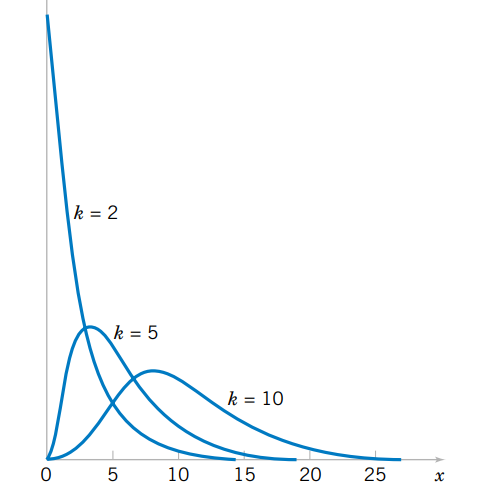
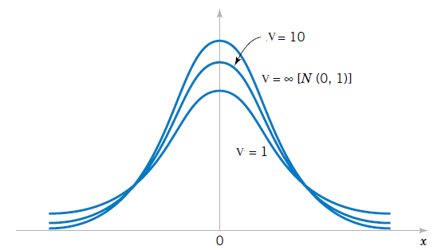
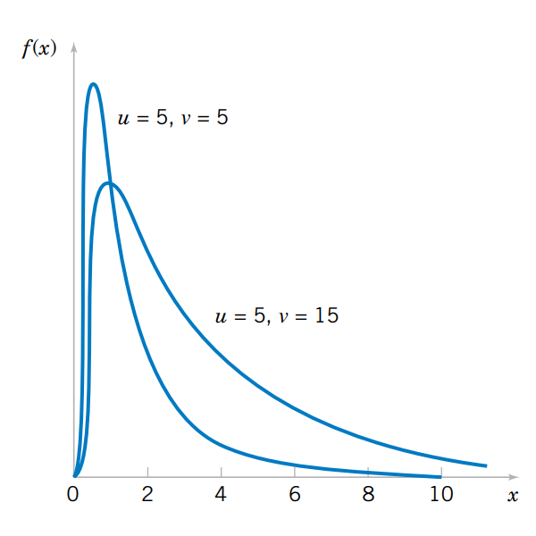

```{r setup, include=FALSE}
knitr::opts_chunk$set(echo = TRUE)


library(ggplot2)
library(ggfortify)
# colores
c0="#0DA5A6" # VERDE CLARO
c1="#E77C00" # NARANJA
c2="#6666FF" # AZUL  
c3="#4CBFBA" # VERDE CLARO  
c4="#E09600" # AMARILLO  
c5="#BC2B6A" # MORADO  

```


# **Guía de aprendizaje 4.1**

<div class="container-wrapper-genially" style="position: relative; min-height: 400px; max-width: 100%;"><video class="loader-genially" autoplay="autoplay" loop="loop" playsinline="playsInline" muted="muted" style="position: absolute;top: 45%;left: 50%;transform: translate(-50%, -50%);width: 80px;height: 80px;margin-bottom: 10%"><source src="https://static.genial.ly/resources/panel-loader-low.mp4" type="video/mp4" />Your browser does not support the video tag.</video><div id="5f1f835fc43a880d757f9161" class="genially-embed" style="margin: 0px auto; position: relative; height: auto; width: 100%;"></div></div><script>(function (d) { var js, id = "genially-embed-js", ref = d.getElementsByTagName("script")[0]; if (d.getElementById(id)) { return; } js = d.createElement("script"); js.id = id; js.async = true; js.src = "https://view.genial.ly/static/embed/embed.js"; ref.parentNode.insertBefore(js, ref); }(document));</script>

<br/><br/>

<br/><br/>

## **1. Introducción**

La inferencia estadística permite generalizar lo hallado en una muestra a toda la población. Para realizar este proceso contamos con dos opciones: Estimación y las Pruebas de hipótesis. El fundamento de estos procesos está relacionado con varios conceptos que se describen y se discuten en esta unidad. En algunos casos serán apoyados con procesos de simulación que permitirán la verificación de cada uno de ellos. 
 
Dentro de estos conceptos se destacan: población, muestra, censo, muestreo, parámetro, estimador, tamaño de muestra, tipo de muestreo, métodos de estimación de momentos, método de estimación de máxima verosimilitud, propiedades de estimadores como son insesgadez, eficiencia, consistencia, teorema central del limite, media muestral, proporción muestral, varianza muestral, modelos de probabilidad normal, t-Student, $\chi^{2}$ o ji-cuadrado y F.

<br/><br/>

## **2. Objetivos de la unidad**

Al finalizar esta unidad el estudiante estará en capacidad de RECONOCER los elementos, conceptos y propiedades que intervienen en la inferencia estadística, de tal manera que pueda INFERIR de manera adecuada los resultados obtenidos para la toma de decisiones informadas

<br/><br/>

## **3. Duración**

La presente  unidad será desarrollada durante la comprendida entre 21 y el 25 de Abril .    
Ademas del material suministrado  contaran con el acompañamiento del profesor en dos sesiones (Miércoles y Viernes) y de manera asincrónica con  foro de actividades académicas. Los entegables para esta unidad podrán enviarse a través de la plataforma Blackboard hasta el  25 de Abril.

Para alcanzar los objetivos planteados se propone realizar las siguientes actividades333333

<br/><br/>

## **4. Cronograma de trabajo**


|Actividad           | Descripción                    | 
|:-------------------|:-----------------------------  |
|**Actividad411**        | Construya un mapa mental con que contenga el siguiente grupo de palabras : **población, parámetro, censo, muestra, muestreo, muestreo probabilistico, muestreo no probabilistico, muestreo aleatorio simple, muestreo aleatorio estratificado, muestreo por conglomerados, muestreo por juicio, muestreo por conveniciencia, muestreo bola de nieve, estimador puntual, estimador insesgado, estimador consistente, estimador eficiente, estimación por intervalos de confianza, pruebas de hipotesis** |
|Trabajo  pareja |    |
|Recursos | [Tablero realizado por 300MAE005 A 2020-2](https://padlet.com/dgonzalez80/lijxz9p7nvz5mm2q)|
|Fecha    | octubre 10  |
|Hora     | 23:59     |
|**Actividad412**   | Verifique el cumplimiento del **Teorema Central del Limite** para cada uno de los modelos asignados en la actividad 331 |
|Trabajo individual|   |
|Fecha    | octubre 10  |
|Hora     | 23:59     |

<br/><br/>

## **5. Criterios de evaluación**

* Reconoce los modelos especiales asociados a contextos  y problemas reales

* Utiliza las herramientas estadística apropiadas en el calculo de probabilidades en la solución de problemas en contexto

* Utiliza herramientas computacionales que le permita  la solución de problemas en contexto a través de la simulación


<br/><br/>

## **6. Entregables** 
|              |                  |                                         |
|:-------------|:-----------------|:----------------------------------------|
|Entregable 1  | Actividad411.pdf |  mapa mental                            |
|Entregable 2: | Actividad412.pdf | verificación teorema central del límite |


Los entregables completos y enviados dentro de los tiempos establecidos  otorgarán 10 puntos en cada caso, para un  total de 20 puntos. 

<br/><br/><br/><br/>

## **7. Presentaciones**


<br/><br/><br/><br/>

# **Recursos**

<br/><br/>

## **Introducción**


La inferencia estadística permite generalizar lo hallado en una muestra a toda la población. Para realizar este proceso contamos con dos opciones: Estimación y las Pruebas de hipótesis. El fundamento de estos procesos está relacioando con varios conceptos como:

<br/><br/>

|               |                 |                    |                    |                      |
|:--------------|:----------------|:-------------------|:-------------------|:---------------------| 
|población              |parámetro                   |censo                     |muestra                         |muestreo                  | 
|muestreo probabilistico| muestreo no probabilistico |muestreo aleatorio simple |muestreo aleatorio estratificado|muestreo por conglomerados|
|muestreo por juicio    | muestreo por conveniciencia|muestreo bola de nieve    |estimador puntual               |estimador insesgado       | 
|estimador consistente  | estimador eficiente        |estimación por intervalos de confianza|pruebas de hipótesis |  |

[Tablero 300MAE005 A 2020-2](https://padlet.com/dgonzalez80/lijxz9p7nvz5mm2q) <br/>
[Tablero 300MAE005 B 2020-2](https://padlet.com/dgonzalez80/ivy0h9vyhtiq9l1d) <br/>
[Tablero 300MAE005 F 2020-2](https://padlet.com/dgonzalez80/ivy0h9vyhtiq9l1d) <br/>
 
 
<br/><br/>

### **Población** 

En Estadística, se identifica el término población con el dominio de la variable aleatoria X, asociada a los objetos o individuos sobre los cuales se desarrolla un experimento y cuyo valor ocurre al azar. El estudio del conjunto de todas las mediciones de interés para un investigador se llama CENSO (Mendenhall (2008)). Como ejemplo podemos mencionar la población de habitantes de Colombia que se estudia a través del Censo de población que se debe realizar cada diez años. 

<br/><br/>

### **Muestra** 

Un subconjunto extraido de los elementos que conforman la población se denomina MUESTRA. Una definición técnica de muestra está dada por: repetición $n$ veces, en idénticas condiciones de la experiencia aleatoria, se puede obtener $n$ valores independientes de una variable aleatoria $X_{1}, X_{2},...,X_{n}$ a la que se le denomina muestra de la variable $X$.

<br/><br/>

### **Parámetro** 

Es una caracterización numérica de la distribución de probabilidad de una variable aleatoria. Como ejemplo de parámetros tenemos a $\mu$, $\sigma^{2}$ que determinan la función de probabilidad de una variable con distribución normal. Si suponemos que los valores correspondientes a estos parámetros son 100 y 25 respectivamente, entonces la función de distribución de probabilidad quedará determinada por :
$$f(x)=\frac{1}{\sqrt{50 \pi}} \exp{\Bigg(- \frac{1}{50}\big(x-100\big)^{2}\Bigg)}$$

<br/><br/>

### **Estimador** 

Es una función de los valores obtenidos en una muestra aleatoria que da como resultado un valor que corresponde a una aproximación del parámetro objeto de estudio. Generalmente se representa como $\widehat{\theta}$. Como algunos ejemplos podemos citar:
$$\widehat{\mu}=\frac{1}{n}\sum_{i=1}^{n}x_{i}=\bar{x} $$
$$\widehat{\sigma^{2}}=\frac{1}{n-1}\sum_{i=1}^{n}\big(x-\bar{x}\big)^{2} = s^{2}$$

<br/><br/>

### **Estimación** 

Es la evaluación o generación del estimador para una muestra determinada. 

Como ejemplo podemos utilizar uno de los estimadores que estudiaremos :  $\widehat{\mu}= \bar{x}$, para una muestra dada

$$ 630, 650, 710, 750, 790, 820, 860 \text{ y } 910$$
$$\widehat{\mu}=\frac{1}{n}\sum_{i=1}^{n} x_{i} =\frac{1}{8}(630+650+...+910)=765$$
El valor del estimador de $\mu$ para esta muestra es $$\widehat{\mu}=\bar{x}= 765$$.

<br/><br/>

## **Muestreo**

<br/>

### **Importancia del Muestreo**

<br/>

El papel principal de la estadística está relacionado con el análisis de información que permita tomar decisiones con respecto a una población. Es posible que se pueda estudiar la totalidad de elementos  que determinan la población, en este caso estaremos realizando un censo. Sin embargo no siempre podemos estudiar la totalidad de la población por lo cual debemos seleccionar una pequeña parte de ella. A este subconjunto lo podemos llamar muestra.

<br/>

|                                      | **Muestra**     | **Censo**          |
|:-------------------------------------|:----------------|:-------------------|
|Presupuesto                           |pequeño          | grande             |
|Tiempo disponible                     |poco             | mucho              |
|Tamaño de la población                |grande           | pequeña            |
|Varianza de la característica         |grande           | pequeña            |
|Costos de los errores de muestreo     |bajos            | altos              |
|Costos de los errores que no son de muestreo            | alto   | bajo      |
|Naturaleza de la prueba               |desctructiva     |no destructiva      |
|Atención a casos individuales         |si               |no                  |
||||
<font size="-1">Tomado de Malhotra(2004)</font>

<br/>

Un diseño de muestreo es una estrategia para obtener una muestra, genera algunas preguntas asociadas al proceso de muestreo: ¿cómo seleccionar de una manera óptima la muestra?, ¿Qué característica medir en las unidades observadas? y ¿cómo estimar las características poblacionales a partir de la información muestral?. El proceso de obtención de las muestras por su parte, requiere la definición de algunos aspectos como, ¿cuál es el tamaño óptimo para el cumplimiento de los objetivos?, o  ¿mediante qué procedimiento de aleatorización realizar el proceso de selección?, ¿qué tipo de método observacional utilizar y qué medidas tomar?. En el muestreo, uno tiene la oportunidad de seleccionar deliberadamente la  muestra, para evitar  inducir por ejemplo, a seleccionar por conveniencia algún individuo en particular, situación que pudiera conducir a sesgos en los resultados finales de la investigación.

En resumen, podemos decir que el muestreo consiste en la selección, mediante procedimientos preestablecidos que nos aseguren aleatoriedad y representatividad,  de una parte de una colección finita de unidades, seguida de algunas conclusiones respecto de la población, basándonos en la parte de ella que hemos observado. Este proceso se basa en principios relacionados con la inferencia estadística, lo que implica fuentes de incertidumbre (producto de la aleatoriedad), como por ejemplo


a.El método de selección de las unidades.
b.El método de medición de las unidades.
c.El conocimiento de los procesos que generan los verdaderos valores de las unidades medidas.

<br/><br/>

### **Diseños Muestrales**


Un diseño muestral es una estrategia de selección de unidades muestrales, mediante un proceso de aleatorización definido previamente (plan de muestreo). De acuerdo con esta definición, son tres los elementos esenciales de un diseño muestral:

<br/><br/>

#### **Unidad muestral**

Constituye la unidad básica a partir de la cual se obtiene la información, pudiendo por tanto, ser éstas personas,  o individuos de cualquier tipo si , por ejemplo nuestro interés es estimar la talla promedio; casas, número promedio de habitaciones, o el consumo de energía; comunidades, si los que nos interesa es el número promedio de especies por comunidad, áreas o cuadrículas si deseamos estimar densidades medias o biomasa total, etc.

<br/><br/>

#### **Proceso de aleatorización**

Aun cuando la unidad muestral esté claramente definida, existen algunos elementos que pueden afectar el proceso de muestreo, alterando la calidad de la información. En este caso no es la definición, sino la selección de la unidad muestral, la que puede estar sesgada por la naturaleza de la medición, así por ejemplo, si deseamos encuestar a personas para averiguar su tendencia política o su nivel socio económico, pudiéramos sentirnos tentados a seleccionar sus nombres desde una guía telefónica, lo que dejaría fuera de la encuesta a todas aquellas personas  que no tienen teléfono, constituyéndose ello en una fuente de sesgo. En  otros casos, la naturaleza del muestreo tiene que ver con el entrenamiento de los muestreadores, es el caso, por ejemplo, de las muestras para identificar fallas en un equipo, en que la experiencia del muestreador juega un papel importante en la identificación de los mismos.

Lo anterior significa que, en términos prácticos, la aleatoriedad debe garantizar que cada individuo de la población debe tener las misma posibilidad de ser seleccionado como representante de la población (aleatoriedad). Adicionalmente, exigimos que la elección de un individuo, no esté condicionada a la selección de otro (independencia). Estas dos condiciones, en apariencia sencillas, pueden provocar algunas  dificultades.

<br/><br/>

###  **Tamaño muestral**

Una vez que las unidades muestrales han sido definidas y se ha acordado un proceso de aleatorización, debemos preguntarnos, cuántas unidades debemos seleccionar para tener una buena representación en la  muestra.\\

Dado que cualquiera sea el proceso de selección de una muestra existe un costo asociado, el que en la mayoría de los casos constituye una exigencia ineludible, nuestro objetivo principal, será obtener el máximo de información con el menor tamaño de muestra que nos sea posible.

El tamaño de la muestra $n$ es función de tres elementos que son: la varianza, la confiabilidad y el error de muestreo. Los dos últimos a criterio del investigador.

$$n=\dfrac{z^{2}_{_{\alpha/2}} \sigma^{2}}{e^{2}}$$

Donde:

**Varianza** ($\sigma^{2}$):  Caracteriza la variable a estimar. Entre mayor sea su valor, mayor deberá ser el tamaño de la muestra. En ocasiones es necesario realizar una prueba piloto que nos permita tener un valor para calcular $n$. Otra alternativa puede ser el conocimiento empírico de expertos sobre el rango de la variable. Con este valor podemos estimar una aproximación de la desviación estándar como: $\sigma =$ rango/4. 

**Confiabilidad** ($z_{\alpha/2}$ o percentil de la distribución normal estandar)b: Este concepto está relacionado con el grado de veracidad que tienen los resultados obtenidos. Si el estudio es repetido muchas veces, ¿ cuántas de estas coinciden con los resultados obtenidos?. Su valor está relacionado con el percentil de las distribución normal estándar, por ejemplo: una confiabilidad del 95% está relacionada con un valor de $z=1.96$.

**Error de muestreo** ($e$) : corresponde a la diferencia entre el valor de la característica en la población (parámetro) y el valor obtenido con la información de la muestra (estimador).Equivale al error que estamos en capacidad de tolerar en las unidades de la variable.

<br/><br/>

**Ejemplo de cálculo de tamaño de la muestra- Caso de una media** : Suponga que deseamos determinar el tamaño de la muestra para estimar la media de la nota del curso de estadística, con una confianza del 95\% y un error de muestreo de 0.2 puntos. Un estudio realizado el semestre pasado arrojó una varianza de 1.6.

La información necesaria para el calculo del tamaño de muestra requerido es:

* percentil 97.5 de la distribución normal $z=1.96$ (Entre -1.96 y 1.96 se encuentra el 95\% de los datos)

* varianza $\sigma^{2}=0.4$

* error de muestreo 0.2

 
$$n=\dfrac{1.96^{2} \times 1.6}{0.2^{2}}=153.6 \approxeq 154$$

En caso de que $n/N >0.05$ debemos realizar un ajuste por corrección por población finita:

$$n=\dfrac{n_{0} \times N}{n_{0}+N-1}$$
Supongamos que N=200 estudiantes y por tanto $154/200 > 0.05$ El tamaño corregido ser{a:

$$n= \dfrac{154 \times 200}{154 + 200 -1} =87.2 \approxeq 88 $$

<br/><br/>

**Ejemplo de cálculo de tamaño de la muestra- Caso de una proporción**: Supongamos ahora que se desea calcular el tamaño de la muestra para realizar una estimación de la proporción de estudiantes que reprueban el curso de matemáticas fundamentales y que deseamos una confianza del 98\% y un error de muetreo de 0.1. En este caso la varianza corresponde a $pq$ donde $q=1-p$ y por tanto tendrá su valor máximo cuando $p=0.50$, es decir que si utilizamos como varianza $0.5 \times (1-0.5)=0.25$ obtendremos el valor más grande de tamaño de muestra posible.

$$ n=\dfrac{2.33^2 \times 0.25}{0.1^{2}}=135.7 \approxeq 136$$

En caso de poder realizar una prueba piloto (observación de una muestra, digamos 30 unidades) y estimar en este caso su varianza, el resultado del tamaño de muestra será inferior al anteriormente calculado.

<br/><br/><br/><br/>

## **Tipos de muestreo** 

En general pueden dividirse en dos grandes grupos: métodos de muestreo probabilísticos y métodos de muestreo no probabilísticos.

Los **métodos de muestreo probabilísticos** son aquellos que se basan en el principio de equiprobabilidad. Es decir, aquellos en los que todos los individuos tienen la misma
probabilidad de ser elegidos para formar parte de una muestra y, consiguientemente, todas las posibles muestras de tamaño n tienen la misma probabilidad de ser elegidas.

Sólo estos métodos de muestreo probabilísticos nos aseguran la representatividad de la muestra extraída y son, por tanto, los más recomendables. Dentro de los métodos de
muestreo probabilísticos encontramos los siguientes tipos:
De acuerdo con las consideraciones anteriores, algunas de las estrategias de muestreo más conocidas son:

+ muestreo aleatorio simple 
+ muestreo aleatorio sistemático 
+ muestreo aleatorio estratificado 
+ muestreo aleatorio por conglomerados

<br/><br/>

### **Muestreos probabilísticos**

<br/><br/>

**Muestreo Aleatorio simple (m.a.s)**
Una muestra aleatoria simple tomada de una población finita, da a cada subconjunto de la población (muestra) de tamaño específico la misma probabilidad de ser seleccionada.\\

El muestreo aleatorio simple es un procedimiento de selección de un conjunto de individuos de modo que toda posible muestra de $n$ unidades tiene la misma probabilidad de ser seleccionada de los $N$ individuos asociados a la  población. La muestra se selecciona en $n$ etapas, en cada una de las cuales, cada elemento que no ha sido aún seleccionado, tiene la misma probabilidad de ser seleccionado. Si el número de individuos de donde seleccionamos los $n$ individuos para determinar la muestra tiene un tamaño conocido, podemos asignar un número a cada una de las $N$ unidades y luego mediante la generación de $n$ números aleatorios entre $1$ y $N$, seleccionamos los individuos que determinarán la  muestra de tamaño $n$ correspondiente.\\

El muestreo puede realizarse sin reemplazo o con reemplazo, o dicho de otro modo, la muestra puede elegirse de dos maneras: sin reposición de la unidad extraída o con reposición de ella. El muestreo con reemplazo es usado cuando es aceptable tener la misma unidad dos veces en la muestra.\\

**Ejemplo**  De la base del caso 1 con 200 observaciones deseamos seleccionar una muestra aleatorio de tamaño n=50. La siguiente es la instucción en R que selecciona las observaciones :


```{r}
# Importa los datos en formato csv
# Base1=read.csv("~/Talleres/Base1.csv")
# visualiza los datos
# viewData(Base1)
# extre la muestra
# muestra1=Base1[sample(1:nrow(Base1),50,replace=F),] 
```

<br/><br/>

**Muestreo Estratificado** 

Una muestra estratificada se obtiene formando estratos, de acuerdo a alguna característica de interés en la población (sexo, edad, ingresos etc.), y de cada estrato se selecciona una muestra aleatoria simple. 

Supongamos, que la población finita se subdivide en $L$ subpoblaciones o estratos, de modo que la muestra esté constituída por elementos de cada uno de ellos. El  muestreo estratificado considera la selección, desde cada uno de los estratos, una muestra aleatoria simple.

La subdivisión de la población en estratos tiene como objetivo reducir la variabilidad total asociada al proceso de muestreo. Por lo tanto es necesario incluir en cada estrato, individuos o unidades muestrales cuya medida de interés tengan variabilidad pequeña respecto a la media. El objetivo general es entonces lograr varianza mínima dentro del estrato y varianza máxima entre estratos. En caso de no lograr esta estratificación, en función de las varianzas, lo más probable es que el proceso de muestreo sea equivalente al que se pudiera haber realizado por muestreo aleatorio simple.

La ventaja principal que puede conseguirse estratificando, es aumentar la precisión de las estimaciones al agrupar elementos con características comunes y con ello disminuir los tamaños muestrales totales y la amplitud de los intervalos de confianza. Por este tipo de muestreo, la amplitud del intervalo que estima al parámetro es menor que el dado por el m.a.s. para un mismo tamaño de muestra.

Por otra parte, la estratificación procura muestras  más representativas. Exagerando, si se pudiera conseguir que cada uno de los $L$ estratos estuviese constituído por elementos idénticos, bastaría tomar $L$ elementos, uno por estrato, y la representatividad sería perfecta. Además, puede lograrse un mejor aprovechamiento de la organización administrativa destinada a la selección de las muestras, al centrar la actividad de muestreo en áreas homogéneas.

El número de estratos depende del criterio de clasificación, es un problema intrínsecamente ligado a la investigación, por ejemplo, si se está trabajando con características de individuos, los estratos pueden elegirse en la siguiente forma:

Estrato 1 $\cdots$ niños (menores de 14 años)
Estrato 2 $\cdots$ jóvenes (15 - 25 años)
Estrato 3 $\cdots$ adultos (26 años o mas)

Otros criterios de clasificación pueden obedecer también, por ejemplo, a posiciones geográficas, en otros casos, cada estrato puede ser un sector de la ciudad de la provincia o de la región.\\

Otro elemento interesante de considerar, en los estudios por muestreo estratificado, es que las conclusiones  pueden darse no sólo a nivel poblacional, sino que independientemente a nivel de cada estrato.\\

<br/><br/>

**Muestreo Sistemático** 

Se forma una muestra sistemática seleccionando al azar una unidad y luego se seleccionan adicionalmente las unidades a intervalos igualmente espaciados (cada $k$ unidades de la población, $k>1$) hasta formar la muestra total.

Supongamos que estamos interesados en una población cuyos individuos  han sido numerados desde 1 a $N$, y elegimos una muestra de tamaño $n$ como sigue: entre las $k$ primeras unidades, donde $k =N/n$ elegimos, en forma aleatoria, el elemento $i-ésimo$,entre los $k$ primeros elementos o unidades muestrales. A continuación, sistemáticamente se eligen los elementos $i+k$ que están $k$ lugares después  del $i-ésimo$, y así  sucesivamente hasta agotar los elementos disponibles de la lista, lo que ocurrirá al llegar al elemento que ocupa el lugar $i+(n-1)k$.

Si existen $k$ muestras posibles de $n$ elementos cada una. Por ejemplo, de una población determinada por $N = 1000$ elementos deseamos elegir  sistemáticamente $25$ elementos, habrá $k = 1000/25 = 40$ elecciones diferentes posibles. Elegimos aleatoriamente un número comprendido entre 1 y 40 y a partir de éste, elegimos los 24 restantes de 40 en 40. Supongamos que fue sorteado el 15, entonces la observación que ocupa el $15^{\circ}$ lugar será el primer elemento de la muestra, el segundo será el $55^{\circ}(15+40)$, el tercero será el $95^{\circ}(15+80)$ y así  sucesivamente hasta que el último elemento seleccionado será la observación que ocupe el lugar 975. La muestra estará conformado por los elementos : $15^{\circ},55^{\circ}, 95^{\circ},\cdots,975^{\circ}$ 

Es más fácil de ejecutar este tipo de muestreo. Es también más preciso que el m.a.s. pues equivale a estratificar la población en $n$ estratos de cada uno de los cuales se extrae una observación. En general, si se desea una muestra de tamaño $n$ basta sortear una de las $k$ columnas. Este tipo de muestreo es particularmente útil en muestreos exploratorios, en los que no se conoce exactamente la distribución de la población.

Este tipo de muestreo no es recomendable cuando el preceso generador de los datos tiene un comportamiento cíclico o estacional, el cuál puede hacer que las unidades seleccionadas coincidan con todos los máximos o todos los mínimos. 


<br/><br/>

**Muestreo por Conglomerados**

Una muestra por conglomerados se obtiene identificando un conjunto de conglomerados que componen la población, aleatoriamente se selecciona un subconjunto de estos conglomerados y se hace un censo en cada uno de los seleccionados.

A veces, para estudios exploratorios, el muestreo probabilístico resulta excesivamente costoso y se acude a métodos no probabilísticos, aún siendo conscientes de que no sirven para realizar generalizaciones, púes no se tiene certeza de que la muestra extraída sea representativa, ya que no todos los sujetos de la población tienen la misma probabilidad de se elegidos. En general se selecciona a los sujetos siguiendo determinados criterios procurando que la muestra sea representativa.

<br/><br/><br/><br/>

### **Muestreos no probabilísticos**

En el caso de no contar con los supuestos que puedan garantizar la selección de la muestra de una manera aleatoria (no contar con un listado de la población o el no poder identificar con anticipación los elementos que conforman la población) y requerir de información para realizar analisis exploratorios, podemos utilizar otro tipo de muestreos llamados no probabílisticos. A continuación se describen algunos de ellos:\\

<br/><br/>

**Muestreo por Cuotas** 

También denominado en ocasiones **accidental**. Se asienta generalmente sobre la base de un buen conocimiento de los estratos de la población y/o de los individuos más **representativos** o **adecuados** para los fines de la investigación. Mantiene, por tanto, semejanzas con el muestreo aleatorio estratificado, pero no tiene el carácter de aleatoriedad de aquel. En este tipo de muestreo se fijan unas "cuotas" que consisten en un número de individuos que reúnen unas determinadas condiciones, por ejemplo: 20 individuos de 25 a 40 años, de sexo femenino y residentes en una determinada región. Una vez
determinada la cuota se eligen los primeros que se encuentren que cumplan esas características. Este método se utiliza mucho en las encuestas de opinión.

<br/><br/>

**Muestreo Intencional** 

Este tipo de muestreo se caracteriza por un esfuerzo deliberado de obtener muestras "representativas mediante la inclusión en la muestra de grupos
supuestamente típicos. Es muy frecuente su utilización en sondeos preelectorales de zonas que en anteriores votaciones han marcado tendencias de voto.

<br/><br/>

**Muestreo Casual o Incidental**

Se trata de un proceso en el que el investigador selecciona directa e intencionadamente los individuos de la población. El caso más frecuente de este procedimiento es utilizar como muestra los individuos a los que se tiene fácil acceso (los profesores de universidad emplean con mucha frecuencia a sus
propios alumnos). Un caso particular es el de los voluntarios.

<br/><br/>

**Bola de Nieve** 

Se localiza a algunos individuos, los cuales conducen a otros, y estos a otros, y así hasta conseguir una muestra suficiente. Este tipo se emplea muy frecuentemente cuando se hacen estudios con poblaciones "marginales", delincuentes, sectas, determinados tipos de enfermos, etc.


<br/><br/><br/><br/>

## **Métodos de estimación**

<br/><br/>

### **Método de momentos**

El método de momentos fue propuesto por Karl Pearson al rededor de 1895, pensado en sus inicios en contexto descriptivo, analizando las distribuciones de probabilidad y aproximándolas al sistema de curvas que llevan su nombre. Posteriormente este concepto fue modificado por R.A. Fisher en 1920. El método consiste en estimar un parámetro de una distribución igualando sus momentos teóricos o poblacionales, si existen, con los correspondientes momentos muestrales.

Para mostrar este método es necesario definir el concepto de momento.

<br/>

| **Momento Poblacional**                                                | **Momentos muestrales**                         |
|:-----------------------------------------------------------------------|:------------------------------------------------|
|  caso variable discreta                                                |                                                 |
|$$\mu^{k}=E\big[X^{k}\big]=\sum_{Rx} x^{k}p(x)$$                        | $$m^{k}=\frac{1}{n}\sum_{i=1}^{n} x_{i}^{k} $$  |
|  caso variable continua                                                |                                                 |
|$$\mu^{k}=E\big[X^{k}\big]=\int_{-\infty}^{\infty}x^{k}f(x) dx $$       |                                                 |
<br/>

El método de momentos supone que los momentos tanto poblacionales como muestrales son conocidos, y por lo tanto tambien la función de probabilidad. 

A continuación se relacionan algunos de estos momentos poblacionales:

<br/>

| Distribución | $E[X]$               | $V[X]=E[X^{2}]-E[X]^{2}$        |
|:-------------|:---------------------|:--------------------------------|
| bernoulli    | $p$                  | $pq$                            |
| geométrica   | $\displaystyle\frac{1}{p}$ | $\displaystyle\frac{q}{p^{2}}$  |
| binomial     | $np$                 | $npq$                           |
| Poisson      | $\lambda$            | $\lambda$                       | 
| gamma        | $\alpha\beta$        | $\alpha\beta^{2}$               |
| exponencial  | $\beta$              | $\beta^{2}$                     | 
| uniforme     | $\displaystyle\frac{a+b}{2}$| $\displaystyle\frac{(b-a)^{2}}{12}$ |
| normal       | $\mu$                |$\sigma^{2}$                     |

Nota: Existe una relación entre las distribuciones Poisson y exponencia.Se podrían dar en función de $\lambda$, haciendo $\beta=\dfrac{1}{\lambda}$  

<br/><br/>

**Ejemplo**

Encuentre los estimadores de los parámetros de la distribución normal a través del método de momentos.
Previamente sabemos que los parámetros de una variable con distribución normal son $E[X]=\mu$ y $V[X]=\sigma^{2}$ y que $V[X]=E[X^{2}]-E[X]^{2}$. Dada esta información el estimador de momentos se construye de la siguiente manera: 

$$\mu^{1}=m^{1} $$

$$\mu^{2}=m^{2} $$

Aplicando el método:

<br/>

|          |                                                               |
|:---------|:--------------------------------------------------------------|
|$\mu^{1}=$| $E[X] = m^{1}$                                                |
|$\mu  =  $| $\displaystyle\frac{1}{n}\sum_{i=1}^{n}x_{i}$                 |
|$\widehat{\mu}  =$| $\displaystyle\frac{1}{n}\sum_{i=1}^{n} x_{i}=\bar{x}$|


<br/>

Para estimar $\sigma^{2}$, se realiza el siguiente procedimiento, usando $\mu^{1}=m^{1}$  y $\mu^{2}=m^{2}$.

$$V[X]=E[X^{2}]-E[X]^{2} = \mu^{2}-(\mu^{1})^{2}$$

entonces igualamos estos dos momentos poblacionales con sus respectivos momentos muestrales quedando la igualdad

$$\begin{eqnarray*}
V[X]&=& \mu^{2}-(\mu^{1})^{2}\\
      &=&m^{2}-(m^{1})^{2}\\
      &=&\displaystyle\frac{1}{n}\sum_{i=1}^{n}x_{i}^{2}-\bar{x}^{2}
\end{eqnarray*}$$

podemos representar la varianza por $\sigma^{2}$ y obtenemos

$$\widehat{\sigma^{2}}=\displaystyle\frac{1}{n}\sum_{i=1}^{n}x_{i}^{2}-\bar{x}^{2}$$

y obtenemos el estimador de la varianza:

<br/>

|                       |                                                                                                   |
|:----------------------|:--------------------------------------------------------------------------------------------------|
|$\widehat{\sigma^{2}}$ | $= \displaystyle\frac{1}{n}\sum_{i=1}^{n}x_{i}^{2}-\bar{x}^{2}$                                   |
|$\widehat{\sigma^{2}}$ | $= \displaystyle\frac{1}{n}\sum_{i=1}^{n}x_{i}^{2}-\bar{x}^{2}-\bar{x}^{2}+\bar{x}^{2}$           |
|                       | $= \displaystyle\frac{1}{n}\sum_{i=1}^{n}x_{i}^{2}-2\bar{x}^{2}+\bar{x}^{2}$                      |
|                       | $= \displaystyle\frac{1}{n}\sum_{i=1}^{n}x_{i}^{2}-\displaystyle\frac{2\bar{x}\sum x_{i}}{n}+\displaystyle\frac{n \bar{x}^{2}}{n}$ |
|                       | $= \displaystyle\frac{1}{n}\Big(\sum_{i=1}^{n} x_{i}^{2}-2\bar{x}\sum_{i=1}^{n} x_{i}+\bar{x}^{2}\Big)$ |
|                       | $= \widehat{\sigma^{2}} = \displaystyle\frac{1}{n}\sum_{i=1}^{n}\Big(x_i-\bar{x}\Big)^{2}$        |

<br/><br/>

En resumen los estimadores de momentos para los parámetros de la distribución normal son:


$$\widehat{\mu} = \displaystyle\frac{1}{n}\sum_{i=1}^{n} x_{i}=\bar{x}$$

$$\widehat{\sigma^{2}} = \displaystyle\frac{1}{n}\sum_{i=1}^{n}\Big(x-\bar{x}\Big)^{2}$$ 


A partir de ellos y mediante la obtención de una muestra aleatoria por ejemplo :630, 650, 710, 750, 790, 820, 860 y 910 se pueden estimar los parámetros por método de momentos con los siguientes resultados:

$$\widehat{\mu}=765$$  

$$\widehat{\sigma^{2}}=8550$$

<br/><br/><br/><br/>

## **Distribuciones muestrales**

**Principales distribuciones muestrales: 

+ normal
+ Chi-cuadrado, 
+ t-student, 
+ F-Fisher


Se denomina distribución muestral a la distribución que sigue los principales estimadores puntuales o funciones de ellos como son:

$$\bar{X},\hspace{.2cm} \widehat{p}, \hspace{.2cm}\frac{(n-1)S^ {2}}{\sigma^{2}}, \hspace{.2cm} Z=\frac{\bar{X}-\mu}{S/\sqrt{n}}, \hspace{.2cm} F=\frac{\chi^ {2}_{1}/v_{1}}{\chi^{2}_{2}/v_{2}}$$

Existe una relación importante entre ellas con la Distribución normal, las cuales se representan en el siguiente diagrama:

<br/>

{width=50%}

Si una variable **X** se distribuye **normal** con parámetros $\mu$ y $\sigma^{2}$, entonces a partir de su transformación se puede obtener una variable **Z** que tenga distribución **normal estándar** $N(0,1)$, que tiene media cero y varianza uno. Varias normales estándar al cuadrado conforman una variable con distribución **chi-cuadrado** y a su vez esta variable tiene la propiedad tal que la suma de $n$ variables aleatorias $\chi^{2}$ con $n-1$ grados de libertad. La razón de una variable con distribución normal estándar y la raiz cuadrada de una variable chi-cuadrado, dividida por sus grados de libertad originan una variable con distribución **t-student**. Por último la razón de dos variables con distribución chi-cuadrado, divididas cada una por sus respectivos grados de libertad, generan una variable con distribución  **F-Fisher**. 

En sintesis, la distribuciones de muestreo básicas, tienen de base la distribución normal.

<br/><br/>

### **Distribución chi-cuadrado** 

Si $S^{2}$ es la varianza de la muestra aleatoria de tamaño $n$ que se toma de una población normal que tiene varianza $\sigma^{2}$, entonces el estadístico:
$$\chi^{2}=\frac{(n-1)S^{2}}{\sigma^{2}}=\sum_{i=1}^{n}\frac{\big(x_{i}-\bar{x}\big)^{2}}{\sigma^{2}}=\sum_{i=1}^{n} \Big(\frac{x_{i}-\bar{x}}{\sigma}\Big)^{2} $$
tiene una distribución chi-cuadrado con $v=n-1$ grados de libertad.


Nota: Esta función fue creada por Karl Pearson cientifico inglés (1857-1936) y su función de distribución y su represntación gráfica estan dadas por:

$$f(x)=\frac{1}{2^{(v/2)}\Gamma(v/2)}x^{(v/2)-1}\exp\{-x/2\} ,\hspace{.3cm} x>0$$
<br/><br/>


{width=50%}


Esta distribución es un caso especial de la distribución Gamma con parámetros $\alpha=\frac{v}{2}$ y $\beta=2$ 

<br/><br/>

### **Distrución t-student**

Esta función nace de la relación entre una variable con distrución normal estandar y la raiz cuadrada de una variable con distribución chi-cuadrado
Sea Z una variable con distribución normal estandar y V una variable con distribución chi-cudadrado con v grados de libertad, entonces la variable aleatoria T se distribuye t-student con v grados de libertad

$$T=\frac{Z}{\sqrt{V/v}} \sim t_{v}$$


Nota: Esta función de distribución fue propuesta por William Sealy Gosset en 1908. Gosset trabajaba en una fábrica de cerveza de prppiedad de Guiness, quien prohibia a sus empleados la publicación de artículos cientificos debido a la difución previa de secretos industriales. Debido a esta prohibición Gosset publicaba sus artículos con el seudonimo de Student.(Wikipedia.org)

La función de probabilidad de distribución t-student y su represntación gráfica están dadas por:

$$f(x)=\frac{\Gamma[(v+1)/2]}{\Gamma[v/2]\sqrt{\pi v}}\Bigg(1+\frac{x^{2}}{v} \Bigg)^{-(v+1)/2}, \hspace{.3cm} -\infty< x<\infty $$

{width=60%}


La gráfica de la distribución t-student es similar a la de la distribución normal, salvo que sus colas son más pesadas.

Si $X_{1},X_{2},...,X_{n}$ es una muestra aleatoria de $n$ variables independientemente e idénticamente distribuidas $N(\mu,\sigma^{2})$ y

$$\bar{X}=\frac{1}{n}\sum_{i=1}^{n}X_{i} $$

$$S^{2}=\frac{1}{n-1}\sum_{i=1}^{n}\Big(X_{i}-\bar{X}\Big)^{2} $$

Entonces la variable aleatoria:

$$T=\frac{\bar{X}-\mu}{S/\sqrt{n}} $$

tiene una distribución t-student con $v=n-1$ grados de libertad

<br/><br/>

### **Distribución F-Fisher**

Si $S_{1}^{2}$ y $S_{2}^{2}$ son las dos varianzas de muestras aleatorias independientes de tanaños $n_{1}$ y $n_{2}$ tomadas de poblaciones normales con varianzas $\sigma_{1}^{2}$ y $\sigma_{2}^{2}$ respectivamente, entonces:

$$F=\frac{S_{1}^{2}/\sigma_{1}^{2}}{S_{2}^{2}/\sigma_{1}^{2}}=\frac{\sigma_{2}^{2}}{\sigma_{1}^{2}} \frac{S_{1}^{2}}{\sigma_{2}^{2}} $$

tiene una distribución F con grados de libertad $v_{1}=n_{1}-1$ y $v_{2}=n_{2}-1$\\


Nota: Ronald Aylmer Fisher (1890-1962) cientifico, matemático, estadístico, biólogo evolutivo y genet?sta inglés fue el creador de la distribución F. Su función de distribución y su representación gráfica estan dadas por:

$$f(x)=\displaystyle\frac{\Gamma \Bigg[\displaystyle\frac{v_{1}+v_{2}}{2}\Bigg]\Bigg(\displaystyle\frac{v_{1}}{v_{2}}\Bigg)^{v_{1}/2} x^{(v_{1}/2)-1}}{\Gamma \Bigg[\displaystyle\frac{v_{1}}{2}\Bigg] \Gamma \Bigg[\displaystyle\frac{v_{2}}{2}\Bigg]
\Bigg[\Bigg(\displaystyle\frac{v_{1}}{v_{2}}\Bigg)x+1\Bigg]^{\big(v_{1}+v_{2}\big)/2}}, \hspace{.3cm} x>0 $$

{width=50%}

<br/><br/>

## **La media muestral**

$$ \bar{X}=\frac{1}{n}\sum_{i=1}^{n} X_{i}$$

Al hablar de distribución de probabilidad de la media muestral, implicitamente estamos afirmando que $\bar{X}$, es una variable aleatoria. De esta variable a continuación estudiaremos sus principales caracteristicas. 

Para verificar las propiedades de este estimador podemos hacer uso de las propiedades del valor esperado de la siguiente manera:

$$\begin{eqnarray*}
E[\bar{X}] &=& E\Bigg[ \frac{1}{n} = \frac{1}{n} E\Big[X_{1}+X_{2}+\cdots + X_{n}\Big]\\
&=&\frac{1}{n} [\mu + \mu \cdots + \mu ] = \frac{1}{n} n\mu = \mu\\
\end{eqnarray*}$$

por tanto:

$$\mu = \mu_{\bar{X}}$$

Como conclusión obtenemos que la media de la media muestral es igual a la media de la variable. 

Con la varianza ocurre algo similar al utilizar las propiedades de la varianza:

$$\begin{eqnarray*}
V[\bar{X}]&=&V\Bigg[\frac{1}{n} \sum_{i=1}^{n} x_{i}\Bigg] \\
&=&\dfrac{1}{n^{2}} V\big[X_{1}+X_{2}+\cdots + X_{n}\big] \\
&=& \dfrac{1}{n^{2}} V[X_{1}]+V[X_{2}]+\cdots +V[X_{n}]\\
&=& \dfrac{1}{n^{2}} n\sigma^{2}\\
&=& \dfrac{\sigma^{2}}{n}
\end{eqnarray*}$$

Se concluye que:

$$V[\bar{X}] = \dfrac{\sigma^{2}}{n}$$

Obtenemos así que la varianza de la media muestral es igual a la varianza de la variable. \\


Para verificar estas caracteristicas, vamos a suponer que tenemos una población de N=5, conformada por los elementos: $10,20,30,40,50$. Para esta población podemos calcular sus parametros $\mu$ y $\sigma^{2}$.

$$\begin{eqnarray*}
\mu_{_{X}}&=&\dfrac{1}{5}\sum_{i=1}^{5}x_{i} =\dfrac{(10+20+30+40+50)}{5}=30 \\
\sigma^{2}_{_{X}}&=&\sum_{i=1}^{5}\dfrac{1}{5}\big(x_{i}-30 \big)^{2} =\dfrac{1}{5}\Big[ \big(10-30\big)^{2} + ...\\
& &\big(20-30 \big)^{2}+ ....\big(50-30 \big)^{2} \Big]=\dfrac{1000}{5}=200
\end{eqnarray*}$$

Ahora estudiaremos la población de muestras que se pueden obtener de esta población de tamaño $n=2$ tomadas con reemplazo (probabilidad constante)

En la practica el muestreo se realiza sin remplazo y debido a que el tamaño de la población es grande o es considerado como infinito, hace que la probabilidad de seleccionar un objeto de la población se pueda considerar como constante .

<br/><br/>

|  muestra |  $\bar{x}$ |  muestra | $\bar{x}$ |  muestra |  $\bar{x}$ |  muestra | $\bar{x}$ | muestra  | $\bar{x}$ |
|:--------:|:----------:|:--------:|:---------:|:--------:|:----------:|:--------:|:---------:|:--------:|:---------:|
| (10,10)  |  10        | (20,10)  | 15        | (30,10)  |  20        | (40,10)  |  25       |  (50,10) |  30       |  
| (10,20)  |  15        | (20,20)  | 20        | (30,20)  |  25        | (40,20)  |  30       |  (50,20) |  35       |
| (10,30)  |  20        | (20,30)  | 25        | (30,30)  |  30        | (40,30)  |  35       |  (50,30) |  40       |    
| (10,40)  |  25        | (20,40)  | 30        | (30,40)  |  35        | (40,40)  |  40       |  (50,40) |  45       |
| (10,50)  |  30        | (20,50)  | 35        | (30,50)  |  40        | (40,50)  |  45       |  (50,50) |  50       |

<br/><br/>

Estos valores conforman la población de muestras de tamaño n=2 que se pueden obtener sin reemplazo de la población inicial, En este caso podemos calcular la media y la varianza poblacional de $\bar{X}$

$$\begin{eqnarray*}
\mu_{_{\bar{X}}}&=& \dfrac{1}{25}(10+15+20+...50) = 30 \\
\sigma^{2}_{_{\bar{X}}}&=& \dfrac{1}{25} \Big[\big(10-30\big)^{2} +...+\big(50-30\big)^{2} \Big]=100
\end{eqnarray*}$$

De estos resultados podemos concluir que:

* La media poblacional de la variable aleatoria $X$ es idéntica a la media de la media poblacional de la media $\bar{X}$

$$\mu_{_{X}} = \mu_{_{\bar{X}}}$$

* La varianza poblacional de $\bar{X}$ es igual la varianza de $X$ dividido por el tamaño de la muestra

$$\sigma^{2}_{_{\bar{X}}} = \dfrac{\sigma^{2}_{_{X}}}{n}$$


Si el muestreo se realiza sin reemplazo la población de muestras de tamaño n=2, estaria conformado por:

<br/><br/>

|  muestra |  $\bar{x}$ |  muestra | $\bar{x}$ |  muestra |  $\bar{x}$ |  muestra | $\bar{x}$ | muestra  | $\bar{x}$ |
|:--------:|:----------:|:--------:|:---------:|:--------:|:----------:|:--------:|:---------:|:--------:|:---------:|
|(10,20)   | 15         | (10,40)  | 25        | (20,30)  |   25       | (20,50)  | 35        |  (30,50) | 40        |
|(10,30)   | 20         | (10,50)  | 30        | (20,40)  |   30       | (30,40)  | 35        |  (40,50) | 45        |

<br/><br/>

En este caso la media y la varianza de esta población son:
$$\begin{eqnarray*}
\mu_{_{\bar{X}}}&=& \dfrac{1}{10}(15+20+...45) = 30 \\
\sigma^{2}_{_{\bar{X}}}&=& \dfrac{1}{10} \Big[\big(15-30\big)^{2} +...+\big(45-30\big)^{2} \Big]=75
\end{eqnarray*}$$

La diferencia presentada en la varianza, se debe a que se trata de una muestra grande en relaciona a la población ($\frac{n}{N}=\frac{2}{5}=0.20$). El haber realizado el muestreo sin repetición cambia la probabilidad del segundo elemento y generando un cambio en la varianza. En este caso se debe corregir el valor obtenido para obtener el valor correcto de la varianza multiplicando la varianza por **fcpf** factor de corrección por población finita

$$\sigma^{2}_{_{\bar{X}}} \times \dfrac{(N-n)}{(N-1)} =100 \times \dfrac{(5-2)}{(5-1)}=75$$

$$\text{ {\bf fcpf} :} \dfrac{(N-n)}{(N-1)}$$

<br/><br/>

**Ejemplo**

Cierto tipo de batería para automóviles dura un promedio de 1110 días con una desviación estandar de 80 días. Si se elegen n=400 de estas baterías de manera aleatoria, encuentre la probabilidad de que el promedio sea mayor a 1120 días y halle el percentil 80 para esta distribución.
Como $X \sim N(\mu=1110, \sigma^{2}=80^{2})$, utilizando las propiedas verificadas anteriomente podemo afirmar que: $\bar{X} \sim N(\mu=1110, \sigma_{\bar{X}}=80/\sqrt{400})$

$$\begin{eqnarray*}
P(X > 1120) &=& P\Bigg(\dfrac{X-\mu}{\sigma/\sqrt{n}} > \dfrac{1120-1110}{80/\sqrt{400}}\Bigg)\\
&=& P(Z > 2.5)\\
&=& 1-P(Z < 2.5)\\
&=& 1-0.9938 \\
&=& 0.0068
\end{eqnarray*}$$

<br/><br/><br/><br/>

## **La proporción muestral**

Al igual que en la media podemos realizar la verificacion con la proporción, mediante la utilización de la siguiente población. Supongamos que en una población compuesta por 5 personas (N=5) tres de ellas son profesonales y queremos estudiar $p$ la proporción de profesionales en la muestra. En términos de variable seria: $S_{1}, N_{2}, N_{3}, S_{4}, S_{5}$, con el fin de distinguir las personas colocaremos un subindice. Con esta información podemos calcular los valores poblacionales:

$$\mu_{p}=\dfrac{3}{5}=0.6$$

$$V[p]=\sigma_{p}=p(1-p)=0.6 \times 0.4 = 0.24$$

Podemos obtener la población de proporciones muestrales ($\widehat{p}$) de tamaño $n=2$

<br/><br/>

|  muestra      | $\widehat{p}$ |  muestra    | $\widehat{p}$ |  muestra    |  $\widehat{p}$ |  muestra    | $\widehat{p}$ | muestra     |$\widehat{p}$ |
|:-------------:|:-------------:|:-------------:|:-------------:|:-------------:|:--------------:|:-------------:|:-------------:|:-------------:|:------------:|
|$(S_{1},S_{1})$|$ 1.0$         |$(N_{3},S_{4})$|$ 0.5$         |$(S_{1},N_{2})$|$ 0.5 $         |$(N_{3},S_{5})$|$ 0.5$         |$(S_{1},N_{3})$|$ 0.5 $       |
|$(S_{4},S_{1})$|$ 1.0$         |$(S_{1},S_{4})$|$ 1.0 $        |$(S_{4},N_{2})$|$ 0.5$          |$(S_{1},S_{5})$|$ 1.0 $        |$(S_{4},N_{3})$|$ 0.5$        | 
|$(N_{2},S_{1})$|$ 0.5 $        |$(S_{4},S_{4})$|$ 1.0$         |$(N_{2},N_{2})$|$ 0.0 $         |$(S_{4},S_{5})$|$ 1.0$         |$(N_{2},N_{3})$|$ 0.0 $       |
|$(S_{5},S_{1})$|$ 1.0$         |$(N_{2},S_{4})$|$ 0.5 $        |$(S_{5},N_{2})$|$ 0.5$          |$(N_{2},S_{5})$|$ 0.5 $        |$(S_{5},N_{3})$|$ 0.5$        |
|$(N_{3},S_{1})$|$ 0.5 $        |$(S_{5},S_{4})$|$ 1.0$         |$(N_{3},N_{2})$|$ 0.0 $         |$(S_{5},S_{5})$|$ 1.0$         |$(N_{3},N_{3})$|$ 0.0 $       |

<br/><br/>

De esta población tenemos que:

$$\mu_{\widehat{p}}=\dfrac{15}{25}=0.6$$

$$V[\hspace{.1cm}\widehat{p}\hspace{.1cm}]=\frac{3}{25}=0.12$$

Con este resultado estamo verificando que se cumple que:

$$E[\hspace{.1cm}\widehat{p}\hspace{.1cm}]= p$$

$$V[\hspace{.1cm}\widehat{p}\hspace{.1cm}] =\dfrac{p(1-p)}{n}$$

<br/><br/>

**Ejemplo**

La proporción de individuos con tipo de sangre Rh positivo es de 85%. Si se tiene una muestra de $n=500$ individuos, Encuentre la probabilidad de que la proporción muestral $\widehat{p}$ pase de 82%.
Cuando el tamaño de muestra es grande, la distribución de la proporción se aproxima a una distribución normal con media $p$ y varianza $p(1-p)/n$. De esta manera podemos hallar la probabilidad solicitada:

$$\begin{eqnarray*}
P(p>0.82) &=& P\Bigg(\dfrac{\widehat{p}-p}{(p(1-p)/\sqrt{n}} > \dfrac{0.82 - 0.84}{\sqrt{(0.85 \times 0.15)/500}}\Bigg) \\
&=& P\big(Z > -1.878 \big) \\
&=& 1 - P(Z < -1.88)\\
&=& 1-0.0301
\end{eqnarray*}$$

<br/><br/>

## **La varianza muestral**.

Ahora tenemos interes en estudiar el comportamiento de $S^{2}$ llamada cuasivarianza por algunos y definida por:
$$\widehat{\sigma^{2}}=S^{2}=\dfrac{1}{(n-1)}\sum_{i=1}^{n}\big(x_{i}-\bar{x}\big)^{2}$$


Se puede demostrar que:

$$E[S^{2}] = \sigma^{2}$$


$$V[S^{2}] = \dfrac{2\sigma^{4}}{(n-1)}$$


Pero también que:

$$\dfrac{(n-1) S^{2}}{\sigma^{2}} \sim \chi^{2}_{(v=n-1)} $$

Revisar : Canavos(1988) pp.231

<br/><br/>

## **Algunos estimadores**

| Parámetro |  Estimador        | Valor esperado        | Varianza            |
|:---------:|:-----------------:|:---------------------:|:-------------------:|
| $\theta$  | $\widehat{\theta}$| $E[\widehat{\theta}]$ |$V[\widehat{\theta}]$|
| $\mu$     | $\bar{x}$         |  $\mu$                | $\displaystyle\frac{\sigma^{2}}{n}$ |
| $p$       |  $\widehat{p}=\frac{X}{n}$ | $p$ | $\displaystyle\frac{pq}{n}$ |
|$\sigma^{2}$|$S^{2}=\displaystyle\frac{\displaystyle\sum_{i=1}^{n}(x-\bar{x})^{2}}{n-1}$|$\sigma^{2}$|$\dfrac{2\sigma^{4}}{(n-1)}$ |
|$\mu_{1}-\mu_{2}$ | $\bar{x}_{1}-\bar{x}_{2}$ | $ \mu_{1}-\mu_{2} $ |$ \dfrac{\sigma^{2}_{1}}{n_{1}}+\dfrac{\sigma^{2}_{2}}{n_{2}}$ |
|$p_{1}-p_{2}$| $\widehat{p_{1}}-\widehat{p_{2}}$| $p_{1}-p_{2}$|$ \dfrac{p_{1}q_{1}}{n_{1}}+\dfrac{p_{2}q_{2}}{n_{2}}$ |


<br/><br/>

## **Teorema central del límite**: 

Si $\bar{X}$ es la media de una muestra de tamaño $n$ tomada una población con media $\mu$ y varianza $\sigma^{2}$, entonces la forma límite de la distribución de :
$$Z=\dfrac{\bar{X}-\mu}{\Big(\sigma/\sqrt{n}\Big)} \sim N(0,1) $$
%% conforme $n\rightarrow \infty$, esta aproximación es cada vez más próxima a la normal. Este teorema es aplicable tambien a la variable total de sumatoria de los valores de la muestra $T_{n}=X_{1}+X_{2}+...+X_{n}$

{width=70%}


El potencial de este teorema esta en que no importa la distribución de la variable X, la distribución de la media provemiente de la muestra tomada de esta población se distribuye aproximadamente normal. Al final de la guía se encuentra practica computacional que nos ayuda a comprender el alcance de este teorema.

### **Verificación del Teorema central del límite **

```{r, echo=FALSE}
par(cex=0.5, cex.axis=.5, cex.lab=.5, cex.main=.5, cex.sub=.5,  mfrow=c(3,2), mai = c(.5, .5, .5, .5))
# Teorema Central del Límite-----------------------------
n=1000   #  numero de columnas (tamaño máximo de muestra)
m=1000*n
# Caso --------------------------------------------------
# distribución exponencial-------------------------------
X=matrix(rexp(m,1),ncol=n)

# generación de muestras-------------
X1=X[ ,1]            # n=1
X2=X[ ,1:2]          # n=2
X20=X[ ,1:20]        # n=20
X30=X[ ,1:30]        # n=30
X50=X[ ,1:50]        # n=50
X100=X[ ,1:100]      # n=100
X1000=X[ ,1:1000]    # n=1000

# generacion de medias---------------
Mx2=apply(X2,1,mean)        # medias de muestras de tamaño n=2
Mx20=apply(X20,1,mean)      # medias de muestras de tamaño n=20
Mx30=apply(X30,1,mean)      # medias de muestras de tamaño n=30
Mx50=apply(X50,1,mean)      # medias de muestras de tamaño n=50
Mx100=apply(X100,1,mean)    # medias de muestras de tamaño n=100
Mx1000=apply(X1000,1,mean)  # medias de muestras de tamaño n=1000

# generación de densidad empírica --
d=density(X1)
d2=density(Mx2)
#d20=density(Mx20)
d30=density(Mx30)
d50=density(Mx50)
d100=density(Mx100)
d1000=density(Mx1000)

# Gráficos de densidad -------------------------------
# histogramas  de comparacion-------------------------
plot(d, main=" ", xlab = "n=1")
plot(d2,main=" ", xlab = "n=2")
#plot(d20, main="", xlab = "n=20")
plot(d30, main=" ", xlab = "n=30")
plot(d50, main=" ", xlab = "n=50")
plot(d100, main=" ", xlab = "n=100")
plot(d1000,main=" ", xlab="n=1000")

# histogramas  de comparacion--------------------------
hist(X1,  main = "n=1", freq=FALSE)
hist(Mx2, main ="n=2", freq=FALSE) 
# hist(Mx20, main = "n=20",freq=FALSE)
hist(Mx30, main = "n=30",freq=FALSE) 
hist(Mx50, main = "n=50",freq=FALSE) 
hist(Mx100, main = "n=100", freq=FALSE) 
hist(Mx1000, main = "n=1000", freq = FALSE) 

# histogramas  de comparacion--------------------------
qqnorm(X1) ; qqline(X1, col="red")
qqnorm(Mx2) ; qqline(Mx2, col="red")
# qqnorm(Mx20) ; qqline(Mx20, col="red")
qqnorm(Mx30) ; qqline(Mx30, col="red")
qqnorm(Mx50) ; qqline(Mx50, col="red")
qqnorm(Mx100) ; qqline(Mx100, col="red")
qqnorm(Mx1000) ; qqline(Mx1000, col="red")
```


Se puede notar la transformación de la distribución de la media a una distribución normal a medida que el tamaño de muestra aumenta

<br/><br/>


## **Video** 

<iframe width="560" height="315" src="https://www.youtube.com/embed/jbrnCa3jq0Y" title="YouTube video player" frameborder="0" allow="accelerometer; autoplay; clipboard-write; encrypted-media; gyroscope; picture-in-picture" allowfullscreen></iframe>


