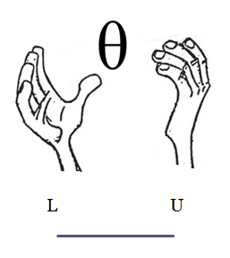

```{r setup, include=FALSE}
knitr::opts_chunk$set(echo = TRUE,comment = NA)
library(readr)
library(paquetepye)
# colores
c0="#0DA5A6" # VERDE CLARO
c1="#E77C00" # NARANJA
c2="#6666FF" # AZUL  
c3="#4CBFBA" # VERDE CLARO  
c4="#E09600" # AMARILLO  
c5="#BC2B6A" # MORADO  

Valle <- read_csv("data/VALLE.csv")
Muestra= Valle[sample(1:nrow(Valle),1000,replace=F),]


```


# **Guía de aprendizaje 4.2**

<div class="container-wrapper-genially" style="position: relative; min-height: 400px; max-width: 100%;"><video class="loader-genially" autoplay="autoplay" loop="loop" playsinline="playsInline" muted="muted" style="position: absolute;top: 45%;left: 50%;transform: translate(-50%, -50%);width: 80px;height: 80px;margin-bottom: 10%"><source src="https://static.genial.ly/resources/panel-loader-low.mp4" type="video/mp4" />Your browser does not support the video tag.</video><div id="5f1f835fc43a880d757f9161" class="genially-embed" style="margin: 0px auto; position: relative; height: auto; width: 100%;"></div></div><script>(function (d) { var js, id = "genially-embed-js", ref = d.getElementsByTagName("script")[0]; if (d.getElementById(id)) { return; } js = d.createElement("script"); js.id = id; js.async = true; js.src = "https://view.genial.ly/static/embed/embed.js"; ref.parentNode.insertBefore(js, ref); }(document));</script>

<br/><br/>

<br/><br/>

## **1. Introducción**

La inferencia estadística constituye una de las principales componentes de la metodologia estadistica, encaminados a generar procedimiento para el avance de la ciencia. Con ella se pueden generalizar los
resultados obtenidos en una muestra a toda la población, previo cumplimiento de supuestos establecidos por la estadística (llamada paramétrica) .

Antes de empezar es necesario entender los conceptos básicos como: población, censo, parámetro, muestra, muestreo, estimador, estimación, métodos de estimación, propiedades de los estimadores como la insesgadez, la eficiencia, la consistencia .Las distribuciones muestrales : normal, t-student, chi-cuadrado y f de Fisher. Todos trabajados y tratados en la unidad 4.1.

El siguiente documento te  oriente sobre los pasos a seguir para alcanzar el objetivo planteado

<br/><br/>

## **2. Objetivos de la unidad**

Al finalizar la unidad el estudiante estará en capacidad de IDENTIFICAR, CALCULAR, INTERPRETAR e INFERIR sobre un intervalo de confianza para estimadores de una y dos poblaciones,
que le permita seleccionar la mejor alternativa para la estimación de un parámetro poblacional, orientados a la toma de decisiones  informadas.

<br/><br/>

## **3. Duración**

La presente  unidad será desarrollada del 6 al 24 de octubre de 2021 . Ademas del material suministrado  contaran con el acompañamiento del profesor durante las sesiones de clase  y de manera asincrónica con  foro de actividades académicas. Los entegables para esta unidad podrán enviarse a través de la plataforma Brightspace hasta el  24 de octubre de 2021 

Para alcanzar los objetivos planteados se propone realizar las siguientes actividades

<br/><br/>

## **4. Cronograma de trabajo**


|Actividad      | Descripción                    | 
|:--------------|:-----------------------------  |
|**Actividad 1**    |Construir un **mapa mental** sobre intervalos de confianza elaborado **a mano**, el cual deberá ser entregado en formato pdf|
|Trabajo individual |  |
|Fecha          | 24 de octubre  de 2021 |
|Hora           | 23:59 hora local       |
|**Actividad 2**    |Resuelva las preguntas y problemas planteadas en  el  [**Taller 421**](https://github.com/dgonzalez80/pye2021.io/blob/main/talleres/Taller412.pdf) y entregue su solución  en formato  pdf en el enlace correspondiente de  Brightspace|
|Trabajo individual |  |
|Fecha          | 24 de octubre  de 2021 |
|Hora           | 23:59 hora local       |


## **5. Criterios de evaluación**

<br/><br/>

## **6. Entregables** 

|               |                              | 
|:--------------|:-----------------------------|
|Entregable 1   | Mapa mental sobre intervalos de confianza|
|Entregable 2   | Solucionario taller 421 de problemas sobre intervalos de confianza| 
|Fecha          | 24 de octubre  de 2021 |
|Hora           | 23:59 hora local       |

<br/><br/><br/><br/>

## **7. Presentaciones**

[**P-Intervalos de confianza**](https://github.com/dgonzalez80/pye2021.io/blob/main/talleres/P_IC.pdf)


<br/><br/><br/><br/>

# **Recursos**

<br/><br/>

## **Estimación por IC**




Un estimador por intervalo de confianza (IC) es una regla que especifica como usar las mediciones obtenidas en una muestra para calcular dos números que forman los extremos del intervalo que confiamos contenga al parámetro de interés $\theta$. Dependiendo del parámetro se utiliza en la construcción del IC las distribuciones muestrales:  $normal$ $estándar$ ($Z$), $t-Student$, $\chi^{2}$ o $F-Fisher$


<br/><br/><br/><br/>

## **Una población**

<br/><br/><br/>

### **Intervalos de confianza para la media, con varianza conocida** 

Partimos de dos valores que contiene el parámetro $\theta$

$$L_{I} \leq \theta \leq L_{S} $$

bajo el supuesto de que

$$Z=\frac{\bar{X}-\mu}{\sigma/\sqrt{n}} \sim N(0,1)$$

podemos construir el siguiente intervalo

$$P(L_{IC} \leq Z \leq L_{SC})=1-\alpha $$

donde $(1-\alpha)$ conforma el concepto de confianza, el cual difiere del concepto de probabilidad, en cuanto la confianza representa la proporción de intervalos que contienen el parámetro. Lo que significa que de 100 intervalos construidos a partir muestras aleatorias, $(1-\alpha)$% o más contendrán el parámetro. 

$$\begin{eqnarray*}
		P(-z_{\alpha/2} \leq Z \leq z_{\alpha/2})&=&1-\alpha \\
		P\Bigg(-z_{\alpha/2} \leq \frac{\bar{X}-\mu}{\sigma/\sqrt{n}} \leq z_{\alpha/2}\Bigg)&=&1-\alpha\\
		P\Bigg(\bar{X}-z_{\alpha/2}\frac{\sigma}{\sqrt{n}} \leq \mu \leq \bar{X}+z_{\alpha/2}\frac{\sigma}{\sqrt{n}}\Bigg)&=&1-\alpha \\
	\end{eqnarray*}$$
	
el intervalo de confianza para la media poblacional queda determinado por:

<div style="padding: 15px; border: 1px solid transparent; border-color: transparent; margin-bottom: 20px; border-radius: 4px; color: #000000; background-color: #FFFFFF ; border-color: #000000;">

$$IC_{\mu}: \bar{x} \pm z_{\alpha/2} \hspace{.1cm}\dfrac{\sigma}{\sqrt{n}} $$

Supuestos:
+ $X\sim N(\mu,\sigma^{2})$
+	varianza conocida

</div>
			
<br/><br/><br/>

### **Intervalo de confianza para la media, con varianza desconocida**
	
$$T=\dfrac{\bar{X}-\mu}{s/ \sqrt{n}}$$

se distribuye t student con $n-1$ grados de libertad y el intervalo se construye \\

$$\begin{eqnarray*}
		P\Big(-t_{\alpha/2} \leq T \leq t_{\alpha/2} \Big)&=&1-\alpha \\
		P\Big(-t_{\alpha/2} \leq \frac{\bar{X}-\mu}{s/\sqrt{n}} \leq t_{\alpha/2} \Big)&=&1-\alpha \\
		P\Bigg(\bar{X}-t_{\alpha/2} \dfrac{s}{\sqrt{n}} \leq \mu \leq \bar{X}+t_{\alpha/2}\dfrac{s}{\sqrt{n}}\Bigg)&=&1-\alpha \\
	\end{eqnarray*}$$

<div style="padding: 15px; border: 1px solid transparent; border-color: transparent; margin-bottom: 20px; border-radius: 4px; color: #000000; background-color: #FFFFFF ; border-color: #000000;">

$$IC_{\mu}: \bar{x} \pm t_{\alpha/2} \hspace{.1cm}\frac{s}{\sqrt{n}} $$
			
Supuestos:
+	$X\sim N(\mu,\sigma^{2})$
+ varianza desconocida

</div>

<br/><br/>

Cuando el tamaño de la muestra se considera grande (usualmente $n>30$) el estadístico T se aproxima a la distribución normal estandar, en este caso el intervalo de confianza se puede construir a a partir de:

<div style="padding: 15px; border: 1px solid transparent; border-color: transparent; margin-bottom: 20px; border-radius: 4px; color: #000000; background-color: #FFFFFF ; border-color: #000000;">

$$IC_{\mu}: \bar{x} \pm z_{\alpha/2} \hspace{.1cm}\dfrac{s}{\sqrt{n}} $$

Supuestos:

+ $X\sim N(\mu,\sigma^{2})$
+ varianza desconocida

</div>

<br/><br/>

|    |                                     |
|:--:|:------------------------------------|
| {width=120%} | Se registró el tiempo transcurrido entre la facturación y la recepción del pago, para una muestra de 100 clientes en una empresa. La media y la desviación estándar son respectivamente: 39.1 días y 17.3 días. Con el fin de establecer una medición de la calidad en el servicio, se requiere determinar una estimación del 95% para la media.|

<br/><br/>

**Solución** 

La estimación del tiempo que demora el pago de una factura es un valor de importancia tanto para empresarios como para proveedores, pues esta información se utiliza para la programación de gastos e ingresos. El problema nos suministra la siguiente información:

+ $\bar{x}=39.1$ días
+ $s=17.3$ días, lo que significa que se desconoce la varianza
+ $n=100$ que se considera grande
+ se requiere construir un IC del 95\% para $\mu$, que implica un valor del percentil $z=\pm 1.96$

$$\bar{x} \pm z_{\alpha/2} \frac{s}{\sqrt{n}} $$

$$39.1 \pm 1.96 \frac{17.3}{\sqrt{100}} $$

$$\Bigg(39.1 -1.96 \frac{17.3}{\sqrt{100}};39.1 + 1.96 \frac{17.3}{\sqrt{100}}\Bigg)$$

$$(35.71; 42.49 )$$

El tiempo promedio transcurrido entre la facturación y el pago en la empresa está entre 35.7 dias y 42.5 dias con una confianza del 95% 

<br/><br/><br/>

### **Tamaño de la muestra para estimar una media**

Uno de los problemas más frecuentes a los que nos enfrentamos es la determinación del tamaño de la muestra para realizar una estimación de la media que garantice una confianza del $(1-\alpha)\%$

$$P\Bigg(-z_{\alpha/2}\frac{\sigma}{\sqrt{n}} \leq \bar{X}-\mu \leq z_{\alpha/2}\frac{\sigma}{\sqrt{n}}\Bigg)=1-\alpha$$

Para construirlo partimos del supuesto que podemos tolerar un error de muestreo
$$e = \vert\bar{X}-\mu\vert \leq z_{\alpha/2}\frac{\sigma}{\sqrt{n}}$$

y que deseamos una con fiabilidad del $(1-\alpha)\%$.

Entonce podemos tener la confianza del $(1-\alpha)\%$ de que el error no exceda $z_{\alpha/2} \frac{\sigma}{\sqrt{n}}$ 	de la siguiente igualdad despejamos $n$

$$e= z_{\alpha/2} \frac{\sigma}{\sqrt{n}}$$

$$e^{2}= z_{\alpha/2}^{2} \frac{\sigma^{2}}{n}$$

$$n = \displaystyle\frac{z_{\alpha/2}^{2}\sigma^{2}}{e^{2}}$$
			
|    |                                     |
|:--:|:------------------------------------|
| {width=120%} | Se desea estimar la media de las personas que han fallecido por Covid en Colombia, con una confianza del 98% y un error de muestro de 1 año. ¿Qué tamaño deberá tener la muestra para cumplir con estas condiciones?

<br/><br/>

**Solución**

Información:
Confianza  : 98%  ($z_{\alpha/2}$)
error de muestro : 1 año ($|\bar{x}-\mu| < e$)
varianza : no tenemos la varianza y por tanto tenemos 3 alternativas :(1) mediante un estudio previo similar obtener el valor de la varianza,  (2) realizar una muestra piloto  que puede ser de n=40 y con ella estimar la varianza $s^{2}$, (3) preguntando a un experto sobre el valor del mínimo y el máximo de la variable se puede estimar la desviación estándar ($s=\frac{\max\{x\}+\min\{x\}}{2}$)   

```{r}
# varianza
s2.edad=var(Muestra$edad)
# confianza
alpha=1-.98
za1.2=qnorm(1-alpha/2)
# error de nuestre
e=1 # año

# tamaño de muestra
n=(za1.2)^2*(s2.edad)/(e^2)

round(n,0)  # redondeo a entero
```
```{r}
library(paquetepye)
nmu(qnorm(0.99),s2.edad,1)
```


<br/><br/><br/>

### **Intervalos de confianza para la proporción** 

La construcción del intervalo de confianza para una proporción es similar al proceso realizado en la construcción de la media, bajo el supuesto de $np>10$ que permite la aproximación a una distribución normal

$$\widehat{p} \sim N\Big(p, \frac{p(1-p)}{n}\Big)$$

por tanto

$$\Bigg[\widehat{p}-z_{\alpha/2}\sqrt{\frac{\widehat{p}\hspace{.1cm}(1-\widehat{p}}{n}} \hspace{.2cm};\hspace{.2cm} \widehat{p}+z_{\alpha/2}\sqrt{\frac{\widehat{p}\hspace{.1cm}(1-\widehat{p}}{n}} \Bigg]$$

<div style="padding: 15px; border: 1px solid transparent; border-color: transparent; margin-bottom: 20px; border-radius: 4px; color: #000000; background-color: #FFFFFF ; border-color: #000000;">

$$IC_{p}: \widehat{p} \pm z_{\alpha/2} \hspace{.1cm}\sqrt{\frac{\widehat{p}(1-\widehat{p})}{n}}$$

Supuesto:
+ $np>5$ o $n(1-p)>5$

</div>

<br/><br/>		

|    |                                     |
|:--:|:------------------------------------|
| {width=120%} | En una encuesta aleatoria realizada a 500 familias de la ciudad que poseen televisión por cable,  se encuentra que 340 tienen suscripción a HBO.  Calcule un intervalo de confianza para la proporción de familias que tienen suscripción a HBO en la ciudad. Interprete el resultado obtenido.

<br/><br/>

**Solución** 

```{r}
prop.test(340,500)$conf.int
```
De acuerdo con el resultado anterior, se puede afirmar con una confianza del 95% que entre el 63.7% y el 72.0% de las familias tienen una suscripción a HBO


<br/><br/><br/>


### **Tamaño de muestra para la estimación de una proporción**

$$n=\dfrac{z_{\alpha/2}^{2}\hspace{.3cm} p(1-p)}{e^{2}}$$
Donde :

+ $z_{\alpha/2}$ : representa el percentil de la distribución normal relacionado con la confianza

+ $p$ : la proporción y p(1-p) la varianza.  Para conocerla se puede hacer uso de una estimación a través de una prueba piloto, la varianza máxima que ocurre cuando $p=0.5$  ($pq=0.25$)

+ $e$ : el error de muestreo que representa la tolerancia al erro que tiene el investigador ($|\widehat{p}-p|<e$).

|    |                                     |
|:--:|:------------------------------------|
| {width=120%} | Una empresa requiere realizar un estudio para establecer las proporción de fallas diarias que presta la empresa al presentar un servicio . El gerente encargado del estudio decide que la tasa de error máximo tolerable debe ser del 5% y el nivel de confianza del 99% . Con esta información una firma de consultora presenta una propuesta a la empresa por valor de \$110.2 millones para realizar el estudio y justifica su costo así: Por costos administrativos y de logística corresponde un valor de \$55.4 millones y cada encuesta realizada tiene un valor de $50 mil pesos. El Director de la empresa le encarga a usted revisar la información darle un concepto sobre la propuesta realizada por la firma de auditores a la mayor brevedad

<br/><br/>

**Solución**

Información de la solicitud: 
+ Objetivo : Analizar la propuesta realizada por la firma externa
  + Valor total : 110.2 millones
  + Valor costos administrativos y logísticos : 25.4 millones
  + Valor encuestas : 110.2-55.4 = 54.8 millones
  + Número de encuestas propuestas a realizar : 1096
  
```{r}
library(paquetepye)
np(qnorm(0.995),0.5,0.05)
```
De acuerdo con la información sumunistrada por la empresa, el tamaño de muestra apropiado para la estimación de la proporción, suponiendo varianza máxima es de $n=664$, por tal razón la propuesta realiza por la empresa consultora excede en   432 encuesta que presentan un sobre costo de \$21.6 millones
  
<br/><br/><br/>

### **Intervalos de confianza para la varianza** 

En el caso del intervalo de confianza para la varianza se parte de la premisa de que la variable

$$\frac{(n-1)S^{2}}{\sigma^{2}} \sim \chi^{2}_{v=n-1}$$

a partir de ella se puede construir

$$P\Bigg(\chi^{2}_{1-\alpha/2} \leq \frac{(n-1)S^{2}}{\sigma^{2}} \leq \chi^{2}_{\alpha/2} \Bigg)=1-\alpha$$

al invertir esta ecuaciones tenemos
$$P\Bigg(\frac{1}{\chi^{2}_{1-\alpha/2}} \geq \frac{\sigma^{2}}{(n-1)S^{2}} \geq \frac{1}{\chi^{2}_{\alpha/2}} \Bigg)=1-\alpha$$

finalmente tenemos

$$P\Bigg( \frac{(n-1)S^{2}}{\chi^{2}_{\alpha/2}} \leq \sigma^{2} \leq \frac{(n-1)S^{2}}{\chi^{2}_{1-\alpha/2}} \Bigg)=1-\alpha$$
	<div style="padding: 15px; border: 1px solid transparent; border-color: transparent; margin-bottom: 20px; border-radius: 4px; color: #000000; background-color: #FFFFFF ; border-color: #000000;">
	

$$IC_{\sigma^{2}}: \Bigg( \displaystyle\frac{(n-1)S^{2}}{\chi^{2}_{1-\alpha/2 ; v=n-1}} ;\displaystyle\frac{(n-1)S^{2}}{\chi^{2}_{\alpha/2; v=n-1}} \Bigg)$$

Supuestos:
$X\sim N(\mu,\sigma^{2})$

</div>

<br/><br/>

|    |                                     |
|:--:|:------------------------------------|
| {width=120%} | Se quiere estimar un intervalo de confianza del 95% para la desviación estandar de los precios de los últimos 22 dias (sep.10.2021 a oct.7.2021, tomados de :Investing.com)

<br/><br/>

```{r}
ecopetrol=c(2810, 2810,	2825, 2769, 2734, 2706,	2699, 2671, 2550, 2590,	2570, 2529,	2520, 2566,	2615, 2620, 2550, 2572,	2553, 2570,	2593, 2606)	

ic.var=function(x){
  n=length(x)
  per.chi2=qchisq(c(0.975, 0.025), n-1)   # percentiles chi-cuadrado para 95% de confianza
  icvar=(n-1)*var(x)/per.chi2
  return(icvar)
}
ic.var(ecopetrol)        # intervalo de confianza para la varianza
sqrt(ic.var(ecopetrol))  # intervalo de confianza para la desviación estandar
```
<br/><br/>

Se estima con una confianza del 95% que la desviación estándar del precio de las acciones de Ecopetrol está entre $ 75.7 y $ 140.0 

<br/><br/><br/><br/>

## **Dos poblaciones**

<br/><br/>

### **Estimación de intervalos de confianza para comparación de dos poblaciones**

Cuando se compraran dos poblaciones se puede estar interesado en la diferencia de medias, diferencia de proporciones o la razón de varianzas. Es necesario distinguir cuando se trata de diferencia de medias pareadas o diferencia para poblaciones independientes.\\

<br/><br/><br/>

### **Diferencia de medias - pareadas**

Se consideran muestras pareadas cuando existen una fuerte dependencia entre pares de observaciones de dos poblaciones. Es el caso de experimentos donde se observan individuos en dos momentos diferentes de tiempo, por ejemplo estudiantes a los que se les realiza un examen de entrada y un examen de salida. En este caso se compara la evolución de cada individuo consigo mismo conformando parejas de mediciones.

<div style="padding: 15px; border: 1px solid transparent; border-color: transparent; margin-bottom: 20px; border-radius: 4px; color: #000000; background-color: #FFFFFF ; border-color: #000000;">

$$IC_{d=\bar{x}_{1}-\bar{x}_{2}}: \bar{d} \pm t_{\alpha/2} \frac{s_{d}}{\sqrt{n}}$$

donde $d_{i}=x_{1i}-x_{2i}$ y $s_{d}$ es la desviación estándar de las diferencias 
$d_{i}=x_{1i}-x_{2i}$ 

</div>

<br/><br/>

|    |                                     |
|:--:|:------------------------------------|
| {width=120%} | Se afirma que una persona podrá reducir su peso en un periodo de dos semanas un promedio de 4.5 kilogramos con una nueva dieta. Los pesos de 7 mujeres de siguieron  esta dieta se registraron antes y después de un periodo de dos semanas.  |
|| peso.ant=c(58.2, 60.3, 61.3, 69.0, 64.0, 62.6, 56.7)|
||pes.des=c(60.0, 54.9, 58.1, 62.1, 58.5, 59.9, 54.4)|
|| Pruebe la afirmación sobre la dieta calculando un intervalo de confianza del 95% para la diferencia de medias . Suponga que las diferencias de los pesos se distribuyen aproximadamente normal. |

```{r}
peso.ant=c(58.2, 60.3, 61.3, 69.0, 64.0, 62.6, 56.7)
peso.des=c(60.0, 54.9, 58.1, 62.1, 58.5, 59.9, 54.4)

t.test(peso.ant,peso.des,  
       paired = TRUE,        # pareadas  
       conf.level = 0.95)$conf.int    # 

```
<br/><br/>

Se puede afirmar que la diferencia entre los promedios de los peso antes y después, está entre $(0.80 6.11)$ kilogramos con una confianza del 95%. Por el momento diremos que la dieta generó una reducción en el peso dado que los dos valores del intervalo son positivos.  La veracidad de la afirmación, la retomaremos en la unidad 4.3 donde se realiza una prueba de hipótesis.  

<br/><br/><br/>

### **Diferencia de medias poblaciones independientes** 

<br/><br/>

<div style="padding: 15px; border: 1px solid transparent; border-color: transparent; margin-bottom: 20px; border-radius: 4px; color: #000000; background-color: #FFFFFF ; border-color: #000000;">


**Caso1** :Supone varianzas iguales y desconocidas

$$(\bar{x}_{1}-\bar{x}_{2})\pm t_{\alpha/2} \hspace{.2cm}s_{p} \sqrt{\frac{1}{n_{1}}+\frac{1}{n_{2}}}$$

donde $s_{p}^{2}$ es la varianza común

$$s_{p}^{2}=\frac{(n_{1}-1)s_{1}^{2}+(n_{2}-1)s_{2}^{2}}{n_{1}+n_{2}-2}$$

y $t_{\alpha/2}$ se distribuye t-student con $v=n_{1}+n_{2}-2$ grados de libertad

Supuestos: 
+	$X_{1}$ y $X_{2}$ son variables aleatorias independientes con distribución normal
+ $X_{1}$ y $X_{2}$ tienen varianzas iguales pero desconocidas

</div>

<br/><br/>

|    |                                     |
|:--:|:------------------------------------|
| {width=120%} | A seis ingenieros que trabajan para el estado se les solicito realizar un pronostico la tasa de inflación para el año entrante. La misma petición se le realizo a ocho especialistas en finanzas que trabajan para el sector privado. Los pronósticos entregado fueron: |
|    |ingenieros :  4.2%, 5.1%, 3.9%, 4.7%, 4.8%, 5.8% |  
|    |especialistas en finanzas:  5.7%, 6.1%, 5.2%, 4.9%, 4.6%, 4.5%, 5.2%, 5.5% | 
|    |¿Están los especialistas (ingenieros y financieros) realizando pronósticos similares? . Suponga que los pronósticos realizados tienen distribución normal. Construye un intervalo de confianza para la diferencia de los promedios realizados por los ingenieros y los especializadas en finanzas del 95%. Concluya a partir de los resultados. |

<br/><br/>

**Solución**:

En este caso se trata de una diferencia de medias para grupos independientes, por lo cual es necesario conocer como es la relación entre sus varianzas (iguales o diferentes) y de este modo ajustar el procedimiento.


```{r}
inf.ing=c(4.2, 5.1, 3.9, 4.7, 4.8, 5.8)
inf.fin=c(5.7, 6.1, 5.2, 4.9, 4.6, 4.5, 5.2, 5.5)
par(mfrow = c(1, 2))
boxplot(inf.ing, las=1, col=c2, ylim=c(3,6)); grid()
boxplot(inf.fin, las=1, col=c3, ylim=c(3,6)); grid()

var.test(inf.ing, inf.fin)$conf.int
t.test(inf.ing, inf.fin,  paired = FALSE,   # grupos independientes 
       var.equal = TRUE,                    # varianzas iguales
       conf.level = 0.95)$conf.int 
```
Al realizar la comparación de las varianzas se puede observar que el intervalo contiene a 1, por lo cual asumiremos que las varianza son iguales (este procedimiento se debe hacer mediante pruebas de hipótesis que ser verán en la Unidad 4.3). Utilizaremos la función de R `var.test(x, ...)` para establecer si las varianzas son iguales o diferentes y luego la función `t.test(x,y, ...)$conf.int` para calcular el intervalo.

La diferencia entre la estimación promedio de la inflación pronosticada por lo ingenieros y la realizada por los especialistas en finanzas, con una confianza del 95%, está entre $(-1.1704541;  0.2454541 )$, lo cual nos indica que sus estimaciones promedio son similares


<br/><br/>

<div style="padding: 15px; border: 1px solid transparent; border-color: transparent; margin-bottom: 20px; border-radius: 4px; color: #000000; background-color: #FFFFFF ; border-color: #000000;">


**Caso2** : Supone varianzas diferentes, pero desconocidas 

En el caso tenemos
			
$$(\bar{x}_{1}-\bar{x}_{2})\pm t_{\alpha/2} \sqrt{\frac{s_{1}^{2}}{n_{1}}+\frac{s_{2}^{2}}{n_{2}}}$$

donde los grados de libertad de t se aproximan a

$$v=\frac{(s_{1}^{2}/n_{1}+s_{2}^{2}/n_{2})^{2}}{\Big[(s_{1}^{2}/n_{1})^{2}/(n_{1}-1)\Big]+\Big[(s_{2}^{2}/n_{2})^{2}/(n_{2}-1)\Big]}$$
</div>

<br/><br/>

|    |                                     |
|:--:|:------------------------------------|
| {width=120%} | Supongamos el mismo caso del ejemplo anterior, pero con los siguientes datos :   
|    | ingenieros :  2.2%, 1.1%, 3.9%, 5.9%, 4.5%, 5.1%    |
|    | especialistas en finanzas:  3.7%, 2.1%, 2.2%, 3.9%, 3.6%, 3.5%, 3.2%, 3.5% |

<br/><br/>

```{r}
inf.ing=c(2.2, 1.1, 3.9, 5.9, 4.5, 5.1)
inf.fin=c(3.7, 2.1, 2.2, 3.9, 3.6, 3.5, 3.2, 3.5)
par(mfrow = c(1, 2))
boxplot(inf.ing, las=1, col=c2, ylim=c(1,6)); grid()
boxplot(inf.fin, las=1, col=c3, ylim=c(1,6)); grid()

var.test(inf.ing, inf.fin)$conf.int
t.test(inf.ing, inf.fin,  paired = FALSE,   # grupos independientes 
       var.equal = FALSE,                    # varianzas diferentes
       conf.level = 0.95)$conf.int 

# resumen pronóstico ingenieros
summary(inf.ing)

# resumen pronóstico especialistas en finanzas
summary(inf.fin)
```
En este caso las varianzas son diferentes, por lo que se debe ajustar la función a : `var.equal = FALSE,`.  Los resultados indican que existen diferencias entre los promedios estimados por los ingenieros y los especialistas en finanzas. Siendo $\mu_{ing} < \mu_{fin}$ 

<br/><br/><br/>

<div style="padding: 15px; border: 1px solid transparent; border-color: transparent; margin-bottom: 20px; border-radius: 4px; 
                     color: #000000; 
                     background-color: #FFFFFF ; 
                     border-color: #000000;">

{width=10%}
En cualquiera de los casos los resultados pueden generar que intervalo sea de la forma:

|       |                                                                      |
|:------|:---------------------------------------------------------------------|
|$(-,-)$| los dos limites que conforman el IC son negativos. De este resultado se puede concluir que $\mu_{1}<\mu_{2}$ |
|$(-,+)$| el limite inferior es negativo y el superior es positivo. Este intervalo contiene la posibilidad de $\mu_{1}=\mu_{2}$ |
|$(+,+)$| los dos limites son positivos , entonces podemos decir que $\mu_{1}>\mu_{2}$ |

</div>
	

	
<br/><br/><br/>

### **Diferencia de proporciones**

<br/><br/>

<div style="padding: 15px; border: 1px solid transparent; border-color: transparent; margin-bottom: 20px; border-radius: 4px; color: #000000; background-color: #FFFFFF ; border-color: #000000;">

$$(\widehat{p_{1}}-\widehat{p_{2}}) \pm z_{\alpha/2} \sqrt{\frac{\widehat{p_{1}}(1-\widehat{p_{1}})}{n_{1}}+\frac{\widehat{p_{2}}(1-\widehat{p_{2}})}{n_{2}}}$$
</div>

<br/><br/>


|    |                                     |
|:--:|:------------------------------------|
| {width=100%} |En una muestra de 200 clientes, el 20% indica preferencia por tamaño especial de pizza. Con posterioridad a una campaña publicitaria realizada en radio y televisión promoviendo dicho producto, se selecciono una muestra de igual tamaño. En esta ultima muestra el 22% de los clientes indico preferencia por el producto. De acuerdo con estos resultados calcule un intervalo de confianza del 95% para la diferencia de proporciones. De acuerdo a los resultados obtenidos, podría afirmarse que la campaña publicitaria fue efectiva? |

<br/><br/>

**Solución**

En este caso se trata de la comparación de dos proporciones (proporción de clientes que prefieren el tamaño especial dentro de los clientes de la pizzería - $p_{2}$ comparada con la proporción de los clientes de la misma pizzería pero después de realizada la campaña publicitaria - $p_{2}$)
	
Información suministrada:
 	
+ $n_{1}=200$(numero de clientes encuestados sobre sus preferencias antes de realizar la campaña publicitaria
+ $\widehat{p}_{1}=0.20$ proporción muestral de clientes que prefieren el tamaño especial de pizza antes de la campaña publicitaria
+ $n_{2}=200$(numero de clientes encuestados sobre sus preferencias después de realizada la campaña publicitaria
+ $\widehat{p}_{2}=0.22$ proporción muestral de clientes que prefieren el tamaño especial de pizza después de realizadala campaña publicitaria

En ambos casos los tamaños de muestra se consideran grandes, permitiendo transformar la diferencia de proporciones en una variable z con distribución normal estándar

$$(0.20-0.22) \pm 1.96 \sqrt{\frac{0.20*(1-0.20)}{200}+\frac{0.22*(1-0.22)}{200}}$$

$$(-0.0998 ; -0.0598)$$

El intervalo estimado se lee: La diferencia entre la proporción de clientes que prefieren el tamaño especial de pizza antes de la realizar la campaña publicitaria y la proporción de clientes que prefieren este mismo tamaño, después de realizada la campaña publicitaria esta entre -0.0998 y -0.059, con una confianza del 95%. Estos resultados indican que $p_{1}-p_{2}<0$ o también que $p_{1}<p_{2}$, lo cual quiere decir que la proporción de clientes con esta preferencia aumento después de haber realizado la campaña publicitaria.


<br/><br/>
```{r}
prop.test(c(40,44),c(200,200))$conf.int
```
El resultado obtenido por R es levemente diferente, debido a ajuste en la formula propuesto por R.G. Newcpmbe (1998), e incorporado en la función de R


<br/><br/>

<div style="padding: 15px; border: 1px solid transparent; border-color: transparent; margin-bottom: 20px; border-radius: 4px; 
                     color: #000000; 
                     background-color: #FFFFFF ; 
                     border-color: #000000;">

{width=10%}
En cualquiera de los casos los resultados pueden generar que intervalo sea de la forma:

|        |                                                                      |
|:-------|:---------------------------------------------------------------------|
|$(-,-)$ | los dos limites que conforman el IC son negativos. De este resultado se puede concluir que $p_{1}<p_{2}$ |
|$(-,+)$ | el limite inferior es negativo y el superior es positivo. Este intervalo contiene la posibilidad de $p_{1}=p_{2}$ |
|$(+,+)$ | los dos limites son positivos , entonces podemos decir que $p_{1}>p_{2}$ |

</div>


<br/><br/><br/>

### **Comparación de varianzas** 

<br/><br/>

La comparación de varianzas se realiza con relación al valor que tome la razón de sus valores $\sigma^{2}_{1}/\sigma^{2}_{2}$. Observe que si esta relación es uno, indicaría que las varianzas son iguales. Por el contrario si esta razón es muy grande indicaría que $\sigma^{2}_{1}>\sigma^{2}_{2}$ y si su valor es muy cercano a cero indicaría lo contrario.

El uso de esta comparación esta relacionado con supuestos necesarios para la comparación de medias independientes, análisis de varianza y diseños experimentales.
En este caso se emplea en su construcción la distribución F de Fischer

<div style="padding: 15px; border: 1px solid transparent; border-color: transparent; margin-bottom: 20px; border-radius: 4px; color: #000000; background-color: #FFFFFF ; border-color: #000000;">


$$\Bigg(\dfrac{s^{2}_{1}}{s^{2}_{2}} \dfrac{1}{f_{1-\alpha/2}(v_{1}v_{2})}; \dfrac{s^{2}_{1}}{s^{2}_{2}} \dfrac{1}{f_{\alpha/2}(v_{1}v_{2})}\Bigg)$$

</div>

<br/><br/><br/>

## **Intervalos no paramétricos**

Cuando se extrae una muestra de una población que no es normal y se requiere estimar un intervalo de confianza se pueden utilizar los métodos de estimación **bootstrap**. Existen varias versiones del método. Una presentación básica del método se describe a continuación:

El artículo de In-use Emissions from Heavy Duty Dissel Vehicles (J.Yanowitz, 2001) presenta las mediciones de eficiencia de combustible en millas/galón de una muestra de siete camiones. Los datos obtenidos son los siguientes: 7.69, 4.97, 4.56, 6.49, 4.34, 6.24 y 4.45. Se supone que es una muestra aleatoria de camiones y que se desea construir un intervalo de confianza del 95 % para la media  de la eficiencia de combustible de esta población. No se tiene información de la distribución de los datos. El método bootstrap permite construir intervalos de confianza del 95 % - Para ilustrar el método suponga que coloca los valores de la muestra en una caja y extrae uno al azar. Este correspondería al primer valor de la muestra bootstrap $X^{∗}_{1}$. Después de anotado el valor se regresa $X^{∗}_{1}$  a la caja y se extrae el valor $X^{∗}_{2}$ , regresandolo nuevamente. Este procedimiento se repite hasta completar una muestra de tamaño $n$, $X^{∗}_{1}$,$X^{∗}_{2}$,$X^{∗}_{2}$,\cdot $X^{∗}_{n}$, conformando la muestra bootstrap.

Es necesario extraer un gran número de muestras (suponga k = 1000). Para cada una de las muestra bootstrap obtenidas se calcula la media $\bar{X^{∗}_{i}}$, obteniéndose un valor para cada muestra. El intervalo de confianza queda conformado por los percentiles $P_{2.5}$ y $P_{97.5}$. Existen dos métodos para estimarlo:

|        |                                              |
|:-------|:--------------------------------------------:|
|Método 1| $(P_{2.5}; P_{97.5})$                        |
|Método 2| $(2\bar{X} − P_{97.5}; 2\bar{X} − P_{2.5})$  |

Construya el intervalo de confianza por los dos métodos y compare los resultados obtenidos.
Tomado de Navidi(2006)

<br/><br/>

```{r}
x=c( 7.69, 4.97, 4.56, 6.49, 4.34, 6.24, 4.45) # datos muestra
boot=sample(x,7000,replace=TRUE)   # se extraen n x m muestras
b=matrix(boot,nrow=1000,ncol=7)    # se construye matriz de n x m 
mx=apply(b,1,mean)                 # se calculan m medias por fila
```

<br/><br/>

```{r}
ic1=quantile(mx, probs=c(0.025, 0.975)) # se calcula IC método 1
ic1
```

<br/><br/>

```{r}
ic2=c(2*mean(mx)-ic1[2], 2*mean(mx)-ic1[1]) # se calcula IC método 2
ic2
```


<br/><br/>

```{r}
hist(mx, las=1, main=" ", ylab = " ", xlab = " ", col=c3)
abline(v=ic1, col="red")
abline(v=ic2, col="blue")
```

Como se puede observar, el segundo estimador corrige el intervalo

<br/><br/><br/><br/>

# **Conceptos**

<br/><br/>

## **Confianza**

Para explicar el concepto de confianza se simula 100 intervalos para la estimación de una media con valor de $\mu=100$, como se ve en la gráfica no todos los intervalos (representados por una línea) contienen el valor del parámetro, solo de color negro lo contiene.

Al contarlos se encuentra que 35 no lo contienen (de color rojo), mientras que  65 lo contiene, por tanto este procedimiento tiene una confianza del 65% de contener el valor de $\mu=100$


Este valor se integra al concepto de intervalo de confianza mediante el término $1-\alpha$, por defecto los programas utilizan un nivel de confianza del 95% ( $1-\alpha =0.95$) y se de nota por : $IC_{\mu; 1-\alpha=0.95}$ 

<br/><br/><br/>

## **Grados de libertad**

Una definicion de grados de libertad encontrada: [¿Qué son los llamados “grados de libertad”?](https://psicologiaexperimental.files.wordpress.com/2010/04/grados-de-libertad.pdf) escrito por : Roberto Behar y Pere Grima, los define como el número de dimensiones en los que se puede mover un valor por asignar. En el caso de una variable X, solo tenemos un grado de libertad para asignar este valor. En el caso de tener una variable bidimensional (X,Y), al momento de asignar valores a esta variable tenemos dos dimensiones = dos grados de libertad. Sin embargo que colocamos la restricción de que X+Y=10, perdemos un grado de libertad, dado que al colocar el primero, el segundo queda asignado por la restricción.

En el caso de una muestra de tamaño $n$ que se puede representar como ($X_{1}$,$X_{2}$,$X_{3}$,$X_{4}$,$X_{5}$ \docs, $X_{n}$), lo cual está asociado con un espacio de $n$ dimensiones. En el caso de conocer el valor de $\bar{X}$, los grados de libertad se reducen a $n-1$

Como ejemplo supongamos que tenemos una muestras de datos formado por : $X_{1}$,$X_{2}$,$X_{3}$,$X_{4}$,$X_{5}$. Con media $\mu$. En este caso tendremos $n-1$ grados de libertad dado que conocemos el valor de la media en este caso. Es decir que tendríamos libertad de asignar 4 de los valores de la muestra, dado que el último estaría determinado por el valor de la media.

<br/><br/><br/><br/>

# **Formulario**

|   |**parámetro** |**Estimador por IC **                                                            | **Supuestos** |
|:-:|:------------:|:-------------------------------------------------------------------------------:|:---------------------:|
|(1)| $\mu$         |$\bar{x} \pm z_{\alpha/2} \hspace{.1cm}\dfrac{\sigma}{\sqrt{n}}$                 |$X\sim norm(\mu, \sigma^{2})$,$\sigma^{2}$ conocida           |
|(2)|               |$\bar{x} \pm z_{\alpha/2} \hspace{.1cm}\dfrac{s}{\sqrt{n}}$                      |$n>>$, TCL|
|(3)|              |$\bar{x} \pm t_{\frac{\alpha}{2};v=n-1} \hspace{.1cm}\dfrac{s}{\sqrt{n}}$        |$X\sim norm(\mu, \sigma^{2})$, $\sigma^{2}$ desconocida|
|(4)|$p$           |$\widehat{p}\pm z_{\frac{\alpha}{2}} \sqrt{\frac{\widehat{p}(1-\widehat{p})}{n}}$| $n>>$|
|(5) |$\sigma^{2}$  |$\Bigg( \dfrac{(n-1)s^{2}}{\chi^{2}_{1-\alpha/2}} ;\dfrac{(n-1)s^{2}}{\chi^{2}_{\alpha/2}} \Bigg)$ | $X\sim norm(\mu, \sigma^{2})$|
|(6) |$\mu_{1}-\mu_{2}$|$\bar{d} \pm t_{\alpha/2}\dfrac{s_{d}}{\sqrt{n}}$    |Grupos pareados $d={x}_{1}-x_{2}$,$X_{1}\sim norm(\mu_{1}, \sigma^{2}_{1})$,$X_{2}\sim norm(\mu_{2}, \sigma^{2}_{2})$| |              
|(7) |              | $(\bar{x_{1}}-\bar{x_{2}})\pm t_{\alpha/2} \hspace{.2cm}s_{p} \sqrt{\frac{1}{n_{1}}+\frac{1}{n_{2}}}$ | Grupos independientes,$X_{1}\sim norm(\mu_{1}, \sigma^{2}_{1})$,$X_{2}\sim norm(\mu_{2}, \sigma^{2}_{2})$, varianzas iguales|
| |                 | donde $s_{p}^{2}=\dfrac{(n_{1}-1)s_{1}^{2}+(n_{2}-1)s_{2}^{2}}{n_{1}+n_{2}-2}$ y $v=n_{1}+n_{2}-2$ | |
|(8) |              |$(\bar{x_{1}}-\bar{x_{2}})\pm t_{\alpha/2, v^{*}} \sqrt{\frac{s_{1}^{2}}{n_{1}}+\frac{s_{2}^{2}}{n_{2}}}$ |Grupos independientes,$X_{1}\sim norm(\mu_{1}$, $\sigma^{2}_{1})$, $X_{2}\sim norm(\mu_{2}, \sigma_{2}^{2})$, varianzas diferentes |
| ||donde $v^{*}=\frac{(s_{1}^{2}/n_{1}+s_{2}^{2}/n_{2})^{2}}{\Big[(s_{1}^{2}/n_{1})^{2}/(n_{1}-1)\Big]+\Big[(s_{2}^{2}/n_{2})^{2}/(n_{2}-1)\Big]}$||
|(9)| $p_{1}-p_{2}$|$(\widehat{p_{1}}-\widehat{p_{2}})\pm z_{\alpha/2} \sqrt{\dfrac{\widehat{p_{1}}(1-\widehat{p_{1}})}{n_{1}}+\dfrac{\widehat{p_{2}}(1-\widehat{p_{2}})}{n_{2}}}$|$n_{1}>>$, $n_{2}>>$|
|(10)| $\dfrac{\sigma^{2}_{1}}{\sigma^{2}_{2}}$ |$\Bigg(\dfrac{s^{2}_{1}}{s^{2}_{2}} \dfrac{1}{f_{1-\alpha/2}(v_{1}v_{2})}; \dfrac{s^{2}_{1}}{s^{2}_{2}} \dfrac{1}{f_{\alpha/2}(v_{1}v_{2})}\Bigg)$|$X_{1}\sim norm(\mu_{1}$, $\sigma^{2}_{1})$, $X_{2}\sim norm(\mu_{2}, \sigma_{2}^{2})$| 

<br/><br/><br/>

## **Tamaño de muestra**                                                            

<br/><br/>

### $\mu$  

$$n=\dfrac{z_{\alpha/2}^{2}\hspace{.3cm} \sigma^{2}}{e^{2}}$$                   
Donde: 

+ $z_{\alpha/2}$ : Percentil($1-\alpha/2$) normal;

+ $\sigma^{2}$: varianza, que se puede obtener mediante prueba piloto, conocer de un estudio anterior, o estimar mediante consulta a un experto : $\widehat{\sigma}  \cong  (\max\{x\}-\min\{x\})/4$ y 

+ $e$ : error de muestreo $(|\bar{x}-\mu|< e)$.    

<br/><br/>

### $p$

$$n=\dfrac{z_{\alpha/2}^{2}\hspace{.3cm} pq }{e^{2}}$$

Donde: 

+ $z_{\alpha/2}$ : Percentil($1-\alpha/2$) normal; 

+ $pq$: varianza, que se puede obtener mediante prueba piloto, conocer de un estudio anterior, o se puede asumir como varianza máxima $pq=0.5(1-0.5)=0.25$ 

+ $e$ : error de muestreo $(|\widehat{p}-p|< e)$.     

<br/><br/><br/>

En todos los casos si n/N>0.05, debes de corregir por un factor de población finita

$$n = \dfrac{N n_{0}}{N+n_{0}-1}$$

<br/><br/><br/><br/>


<div style="padding: 15px; border: 1px solid transparent; border-color: transparent; margin-bottom: 20px; border-radius: 4px; 
                     color: #000000; 
                     background-color: #FFFFFF ; 
                     border-color: #000000;">

{width=10%}

| parámetro        | código R                                       |
|:----------------:|:-----------------------------------------------|
|$\mu$             | `t.test(x, coef.level= 1−a)$conf.int`          |
|$p$               | `prop.test(x,n, conf.level=0.95)$conf.int`          |
|$\mu_{1}-\mu_{2}$ | `t.test(datos1,datos2, paired=T)$conf.int`              |
|                  | `t.test(datos1 datos2, var.equal=T)$conf.int`           |
|                  | `t.test(datos1 datos2, var.equal=F)$conf.int`           |
|$p_{1} − p_{2}$   | `prop.test(c(x1,x2), c(n1,n2))$conf.int`                |
|$\dfrac{\sigma^{2_{1}}}{\sigma^{2}_{2}}$|`var.test(datos1 datos2)$conf.int` |
|                  | `install.packages("devtools")`                          |
|                  | `devtools::install_github("dgonzalez80/paquetepye")`    |
|                  |  `library(paquetepye)`                                   |
|                  | `nmu(1.96,345,2)     # nmu(z,sigma2,error)`               |
|                  | `np(1.96,0.5,0.05) # np(z,prob,error)`                  |
|                  | `no(385,2000)   #  n0(n,N)`                          |


</div>


<br/><br/><br/><br/>


# **Video**


<iframe width="560" height="315" src="https://www.youtube.com/embed/5y7MJiPXIjw" title="YouTube video player" frameborder="0" allow="accelerometer; autoplay; clipboard-write; encrypted-media; gyroscope; picture-in-picture" allowfullscreen></iframe>

<br/><br/><br/><br/>

# **Tutorial**

<br/><br/>

El siguiente código permite la activación de tutorial 
<br/><br/>

```{r eval=FALSE}
install.packages("learnr") # solo una vez
install.packages('remotes')  # solo una vez
library(remotes) # solo una vez
install_github("dgonzalez80/paquetepye", force = TRUE) # solo una vez
learnr::run_tutorial("Taller_Intervalos", "paquetepye")
```


