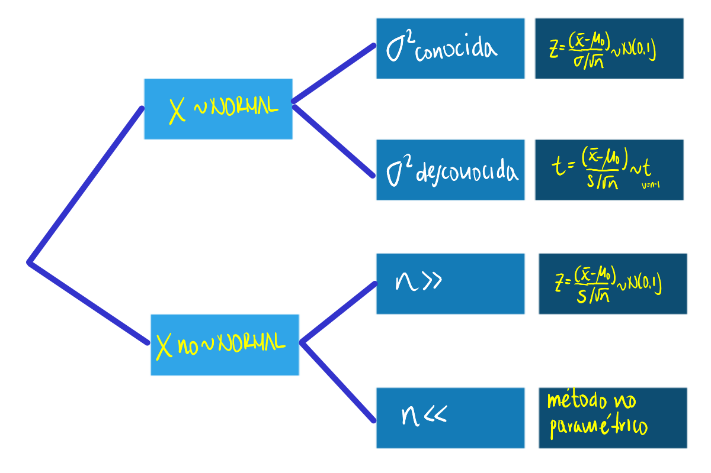
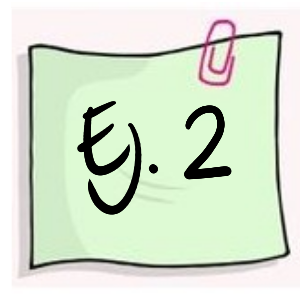

```{r setup, include=FALSE}
knitr::opts_chunk$set(echo = TRUE,comment = NA)
library(ggplot2)
library(ggfortify)
# colores
c0="#0DA5A6" # VERDE CLARO
c1="#E77C00" # NARANJA
c2="#6666FF" # AZUL  
c3="#4CBFBA" # VERDE CLARO  
c4="#E09600" # AMARILLO  
c5="#BC2B6A" # MORADO  
  

```

<span style="color:#E77C00">**En construcción**</span>

# **Guía de aprendizaje 4.3**

<div class="container-wrapper-genially" style="position: relative; min-height: 400px; max-width: 100%;"><video class="loader-genially" autoplay="autoplay" loop="loop" playsinline="playsInline" muted="muted" style="position: absolute;top: 45%;left: 50%;transform: translate(-50%, -50%);width: 80px;height: 80px;margin-bottom: 10%"><source src="https://static.genial.ly/resources/panel-loader-low.mp4" type="video/mp4" />Your browser does not support the video tag.</video><div id="5f1f835fc43a880d757f9161" class="genially-embed" style="margin: 0px auto; position: relative; height: auto; width: 100%;"></div></div><script>(function (d) { var js, id = "genially-embed-js", ref = d.getElementsByTagName("script")[0]; if (d.getElementById(id)) { return; } js = d.createElement("script"); js.id = id; js.async = true; js.src = "https://view.genial.ly/static/embed/embed.js"; ref.parentNode.insertBefore(js, ref); }(document));</script>

<br/><br/>

<br/><br/>

## **1. Introducción**

El origen de los estudios, relacionados con las pruebas de hipótesis estadísticas, se sitúa alrededor de 1738, cuando en un ensayo escrito por Daniel Bernoulli aparece el cálculo una estadística de prueba para ensayar su hipótesis en el campo de la astronomía. Entre 1915 y 1933 se desarrolla esta formulación gracias a los estudios realizados por tres grandes autores: Ronald Fisher, Jerzy Neyman y Egon Pearson. Hoy en día predomina la teoría de Neyman-Pearson (lema de Neyman-Pearson). 

Una hipótesis estadística es una afirmación o conjetura acerca de los parámetros de la distribución de probabilidades de una población. Si la hipótesis estadística especifica completamente la distribución, entonces ella se llama Hipótesis Simple, de otra manera se llama Hipótesis Compuesta.

Las pruebas de hipótesis constituyen una de las principales herramientas que  proporciona la estadística a un profesional de cualquier disciplina para darle un carácter científico a sus afirmaciones y decisiones.

En esta unidad se plantea el siguiente objetivo, el cual podrá lograrse con el desarrollo de los trabajos planteados y documentación proporcionada.


<br/><br/>

## **2. Objetivos de la unidad**

Al finalizar la unidad el estudiante estará en capacidad de IDENTIFICAR, CALCULAR, CONTRASTAR y CONCLUIR sobre una hipótesis estadística que le permita la elección de la prueba más potente para la verificación de una prueba de hipótesis, permitiéndole tomar decisiones informadas.

<br/><br/>

## **3. Duración**

La presente  unidad será desarrollada durante la comprendida entre 25 al 31 de octubre de 2021.   
Ademas del material suministrado  contaran con el acompañamiento del profesor en tres sesiones (Lunes, Miércoles y Viernes) y de manera asincrónica con  foro de actividades académicas. Los entegables para esta unidad podrán enviarse a través de la plataforma Brightspace hasta el  31 de octubre.

Para alcanzar los objetivos planteados se propone realizar las siguientes actividades


<br/><br/>

## **4. Cronograma de trabajo**

<br/><br/>

### **Recursos**: 

[Presentación Pruebas de hipótesis paramétricas](https://drive.google.com/open?id=17JkIdxED-k6f0V5RTFgba8KzEyIbcrs2)

Además de ellos  podrá complementar el tema con los capítulos 6 del libro de Navidi y del capitulo 10 del libro de Walpole  y videos relacionados con el tema :

+ [Capitulo 6 Navidi](https://drive.google.com/open?id=1IbIGZBDT1zx8ErJodoLiEcdS7IRsj3r9) </br>
+ [Capitulo 10 Walpole](https://drive.google.com/open?id=1QcYO59i9GpIV2Q4hlU02OCavdfKUYsNa)</br>
+ [Video Pruebas de hipótesis paramétricas](https://www.youtube.com/watch?v=XoXwb6qYl58)</br>
+ [Video Pruebas de hipótesis no paramétricas](https://www.youtube.com/watch?v=m3YIdS2TVHk)</br>

<br/><br/>


|Actividad      | Descripción                    | 
|:--------------|:-----------------------------  |
| **Actividad1**| A partir del material suministrado, realice un **mapa mental** de los conceptos principales del tema de la Unidad 4.3 y con el construya un archivo pdf para entregarlo a través de  Brightspace |
|Trabajo individual ||
|Fecha | octubre 31 de 2021  |
|Hora  | 23:59 |

<br/><br/>

## **5. Criterios de evaluación**

+ Reconoce los diferentes conceptos asociados con las pruebas de hipótesis 

<br/><br/>

## **6. Entregables** 

<br/><br/>

## **7. Presentaciones**

<br/><br/><br/><br/>

# **Recursos**

<br/><br/>

## **Introducción**


El origen de los estudios, relacionados con las pruebas de hipótesis estadísticas, se sitúa alrededor de 1738, cuando en un ensayo escrito por Daniel Bernoulli(1) aparece el cálculo una estadística de prueba para ensayar su hipótesis en el campo de la astronomía. Entre 1915 y 1933 se desarrolla esta formulación gracias a los estudios realizados por tres grandes autores: Ronald Fisher(2), Jerzy Neyman(3) y Egon Pearson(4). Hoy en día predomina la teoría de Neyman-Pearson (lema de Neyman-Pearson).


Tomada de : https://pixabay.com/es/


Una hipótesis estadística es una afirmación o conjetura acerca de los parámetros de la distribución de probabilidades de una población. Si la hipótesis estadística especifica completamente la distribución, entonces ella se llama **Hipótesis Simple**, de otra manera se llama Hipótesis Compuesta. 

Desde el punto de vista clásico, todas las pruebas de hipótesis trabajan en base a ciertos principios que consideran:

+ Hipótesis nula (**Ho**)
+ Hipótesis alterna (**Ha**)
+ Estadístico de Prueba (**EdeP**)
+ Región de Rechazo (**RdeR**)
+ Regla de Decisión(**RD**)

<br/><br/>

## **Conceptos básicos** 

<br/><br/>

## **Hipótesis Nula (Ho)** 

Es la hipótesis a probar, ésta NO se rechaza si de la muestra no se obtiene suficiente evidencia para rechazarla.

<br/><br/>

## **Hipótesis Alterna (Ha)** 

La hipótesis $Ho$ se contrasta con la hipótesis Ha, y ésta última corresponde a valores alternativos del parámetro planteados en la hipótesis nula. La hipótesis $Ha$ se considera cierta si existe suficiente evidencia para rechazar la hipótesis nula.

<br/><br/>

## **Estadístico de Prueba**  

Es una función de la muestra que contiene información sobre el parámetro de interés, la que nos permite decidir sobre el rechazo de la hipótesis nula, $Ho$ . Es tambien una variable aleatoria que sigue una función de distribución conocida como por ejemplo:

Para una muestra determinada se obtiene un valor del estadístico de prueba, a partir del cálculo y se determina el rechazo o no, de la hipótesis nula.

<br/><br/>

## **Región de Rechazo (RdeR)**  

También llamada región crítica (RC), define los valores del estadístico de prueba para los cuales la información muestral contradice la hipótesis nula. Estos valores nos permitirán adoptar una regla de decisión consistente. Una prueba de una hipótesis estadística es un procedimiento que permite, mediante el contraste entre la información muestral y lo propuesto en una hipótesis, decidir sobre
su rechazo. 

Una prueba de una hipótesis estadística es un procedimiento que permite, mediante el contraste entre la información muestral y lo propuesto en una hipótesis, decidir sobre
su rechazo. 

<br/><br/>

## **Regla de Decisión (RD)**  

De esta manera, como una regla de decisión, si para una muestra particular el estadístico de prueba (valor calculado) cae dentro de la región crítica, rechazaremos la hipótesis nula $H_{o}$ en favor de la hipótesis alternativa $H_{a}$. En cambio, si el valor calculado no cae dentro de la RC, no podremos rechazar la hipótesis nula y por tanto decimos que la información contenida en la muestra no ofrece suficiente evidencia estadística que nos permita rechazar $Ho$, ASUMIMOS que la hipótesis nula es cierta. 

<br/><br/>

## **Errores asociados**

Cuando se decide ya sea en favor o en contra de una determinada prueba de hipótesis, es posible estar en una de las cuatro situaciones descritas en la siguiente tabla:


|                   |  **Estado de la naturaleza**    |                                 |
|:------------------|:--------------------------------|:--------------------------------|
| **Decisión sobre la hipótesis**|                    |                                 |
|Rechazar $Ho$      | **Error tipo I**                | **Decisión correcta**           |
|                   |               |                                 |
|                   | P(Error tipo I) = $\alpha$      | $1-\beta$ : Potencia            |
|No rechazar $Ho$   | **Decisión correcta**           | **Error tipo II**               |
|                   |                                 | P(Eror tipo II) =$\beta$        |
|                   |                                 |               |

Existen dos situaciones en las que se comenten errores después de tomar una decisión:

<br/><br/>

**Error tipo I**: Cuando se rechazamos una hipótesis nula que en realidad es verdadera. Tomando como simil la situación donde un médico desea determinar si un paciente está sano o enfermo ($Ho$: SANO vs $Ha$: ENFERMO), es posible que concluya que el paciente está enfermo (rechace $Ho$) cuando en verdad esta persona esta sana. En términos de probabilidad este error se debe de representar como:
$$P(\text{Rechazar } Ho | Ho \text{ es verdadera})= \alpha$$
Para ilustrar el error tipo I, podeos acudir aun evento ocurrido a una estudiante que despues de realizar una donación de sangre fue requerida por la clinica benefactora, pues el examen que le habian practicado a la sangre donada, presentaba signos de estar infectada por epatitis c. Esto prendió las alarmas en la casa y fue llevada por la familia a que se le realizaran otros examenes para confirmar el diagnostico inicial. Las segundas pruebas evidenciaron que se trataba de un error. Este caso constituye un caso de falso positivo (Se diagnostica como enferan, cuando en verdad esta sana) 


<br/><br/>

**Error Tipo II**: Cuando no se rechaza una hipótesis nula que en realidad es falsa. Utilizando el ejemplo del médico, diríamos que cuando el medico indica que el paciente esta sano, cuando esta realmente enfermo, incurre en un error frecuente cuando algunos pacientes son asintomáticos y aunque tienen la enfermedad, sus exámenes médicos salen negativos. En este caso la probabilidad se representa como:

$$P(\text{No rechazar} Ho | Ho \text{ es falsa}) $$
Para ilustrar el caso del error tipo II, recurrimos a lo acontecido en el Tour de Francia, donde el ciclista estadunidence Lance Armstrong gano esta competencia seis veces de manera consecutiva y aunque fue acusado de dopin, no se le pudo comprobar. Fue solo en el 2012 cuando el mismo admitió haber usado EPO. Podemos decir que durante su vida deportiva los examenes practivados dieron negativos, estando el dopado. Este caso se cataloga como falso negativo. 

<br/><br/>

## **Nivel de significancia ($\alpha$)**  

No es posible minimizar simultáneamente, las probabilidades de los errores tipo I y II, ya que en la medida que uno disminuye el otro aumenta, como se muestra en la figura siguiente, en la que claramente se ve que la reducción del área $\alpha$ (probabilidad de error tipo I), implica el aumento del área $\beta$ (probabilidad de error tipo II).


<br/><br/><br/><br/>

# **Pruebas paramétricas**

Se llaman pruebas de hipótesis metrificaras debido a que para su realización se deben verificar el cumplimiento de supuestos sobre parámetros. 

<br/><br/>

## **Una población**

Los parámetros más importante a los que se les realizan pruebas de hipótesis son : $\mu$, $p$ y $\sigma^{2}$, en el caso de una población :  

<br/><br/>

| parámetro    |  prueba de dos colas    | prueba de cola inferior| prueba de cola superior|
|:-------------|:------------------------|:-----------------------|:-----------------------|
|$\mu$         |$Ho: \mu = \mu_{o}$      |$Ho: \mu \geq \mu_{o}$  |$Ho: \mu \leq \mu_{o}$  |
|              |$Ha: \mu \neq \mu_{o}$   |$Ha: \mu < \mu_{o}$     |$Ha: \mu > \mu_{o}$     |
|$p$           |$Ho: p = p_{o}$          |$Ho: p \geq p_{o}$      |$Ho: p \leq p_{o}$      |
|              |$Ha: p \neq p_{o}$       |$Ha: p < p_{o}$         |$Ha: p > p_{o}$         |
|$\sigma^{2}$  |$Ho: \sigma^{2} = \sigma^{2}_{o}$   |$Ho: \sigma^{2} \geq \sigma^{2}_{o}$ |$Ho: \sigma^{2} \leq \sigma^{2}_{o}$|
|              |$Ha: \sigma^{2} \neq \sigma^{2}_{o}$|$Ha: \sigma^{2} < \sigma^{2}_{o}$   |$Ha: \sigma^{2} > \sigma^{2}u_{o}$  |

<br/><br/>

## **Sobre una media**

Dependiendo de las condiciones podemos optar por tres diferentes EdeP para la realización de la prueba para una media, aunque tenemos una cuarta posibilidad en el caso de realizarla mediante un método no paramétrico:





|    |                                     |
|:--:|:------------------------------------|
|  | Un informe indica que el precio medio del pasaje de avión entre Cali  y San Andrés  es de \$120 mil pesos  y su desviación estándar de \$40 mil pesos. Se toma una muestra que se registra a continuación. ¿Se puede aceptar, con un nivel de significación igual a $\alpha=0.1$, las afirmaciones acerca de la media? |
  
165.1, 91.8, 128.3, 160.3, 103.6, 153.2, 50.7, 150.3, 160.8, 38.1, 98.8, 88.7, 123.1, 106.5, 79.5, 84.1, 216.1, 139.8, 98.4, 127.1, 103.0, 83.7, 158.8, 126.1, 113.4, 61.3, 79.8, 121.8, 89.9, 97.4, 134.0, 141.2, 154.3, 122.4, 107.6, 137.7, 121.0, 187.7, 56.8, 79.5, 183.8, 114.7, 80.2, 97.3, 113.8, 92.4, 123.5, 138.4, 114.7, 48.8, 178.1, 106.0, 103.1, 100.8, 180.7, 113.1, 121.4, 163.0, 51.4, 135.5,104.5, 202.1, 171.0, 100.7, 56.4, 99.7, 93.0, 118.3, 110.4, 136.9, 112.3, 69.8, 138.3, 87.2, 121.8, 118.6, 174.5, 77.7, 158.5, 85.3, 71.4, 63.0, 140.9, 126.9, 194.2, 136.7, 98.8, 222.5, 131.3, 175.0, 127.7, 88.5, 104.5, 144.7, 73.0, 97.2, 131.0, 120.5, 166.6, 96.0 . 

<br/>

**Solución**

Las pruebas a contrastar son:

$Ho: \mu= 120$ <br/>
$Ha: \mu \neq 120$ 

<br/><br/>

Antes de realizar la prueba debemos de determinar si la distribución de la población de precios es normal, para lo cual realizaremos la prueba de normalidad de Shapiro Wilk

$Ho: X \hspace{0.3cm}\sim norm$ <br/>
$Ha: X \hspace{.3cm} no \sim norm$ <br/>


```{r}
precio=c(165.1, 91.8, 128.3, 160.3, 103.6, 153.2, 50.7, 150.3, 160.8, 38.1, 98.8, 88.7, 123.1, 106.5, 79.5, 84.1, 216.1, 139.8, 98.4, 127.1, 103.0, 83.7, 158.8, 126.1, 113.4, 61.3, 79.8, 121.8, 89.9, 97.4, 134.0, 141.2, 154.3, 122.4, 107.6, 137.7, 121.0, 187.7, 56.8, 79.5, 183.8, 114.7, 80.2, 97.3, 113.8, 92.4, 123.5, 138.4, 114.7, 48.8, 178.1, 106.0, 103.1, 100.8,180.7,113.1,121.4,163.0,51.4,135.5,104.5,202.1,171.0,100.7, 56.4, 99.7, 93.0, 118.3, 110.4, 136.9, 112.3, 69.8, 138.3, 87.2, 121.8, 118.6, 174.5, 77.7, 158.5, 85.3, 71.4, 63.0, 140.9, 126.9, 194.2, 136.7, 98.8, 222.5, 131.3, 175.0, 127.7, 88.5, 104.5, 144.7, 73.0, 97.2, 131.0, 120.5, 166.6, 96.0)
```

```{r}
boxplot(precio, horizontal = TRUE, col = c2, xlab="precio ($000)")
```

<br/>

```{r}
shapiro.test(precio)
```

<br/>

De acuerdo con los resultados obtenidos en la prueba de Shapiro podemos suponer y aplicando la regla 3 (que se trata más adelante) podemos suponer que los datos siguen una distribucion aproximadamente normal. Cumplido este supuesto y al no tener conocimiento del valor de la varianza utilizaremos una prueba t para una media


```{r}
t.test(precio,
       alternative = "two.sided", # tipo de prueba
       mu = 120,                  # valor a contrastar
       conf.level = 0.90)         # nivel de confianza
```
<br/>

Para tomar una decisión sobre las hipótesis de acuerdo con los resultados podemos utilizar tres reglas:

<br/><br/>

**Regla 1** : Si el **EdeP** cae en la **RdeR**, entonce se rechaza la $H_{0}$ y se **acepta** $H_{a}$ como verdadera. Si por el contrario el **EdeP** NO cae en la **RdeR**, entonces NO se rechaza $H_{0}$, no existe suficiente evidencia para rechazarla, **asumimos** que $H_{0}$ es verdad.


En este caso es necesario determinar la región de rechazo ($RdeR$) de acuerdo al tipo de hipótesis y a la distribución del estadistico de prueba. En esta caso estamos realizando una prueba de dos colas, para un estadistico de prueba con distribución t-Student con 99 grados de libertad.

<br/><br/>

**Región de Rechazo** 

Para determinar la $RdeR$, a a prtir del nivel de significancia asumido, se buscan los percentiles $t_{0.025; v=59}$ y $t_{0.975;v=59}$ para la distribución t-Student.

```{r}
qt(c(0.025,0.975),99)
```

<br/>

```{r}
p=ggdistribution(dt, seq(-3, +3, 0.1), df = 99, colour = "blue")
p=ggdistribution(dt, seq(-3, qt(0.025,99), 0.1), df = 99, colour = 'blue', fill="red", p=p)   
p=ggdistribution(dt, seq(qt(0.975,99),+3, 0.1), df = 99, colour = 'blue', fill="red", p=p)+ 
      ggtitle("Región de rechazo : (-Inf, -1.984217)  (1.984217, +Inf)")
p
```

<br/>

**Conclusión**: Como el **EdeP** (`t = -0.39343`) NO cae en la **RdeR**, entonces NO rechazamos $Ho$, asuminos $Ho$ es verdadera, es decir $\mu$ de los precios es igual a \120. 


<br/><br/>

**Regla 2**: Si $\alpha <$ **valor-p** entonces rechazamos $H_{0}$, se **acepta** $H_{a}$. Si por el contrario $\alpha >$ valor-p, no rechazamos $H_{0}$, **asumimos** 	que $H_{0}$ es verdad. 

<br/><br/><br/>

## **Valor-p** 

El valor-p corresponde al área delimitada por el $EdeP$ en el sentido que indica la $RdeR$ de la prueba a contrastar. Es decir que corresponde a la probilidad  máxima de cometer error tipo I.

[Gil, Jacky F.; Castañeda, Javier A (2005)](https://www.redalyc.org/pdf/806/80634308.pdf) lo definen como :

*El resultado de la prueba de hipótesis se basa principalmente en el cálculo, en términos de probabilidad, de la fuerza de los hallazgos a favor de la hipótesis nula. Esta probabilidad recibe el nombre de valor-p, y se define como la probabilidad de cometer un falso positivo por efecto del azar, cuando la hipótesis nula es verdadera.*

<br/>

**Conclusión** : Como el valor de $\alpha >$ valor-p  (0.05 > p-value = 0.6949) entonces No se rechaza $Ho$, se **asume** que 	$Ho$ es verdad. El promedio de los precios es igual a \$ 120.  

<br/><br/>

**Regla 3** : El valor-p se interpreta como el error que puedo cometer al rechazar $Ho$, siendo esta verdadera (cometer error tipo I). Si este valor es considerado como pequeño, rechazo $Ho$, se **acepta** $Ha$. Si por el contrario se considera este valor grande, entonce no rechazo $Ho$, asumo que $Ho$ es verdad.

<br/>

**Conclusión** : En este caso valoramos si el valor-p (p-value = 0.6949) es grande o pequeño. En esta caso se puede considerar que su valor es muy grande y por lo tanto no nos atrevemos a rechazar $Ho$, asumimos que $Ho$ es verdadera, es decir que la media de los precios es igual a \$ 120. 

|    |                                     |
|:--:|:------------------------------------|
|  | Al aplicar las últimas dos reglas (2 y 3) no se requiere la construcción de una $RdeR$ para tomar la decisión. Solo con revisar el valor-p entregado por la prueba y aplicar la regla se toma la decisión. En adelante utilizaremos las reglas 2 y 3 dado que al ejecutar las funciones  en R nos sumunistran información sobre valor-p.|

<br/><br/>

|    |                                     |
|:--:|:------------------------------------|
|  | Una operación en una línea de producción debe llenar cajas con detergente hasta un peso promedio de 32 onzas. Periódicamente se selecciona una muestra de cajas llenas, que se pesan para determinar a partir del promedio, si están faltas o sobradas de detergente. Si los datos de la muestra llevan a la conclusión de que les falta o sobra detergente, se debe parar la línea de producción y hacer los ajustes necesarios para que el llenado sea correcto. Con el fin de afianzar los conceptos expuestos, te invito a responder los siguientes interrogantes :|

(a.) Formule la hipótesis nula y alternativa que lleven a decidir si es conveniente parar y ajustar la línea de producción o no. 

(b.) Comente la conclusión a que se llegaría en caso de que no se rechazase  $Ho$ y cuando si ocurriese. 

(c.) Cuándo se comete error tipo I y cuando el tipo II. 

(d.) Bajo condiciones de distribución normal, determine la región de rechazo para una $\alpha= 0.05$ y para $\alpha= 0.08$  

<br/><br/>

## **Sobre una proporción**

En este caso debemos tener en cuenta que la muestra sea mayor a 30 con el fin de tener estimaciones mas robustas para estimar la proporción poblacional.


<br/><br/>

|    |                                     |
|:--:|:------------------------------------|
|  | Una empresa al seleccionar su personal, lo somete a un curso de entrenamiento. Por su experiencia se conoce que el 76% de los aspirantes aprueban el curso. Durante el último proceso, los encargados efectúan cambios al programa de entrenamiento, con el fin de realizar una selección más exigente. Para esta versión se inscriben 40 aspirantes de los cuales lo aprueban el proceso 24. ¿Podría afirmarse que los cambios realizados en el programa de entrenamiento reducen la selección? |

Debemos realizar una prueba de cola inferior debido al sentido que tienen la afirmación que queremos verificar *los cambios realizados en el programa de entrenamiento reducen la selección*. 

Ho: $p \geq 0.76$ <br/>   
Ha :$p < 0.76$   <br/>
<br/><br/>

```{r}
prop.test(24, 40, p = 0.76,
          alternative = "less",
          conf.level = 0.95)
```
<br/><br/>

**Conclusión**

Como el valor-p (p-value = 0.01447) es menor que el nivel de significancia ($\alpha=0.05$), rechazamos la hipótesis nula, aceptamos la hipótesis alterna. Podemos afirmar que $p<0.76$ . Tienen razón al afirmar que los cambios realizados en el proceso de selección provocaron una disminución significativa en la proporción de aprobación.

<br/><br/>


## **Sobre una varianza**

<br/><br/>

|    |                                     |
|:--:|:------------------------------------|
|  | Un fabricante de baterías para celulares afirma que el tiempo de duración de sus baterías se distribuyen aproximadamente normal con una desviación estándar de 9 horas. Un comprador antes de realizar un pedido de este producto solicita al fabricante una muestra de 10 baterías para verificar la información que le esta dando. Con este propósito son enviadas al laboratorio y se obtienen los siguientes datos Es cierta la información suministrada por el fabricante?  | 
|    | 11.1, 15.6, 11.1, 7.5, 7.9, 14.7, 6.3, 8.5, 8.0 , 7.6 |  

<br/>

```{r}
pRdeR=qchisq(c(0.025,0.975),9)
p=ggdistribution(dchisq, seq(0, 30, 0.1), df = 9, colour = 'blue')
p=ggdistribution(dchisq, seq(0, pRdeR[1], 0.1), df = 9, colour = 'blue', fill="blue", p=p)
p=ggdistribution(dchisq, seq(pRdeR[2], 30, 0.1), df = 9, colour = 'blue', fill="blue", p=p)+
       ggtitle("Región de rechazo")
p
pRdeR
```

```{r}
t=c(11.1, 15.6, 11.1, 7.5, 7.9, 14.7, 6.3, 8.5, 8.0 , 7.6)
varx=var(t)
EdeP=(length(t)-1)*varx/81
EdeP
```
<br/><br/>

**Conclusión**

Como el $EdeP$ (1.135074) caen en la $RdeR$, entonces rechazamos la hipótesis nula, aceptamos la hipótesis alterna como verdadera.

Podemos entonce concluir que $\sigma^{2} \neq 81$


<br/><br/><br/>


## **Comparación de dos medias** 

<br/><br/>

### **grupos pareados**

<br/>

|    |                                     |
|:--:|:------------------------------------|
| | El director de un gimnasio requiere determinar si contrata o no a un instructor para su campaña de reducción de peso. Para tomar la decisión decide tomar un grupo de 16 personas que acuden normalmente para darle una oportunidad a un aspirante al cargo. Los siguientes datos corresponden a los resultados obtenidos antes y después de un mes de estar en el programa. Utilice un nivel de significancia $\alpha= 0.10$, para determinar si contrata o no al aspirante.|

|     |     |     |     |     |     |     |     |     |     |     |     |     |     |     |     |     |
|:----|----:|----:|----:|----:|----:|----:|----:|----:|----:|----:|----:|----:|----:|----:|----:|----:|     
|pant |104.5|89   |84.5 |106  |90   |96   |79   |90   |85   |76.5 |91.5 |82.5 |100.5| 89.5|121.5| 72  |
|pdes | 98  |85.5 |85   |103.5|88.5 |95   |79.5 |90   |82   |76   |89.5 |81   | 99.5| 86.5|115.5| 70  |


Ho: $\mu_{ant} \geq \mu_{des}$ <br/>
Ha: $\mu_{ant} < \mu_{des}$ <br/>


```{r}
pant=c(104.5,89,84.5,106,90,96,79,90,85,76.5,91.5,82.5,100.5,89.5,121.5,72)
pdes=c(98,85.5,85,103.5,88.5,95,79.5,90,82,76,89.5,81,99.5,86.5,15.5,70)

t.test(pant, pdes,
       alternative = "less",
       mu = 0, 
       paired = TRUE, 
       conf.level = 0.95)

```


<br/>

**Conclusión**

Como el valor-p ( 0.8889) es mayor que nuestro nivel de significancia ($\alpha= 0.10$), no se rechaza la hipótesis nula, no existe suficiente evidencia en la muestra que permita rechazarla. Se asume que Ho es verdad. Es decir que no hay evidencia que el programa reduzca el peso.


<br/><br/>


<br/><br/><br/>

### **grupos independientes, variables normales, varianzas iguales **

|    |                                     |
|:--:|:------------------------------------|
| | Una empresa desarrolla un curso de entrenamiento para sus empleados, formando dos grupos y aplicando dos metodologías diferentes de entrenamiento con el fin de poder evaluar que método produce los mejores resultados. El primer grupo (g1) esta conformado por 36 empleados y el segundo grupo (g2) por 40 empleados . Se puede afirmar que el método aplicado al segundo grupo produce mejores resultados que el aplicado al primer grupo ? ¿Que supuestos debe tener en cuenta? |
|Grupo 1 | 6.8, 6.1, 5.8, 5.9, 5.8, 6.4, 5.7, 6.0, 5.9, 6.4, 6.0, 5.7, 6.5, 6.5, 6.0, 5.9, 5.7, 5.8, 5.9, 5.8, 6.0, 6.0, 5.8, 5.7, 6.1, 5.9, 5.2, 6.3, 5.4, 6.5, 5.5, 5.9, 7.0, 6.4, 5.1, 6.3 |
|Grupo 2 | 8.8, 8.5, 8.4, 8.5, 7.6, 8.7, 8.0, 7.9, 8.2, 8.0, 7.8, 8.6, 8.5, 7.9, 8.5, 8.3, 8.4, 8.2, 8.3, 7.9, 8.2, 7.7, 7.8, 7.7, 8.1, 8.0, 8.3, 8.2, 8.1, 8.3, 8.1, 8.8, 7.7, 9.1, 7.6, 8.4, 8.2, 8.3, 8.1, 8.7  | 


```{r}
grupo1=c(6.8, 6.1, 5.8, 5.9, 5.8, 6.4, 5.7, 6.0, 5.9, 6.4, 6.0, 5.7, 6.5, 6.5, 6.0, 5.9, 5.7, 5.8, 5.9, 5.8, 6.0, 6.0, 5.8, 5.7, 6.1, 5.9, 5.2, 6.3, 5.4, 6.5, 5.5, 5.9, 7.0, 6.4, 5.1, 6.3)
grupo2=c(8.8, 8.5, 8.4, 8.5, 7.6, 8.7, 8.0, 7.9, 8.2, 8.0, 7.8, 8.6, 8.5, 7.9, 8.5, 8.3, 8.4, 8.2, 8.3, 7.9, 8.2, 7.7, 7.8, 7.7, 8.1, 8.0, 8.3, 8.2, 8.1, 8.3, 8.1, 8.8, 7.7, 9.1, 7.6, 8.4, 8.2, 8.3, 8.1, 8.7)

par(mfrow = c(1, 2))
boxplot(grupo1, las=1, col=c2, ylim=c(5,10)); grid()
boxplot(grupo2, las=1, col=c3, ylim=c(5,10)); grid()
```

Iniciaremos con una prueba de hipótesis para la comparación de varianzas:

Ho:$\sigma^{2}_{1} = \sigma^{2}_{2}$<br/>
Ho:$\sigma^{2}_{1} \neq \sigma^{2}_{2}$<br/>


```{r}
var.test(grupo1,grupo2)
```
<br/><br/>

**Conclusión**

Como el valor-p (0.4282) es mayor al nivel de significancia ($\alpha=0.05$), no rechazamos la hipótesis nula, no existe suficiente evidencia en la muestra que permita rechazarla, asumimos que las varianza son iguales.

<br/><br/>

Ho: $\mu_{1} \geq \mu_{2}$ <br/>
Ha: $\mu_{1} < \mu_{2}$ <br/>

<br/>

```{r}
t.test(grupo1, grupo2,
       alternative ="less",
       mu = 0, 
       paired = FALSE, 
       var.equal = TRUE,
       conf.level = 0.95)
```
<br/><br/>

**Conclusión**

Como el valor-p (2.2e-16) es menor que el nivel de significancia, rechazamos la hipótesis nula, aceptamos como verdadera la hipótesis alterna. La media el primer grupo es significativamente menor que la media obtenida por el segundo grupo. Esto indica que el método aplicado al segundo grupo produce mejores resultados. 

<br/><br/><br/>

### **grupos independientes, variables normales, varianzas diferentes**

|    |                                     |
|:--:|:------------------------------------|
|  |

```{r}

```

<br/><br/><br/><br/>

### **diferencia de proporciones**

|    |                                     |
|:--:|:------------------------------------|
|  |Una encuesta realizada a 100 usuarios de una tarjeta de crédito seleccionados aleatoriamente, 57 dijeron que sabían que empleando su tarjeta podían ganar millas de viajero. Después de una campaña publicitaria para difundir este beneficio, se realizo una encuesta independiente entre 150 usuarios de la tarjeta de crédito y 87 informaron que conocían el beneficio. ¿Se puede concluir que el conocimiento de este beneficio aumento después de la campaña publicitaria? |

<br/><br/>

Ho: $p_{1} \geq p_{2}$ <br/>
Ha: $p_{1} < p_{2}$ <br/>

<br/>

```{r}
prop.test(c(57,87),c(100,150),
          p = NULL,
          alternative = "less",
          conf.level = 0.95)
```
<br/><br/>

**Conclusión**

Como el valor-p ( 0.4896) es mayor al nivel de significancia, no se rechaza la hipótesis nula, no existe suficiente evidencia en la muestra que permita rechazarla, asumimos que Ho es verdad. Por tal motivo no se perciben mejoras el conocimiento de los beneficios que trae el uso de la tarjeta de crédito.  Se recomienda revisar la forma en que se realiza la campaña publicitaria.

<br/><br/><br/><br/>

# **Pruebas no paramétricas**

Hasta el momento nos hemos dedicado a la estadística parametrica, que exige la estimación de parámetros y de la comprobación de supuestos sobre las distribuciones de las variables, como por ejemplo que se distribuyan normal.

Note que la distribución normal esta relacionada con las distribuciones t-student, chi-cuadrado y F entre otras.

### **Cuando utilizar pruebas no parametricas**:

+ Cuando no se cumplen los supuestos como Normalidad
  + Tamaños mínimos de muestra
  + Número igual de elementos  en cada muestra
  + Homogeneidad de varianza, etc

+ Cuando se usan tamaños de muestra pequeños
  + Menores a 30 que no permiten comprobar supuestos sobre la población.

+ Cuando se convierten datos cualitativas (escalas nominales u ordinales ) a información útil para la toma de decisiones (escala de intervalo). Utilizado en estudios mercadeo para medir variables como gustos, satisfacción, nivel de necesidad etc.

### **Ventajas de utilizar pruebas no paramétricas**

+ Son fáciles de usar
+ No se requieren comprobar supuestos
+ Se pueden usar con muestras  pequeñas
+ Se pueden usar con variables  cualitativas

### **Desventajas** 

+ Ignoran información
+ No son tan eficientes como las pruebas parametricas, tienen menor potencia.
+ Llevan a una mayor probabilidad de cometer error tipo II ( no rechazar Ho falsa)


Entre las principales pruebas no paramétricas estan :

+ Prueba Chi-Cuadrado de Independencia
+ Prueba Chi-Cuadrado de Bondad de Ajuste
+ Prueba de Signos 
+ Prueba de Rachas
+ Prueba Wilcoxon
+ Prueba de Mann-Whitney
+ Prueba de Kruskal-Wallis
+ Correlación de Rangos de Sperarman

<br/><br/>

## **de signos**  

|            |                                           |
|:---------- |:----------------------------------------------------------------|
| No. de grupos de datos |		1 o 2                                            |
| Variable dependiente	 | En escala al menos ordinal                          |	
| Objetivo               | Esta prueba puede ser utilizada para determinar si la diferencia entre el numero de veces que los datos caen a un lado de la media verdadera es significativamente diferente al número de veces que cae en el otro lado . Determinar si la diferencia entre el numero de veces en que el valor de una variable es mayor que el de la otra y el numero de veces que es menor es estadísticamente significativa. Versión no paramétrica de la prueba t para una muestra o de la prueba  t para muestras pareadas. Esta prueba se realiza sobre la mediana de los datos $Me$. |

|    |                                     |
|:--:|:------------------------------------|
|  | Carlos y Ángela, Administradoras investigadores de una firma de artículos deportivos tienen la creencia que el deporte afecta la imagen que cada persona tiene de si misma. Para investigar esta posibilidad eligieron a 18 personas de manera aleatoria, para participar en un programa de ejercicios. Antes de empezar el programa las personas respondieron un cuestionario para medir su propia imagen.  Un nivel de 15 puntos en la prueba establece que la persona tiene un concepto indiferente frente a la afirmación, valores menores de 15 que la afecta en forma negativa y valores por encima de 15 que afectan su imagen en forma positiva. Los siguientes son resultados obtenidos : 16, 15, 12, 17, 18, 14, 16, 14, 16,  17, 19, 16,  14, 21, 20, 16, 16, 16  |


```{r}
x=c(16, 15, 12, 17, 18, 14, 16, 14, 16,  17, 19, 16,  14, 21, 20, 16, 16, 16 )
```

**Solución**:

Hipótesis Nula	Ho: Me = 15 
Hipótesis Alterna  Ha: Me 15   ó    Ha : Me > 15 
Estadístico de Prueba : M + : Numero de signos positivos

|    |    |    |    |    |    |    |    |    |    |    |    |    |    |    |    |    |    |
|:--:|:--:|:--:|:--:|:--:|:--:|:--:|:--:|:--:|:--:|:--:|:--:|:--:|:--:|:--:|:--:|:--:|:--:|
|12  |14  |14  |14  |15  |16  |16  |16  |16  |16  |16  |16  |17  | 17 | 18 |19  |20  |21  |
|-   |-   |-   |-   |+   |+   |+   |+   |+   |+   |+   |+   |+   |+   |+   |+   |+   |+   |

M+ = 13
Regla de Decisión  (Distribución Binomial  p=0.5 n= 17)
$P(X\leq 13) =  1-0.9755 =  0.0245$  ( valor-p)

**Conclusión**:

Se rechaza la hipótesis nula, se acepta la hipótesis alterna. Se puede   afirmar que las personas tienen la creencia que el deporte afecta positivamente su imagen.

```{r}

```

<br/><br/>

## **$\chi^{2}$ de bondad de ajuste **

|            |                                                                 |
|:---------- |:----------------------------------------------------------------|
|Tipo de variable|  Cualitativa                                                |
|Número de categorias |$k > 2$ valores                                         |       
|Objetivo	    |Determinar si la diferencia entre las frecuencias de cada uno de los valores de la variable y unas determinadas frecuencias teóricas son estadísticamente significativas.  Utilizada para comprobar el supuesto de normalidad, o de otras distribuciones.                             |
     
<br/><br/>

|    |                                     |
|:--:|:------------------------------------|
|  | El dueño de una panadería tiene la posibilidad de controlar los niveles de inventarios de leche para cuatro marcas diferentes. Con el fin de establecer políticas para la realización de nuevos pedidos requiere saber si la demanda de estas marcas son iguales (distribución uniforme). Con este propósito tomo la información de un dia: |

|Producto | Parmalat | Uno A   | Colanta   | Purace | 
|:--------|:--------:|:-------:|:---------:|:------:|
|ventas   |33        |22       |21         |24      |  


**Solución**:

Ho: Las ventas se distribuyen de manera uniforme (cantidad demandada es igual para todas las marcas)
Ha: Las ventas no tienen una distribución uniforme


```{r}
obs=c(33,22,21,24)
esp=c(0.25,0.25,0.25,0.25)
chisq.test(x=obs,p=esp)
```


<br/><br/>

|    |                                     |
|:--:|:------------------------------------|
|  | Un profesor desea establecer si los resultados obtenidos por sus estudiantes tienen una distribución normal con media 3.5 y desviación estándar 0.7 puntos. Los datos se resumen en la siguiente tabla:  |

```{r}
nf=c(4.1, 2.7, 3.1, 3.2, 3.0, 3.2, 2.0, 2.4, 1.6, 3.2, 3.1, 2.6, 2.0, 2.4, 2.8, 
     3.3, 4.0, 3.4, 3.0, 3.1, 2.7, 2.7, 3.0, 3.8, 3.2, 2.2, 3.5, 3.5, 3.8, 3.5, 
     3.9, 4.2, 4.3, 3.9, 3.2, 3.5, 3.5, 3.7, 4.1, 3.7, 3.5, 3.6, 3.2, 3.1, 3.4, 
     3.0, 3.0, 3.0, 2.7, 1.7, 3.6, 2.1, 2.4, 3.0, 3.1, 2.5, 2.5, 3.6, 2.2, 2.4,
     3.1, 3.3, 2.7, 3.7, 3.0, 2.7, 3.0, 3.2, 3.1, 2.4, 3.0, 2.7, 2.5, 3.0, 3.0, 
     3.0, 3.2, 3.1, 3.8, 4.1, 3.7, 3.5, 3.0, 3.7, 3.7, 4.1, 3.7, 3.9, 3.7, 2.0)

h=hist(nf, las=1, col=c2, main=" ", xlab=" ", ylab=" ")
lim.nf=h$breaks # cortes de los intervalos
obs.nf=h$counts   # valores observados 
mx=mean(nf)     # media
sdx=sd(nf)          # desviación estandar
Fx.nf=pnorm(lim.nf, mx,sdx)   # probabilidades en caso de que Ho sea verdadera
prob.nf=Fx.nf[2:7]-Fx.nf[1:6]
esp.nf=prob.nf+0.002300453     # ajuste para que el sum(esp.nf)=1

chisq.test(x=obs.nf,p=esp.nf)

```


<br/><br/>

## **$\chi^{2}$ de independencia**

<br/><br/>

|    |                                     |
|:--:|:------------------------------------|
|  |Un investigador desea establecer la relación que puede existir entre la calificación obtenida por un producto por parte de sus consumidores y su ubicación de residencia. Con este fin recoge información de 200 de sus clientes: |

|                |Urbano    |Rural   | Total |
|:--------------|----------:|-------:|------:|
|Calificación   |           |        |       |
|Bueno          |20         |11      |31     |
|Regular        |40         | 8      |18     |
|Malo           |15         | 6      |21     |
|Total          |75         |25      |100    |   |

<br/><br/>


```{r}
m=c(20,40,15,11,8,6)
M=as.table(matrix(m,nrow=3))
chisq.test(M)
```

<br/><br/><br/>

### **de Wilcoxon**

|            |                                                                 |
|:---------- |:----------------------------------------------------------------|
No. de grupos|	2                                                              |
Variable dependiente| En escala al menos ordinal                               |	
Objetivo	          | Determinar su la diferencia entre la magnitud de las diferencias positivas entre los valores de las dos variables y la magnitud de las diferencias negativas es estadística mente significativas. Versión no parametrica de la prueba t para muestras pareadas                   |

<br/><br/>

|    |                                     |
|:--:|:------------------------------------|
|  | Los siguiente datos se tomaron de un estudio de comparación de adolescentes sanos (G1) y de adolescentes con bulimia (G2). El primer grupo está conformado por 15 estudiantes y el segundo grupo por 14 estudiantes y corresponden al consumo diario en calorías. Los datos obtenidos son los siguientes:  |

Nota: antes de realizar la comparación de medias, se debe realizar una prueba de bondad de ajuste para establecer si los datos siguen una distribución normal o no. En caso de que los datos no tengan distribución normal, entonces se debe realizar una prueba no paramétrica.


```{r}

```

Conclusión :  Como T obtenido > T critico  ( 35 > 13) no se rechaza Ho, no existe suficiente evidencia  para concluir que existen diferencias entre los ritmos respiratorios de los niños


<br/><br/>

## **U de Mann-Whitney**

|            |                                                                 |
|:---------- |:----------------------------------------------------------------|
|Numero de grupos| 	2                                                          |
|Variable dependiente  |	En escala al menos ordinal	                         |
|Objetivo	 | Determinar si la diferencia entre el numero de veces en que el valor de la variable en un grupo es mayor que el otro y el numero de veces en que es menor es estadísticamente significativa |
|          |Versión no parametrica de la prueba t para muestras independientes |

<br/><br/>

|    |                                     |
|:--:|:------------------------------------|
|  | Los siguientes datos se tomaron de un estudio de comparación de adolescentes sanos (G1)  y adolescentes con bulimia (G2).  El primero esta conformado por 15 estudiantes y el segundo grupo (G2) por 14 estudiantes, corresponden al consumo diario de calorías.
     Los datos obtenidos son los siguientes : |
     
|         |    |    |    |    |    |    |    |    |    |    |    |    |    |    |    |
|:-------:|:--:|:--:|:--:|:--:|:--:|:--:|:--:|:--:|:--:|:--:|:--:|:--:|:--:|:--:|:--:|     
|Grupo 1: |39  |10  |21  |29  |11  |26  |7   |12  |28  |82  |30  |27  |50  |19  |24  | 
|Grupo 2: |68  |32  |58  |16  |23  |53  |55  |32  |61  |29  |50  |64  |67  |37  |    |


Nota: Antes de realizar la comparación de medias se debe realizar una prueba chi-cuadrado de bondad de ajuste para determinar si los datos siguen una distribución normal o no. En caso de que los datos no tengan una distribución aproximadamente normal entonces se debe realizar la prueba de signos.

```{r}

```

Conclusión :
Se rechaza Ho , se acepta Ha. Se puede concluir que las dos poblaciones son diferentes. por lo tanto las medias son diferentes.

Para analizar cual de los grupos presenta un mayor consumo de calorías, se observa  que el Grupo I   tiene suma de rangos de 168  y el Grupo II tiene suma de rangos de 273, lo que indica que los datos del Grupo I tienen valores menores en que los del Grupo II

Por lo tanto los estudiantes sanos presentan consumo de calorías menores que los estudiantes que padecen de bulimia.
	
<br/><br/>

## **Kruskal-Wallis**

|            |                                                                 |
|:---------- |:----------------------------------------------------------------|
Numero de grupos |		k                                                        |
Variable dependiente |	En escala al menos ordinal	                           |
Objetivo	            |Determinar si las diferencias entre las medias de los rangos (asignados a las observaciones ordenadas) en los k grupos son estadísticamente significativas. Versión no parametrica del ANOVA. 

<br/><br/>

|    |                                     |
|:--:|:------------------------------------|
| | Para verificar si la memoria cambia con la edad, una investigadora realiza un estudio en el cual hay tres grupos de personas: G1- 60 años de edad, G2: con 50 años de edad, G3: con 40 años de edad. A cada persona se le presenta una serie de palabras. La serie es presentada dos veces y se cuenta el número de palabras que pueden recordar. |

|         |    |    |    |    |    |    |    |
|:-------:|:--:|:--:|:--:|:--:|:--:|:--:|:--:|
|Grupo 1  |28  |19  |13  |28  |29  |22  |21  | 
|Grupo 2  |26  |20  |11  |14  |22  |21  |    |
|Grupo 3  |37  |28  |26  |35  |31  |    |    |  

Ho : Las poblaciones son idénticas
Ha : Las poblaciones no son idénticas

<br/><br/>

## **Correlación de Spearman**

|    |                                     |
|:--:|:------------------------------------|
|  |Se requiere establecer si existe relación entre el tiempo de estudio dedicado a la preparación de una evaluación y la nota obtenida. Como la nota obtenida representa una variable cualitativa, se debe utilizar una prueba no paramétrica (coeficiente de correlación de Spearman). Los datos obtenidos son los siguientes: |

|       |      |      |      |       |      |      |      |      |      |      |
|:------|-----:|-----:|-----:|------:|-----:|-----:|-----:|-----:|-----:|-----:|
|Tiempo | 21   |18    |15    |17     |18    |25    |18    |4     |6     | 5    |
|Nota   | 4    |4     |4     |3      |3     |5     |3     |1     | 1    | 2    |  |


```{r, message=FALSE, warning=FALSE}
x=c(21,18,15,17,18,25,18,4,6,5)
y=c(4,4,4,3,3,5,3,1,1,2)
cor.test(x,y, method = "spearman",continuity = FALSE,conf.level = 0.95)
```


<br/><br/>

## **de rachas**

|    |                                     |
|:--:|:------------------------------------|
|  |Para verificar si los números aleatórios generados por Excel son de verdad aleatórios se tomó una muestra de ellos mediante la función =aleatorio.entre(), obteniendo como resutado los siguientes números: 0.738, 0.202, 0.357, 0.561, 0.509, 0.146, 0.746, 0.666, 0.133, 0.430, 0.972, 0.999, 0.499, 0.869, 0.821, 0.732, 0.355, 0.189, 0.478, 0.162 .|

Ho : La muestra es aleatoria
Ha: La muestra no es aleatoria


```{r}
library("randtests")
y=rnorm(100,120,20)
runs.test(y)
```


<br/><br/>

## **de normalidad**

Uno de los procedimientos mas utilizados en estadística es la relacionada con la verificación de normalidad de una variable. 

$Ho$: X tiene distribución Normal
$Ha$: X no tiene distribución Normal

Existen muchas pruebas que nos ayudan en este propósito, a continuación relacionamos algunas de ellas 
```{r}
# se genera una variable aleatoria normal
x=rnorm(200,1000,50)
plot(density(x), main=" ", las=1)
```

```{r}
shapiro.test(x)
```

Esta prueba no requiere la instalación de paquetes adicionales, pues está disponible en la configuración básica de R

Como el valor-p es superior al nivel de significancia $\alpha$, no se rechaza $Ho$, se asume que la distribución de la variable es normal.

Otras pruebas de normalidad utilizadas con frecuencia son:


```{r}
# install.packages("normtets")
 library(normtest)

jb.norm.test(x)	 # Test de normalidad de Jarque-Bera
kurtosis.norm.test(x)
skewness.norm.test(x)	
```


```{r}
# install.packages("nortets")
library(nortest)

lillie.test(x) # Kolmogorov-Smirnov
pearson.test(x) # chi-cuadrado de Pearson
```


<br/><br/>


<br/><br/><br/><br/>

# **Resumen**

<br/><br/>

|    |                 |**Estadístico de prueba**                                       |
|:--:|:----------------|:---------------------------------------------------------------|
|    |Una población    |                                                                |
|(1) |                 | $Z_{o} =\dfrac{\bar{X}-\mu_{o}}{\sigma/\sqrt{n}}\sim N(0,1)$   |
|(2) |                 | $Z_{o} =\dfrac{\bar{X}-\mu_{o}}{s/\sqrt{n}} \sim N(0,1)$       |
|(3) |                 | $T_{o} = \dfrac{\bar{X}-\mu_{o}}{s/\sqrt{n}} \sim t_{v=n-1}$   |
|(4) |                 | $X^{2}_{o} = \dfrac{(n-1)S^{2}}{\sigma_{o}^{2}} \sim \chi^{2}_{v=n-1}$ | 
|(5) |                 | $Z_{o} =  \dfrac{X-n \hspace{.1cm} p_{o}}{\sqrt{n \hspace{.1cm }p_{o}}} \sim N(0,1)$ |
|    |                 | $Z_{o} = \dfrac{\widehat{p}-p_{0}}{\sqrt{p_{o}(1-p_{o})/n}} \sim N(0,1)$ |
|    | Dos poblaciones |                                                                 |
|(6) |                 | $T_{o} =  \dfrac{\bar{d}-\Delta_{o}}{s_{d}^{2}} \sim t_{v=n-1}$ |
|    |                 | donde: $\bar{d}=\dfrac{1}{n}\displaystyle\sum_{i=1}^{n}d_{i} \hspace{.2cm}\text{ y } \hspace{.2cm} d_{i} = x_{1}-x_{2}$ |
|(7) |                 | $Z_{o} = \dfrac{(\bar{x}_{1}-\bar{x}_{2})- \Delta_{o}}{\sqrt{\dfrac{\sigma_{1}^{2}}{n_{1}}+\dfrac{\sigma_{2}^{2}}{n_{2}}}} \sim N(0,1)$|
|(8) |                 | $T_{o} = \dfrac{(\bar{x}_{1}-\bar{x}_{2})-\Delta_{o}}{s_{p}\sqrt{\dfrac{1}{n_{1}} + \dfrac{1}{n_{2}}}} \sim t_{v=n_{1}+n_{2}-2}$|
|    |                 | donde: $s^{2}_{p}=\dfrac{(n_{1}-1)s_{1}^{2}+(n_{2}-1)s^{2}_{2}}{n_{1}+n_{2}-2}$ |
|(9) |                 | $T_{o} =  \dfrac{(\bar{x}_{1}-\bar{x}_{2}-\Delta_{o}}{\sqrt{\dfrac{s^{2}_{1}}{n_{1}}+\dfrac{s^{2}_{2}}{n_{2}}}} \sim t_{v^{*}}$ |
|    |                 | donde: $v^{*}= \dfrac{(s^{2}_{1}/n_{1} + s^{2}_{2}/n_{2})^{2}}{\dfrac{(s^{2}_{1}/n_{1})^{2}}{n_{1}-1}+\dfrac{(s^{2}_{2}/n_{2})^{2}}{n_{2}-1}}$|
|(10)|                 | $Z_{o} =  \dfrac{(\widehat{p_{1}}-\widehat{p_{2}})-\Delta_{o}}{\sqrt{\widehat{p}\widehat{q}(1/n_{1}+1/n_{2})}}$ |
|    |                 | donde: $\widehat{p}=\dfrac{x_{1}+x_{2}}{n_{1}+n_{2}}$ \hspace{.2cm} $\widehat{q}=1-\widehat{p}$, |
|    |                 | $\widehat{p_{1}}=\dfrac{x_{1}}{n_{1}} \hspace{.1cm} \text{ y } \hspace{.1cm}\widehat{p_{2}}=\dfrac{x_{2}}{n_{2}}$ |
|(11)|                 | $F =  \dfrac{s_{1}^{2}}{s_{2}^{2}} \sim F_{v_{1}:n_{1}-1; v_{2}: n_{2}-1}$ |
|    |                 | |

<br/><br/>

|                 |  **Reglas de decisión**                                        |
|:----------------|:---------------------------------------------------------------|
| Regla1:         | Si el EdeP cae en la RdeR, entonce se rechaza la $H_{0}$ y se **acepta** $H_{a}$ como verdadera. Si por el contrario el EdeP NO cae en la RdeR, entonces NO se rechaza $H_{0}$, no existe suficiente evidencia para rechazarla, **asumimos** que $H_{0}$ es verdad.|
| Regla2:         | Si $\alpha <$ valor-p entonces rechazamos $H_{0}$, se **acepta** $H_{a}$. Si por el contrario $\alpha >$ valor-p, no rechazamos $H_{0}$, **asumimos** 	que $H_{0}$ es verdad. |
| Regla3:         | El valor-p se interpreta como el error que puedo cometer al rechazar $H_{0}$, siendo esta verdadera (cometer error tipo I). Si este valor es considerado como pequeño, rechazo $H_{0}$, se **acepta** $H_{a}$. Si por el contrario se considera este valor grande, entonce no rechazo $H_{0}$, asumo que $H_{0}$ es verdad.|


```{r}

```

<br/><br/>

# **Código R**
|                   |                                                          |
|:------------------|:---------------------------------------------------------|
 |                                                          |
|                   |**Pruebas paramétricas**                                  |
|Entrada de datos   |                                                          |
|                   |`x1=c(7, 13, 6, 5, 5, 10, 8, 6, 7)`                       |
|                   |`x2=c(3,7,2,3,6,2,1,0,2)`                                 |  
|Una población      |                                                          |
||`z.test(datos,mu=10,stdev=4, conf.level=98)`                                 |
||`t.test(datos, mu=10,conf.level=0.98)`                                       |
||`t.test(datos, mu=10,conf.level=0.98,alternative="greater")`                 |
||`t.test(datos, mu=10,conf.level=0.98,alternative="less)`                     |
||`prop.test(x=22,n=100, p=0.20, conf.level=0.98)`                             |
|Dos poblaciones    |                                                          |
|                   |`t.test(x1,x2,  paired=TRUE)`                             |    
|                   |`t.test(x1,x2,  paired=FALSE, var.equal=TRUE, conf.level=0-98)` |
|                   |`t.test(x1,x2,  paired=FALSE, var.equal=FALSE, conf.level=0.98)`|
|                   |`var.test(x,y)`                                           |
|                   |`prop.test(c(x1,x2), c(n1,n2))`                           |
|                   |**Pruebas no paramétricas**                               |
|                   | `chisq.test(x=obs,p=esp)`                                |
| paquete: MASS     | `library(MASS)`                                          |
|                   |`chisq.test(M)`  # M: matriz                              |
|paquete: BSDA      |`library(BSDA)`                                           |
|                   |`SIGN.test(x,md=15,alternative = "greater")`              |
|                   |`wilcox.test(g1,g2,paired = FALSE,alternative = "less")`  |
|                   |**Pruebas de normalidad**                                 |
|                   |`shapiro.test(x)`                                         |
| paquete:normtest  |` library(normtest)`                                      |
|                   |`ajb.norm.test(x)`                                        |
|                   |`frosini.norm.test(x)`                                    |
|                   |`geary.norm.test(x)`                                      |
|                   |`hegazy1.norm.test(x)	`                                  |
|                   |`hegazy2.norm.test(x)`                                    |
|                   |`jb.norm.test(x)	`                                        |
|                   |`kurtosis.norm.test(x)`                                   |
|                   |`skewness.norm.test(x)	`                                  |
|                   |`spiegelhalter.norm.test(x)`                              |
|                   |`wb.norm.test(x)	`                                        |
|paquete: nortest   |`library(nortest)`                                        |
|                   |`ad.test(x)`                                              |
|                   |`cvm.test(x)`                                             |
|                   |`lillie.test(x)`                                          |
|                   |`pearson.test(x)`                                         |
|                   |`sf.test(x)`                                              |

<br/><br/>


|Tipos de pruebas   |                                                                 |
|:------------------|:----------------------------------------------------------------|
|Dos colas          |$H_{0}: \theta = \theta_{o}$ vs $H_{0}: \theta \neq \theta_{o}$  |
|Cola superior      |$H_{0}: \theta \leq \theta_{o}$ vs $H_{0}: \theta > \theta_{o}$  |
|Cola inferior      |$H_{0}: \theta \geq \theta_{o}$ vs $H_{0}: \theta < \theta_{o}$  |


