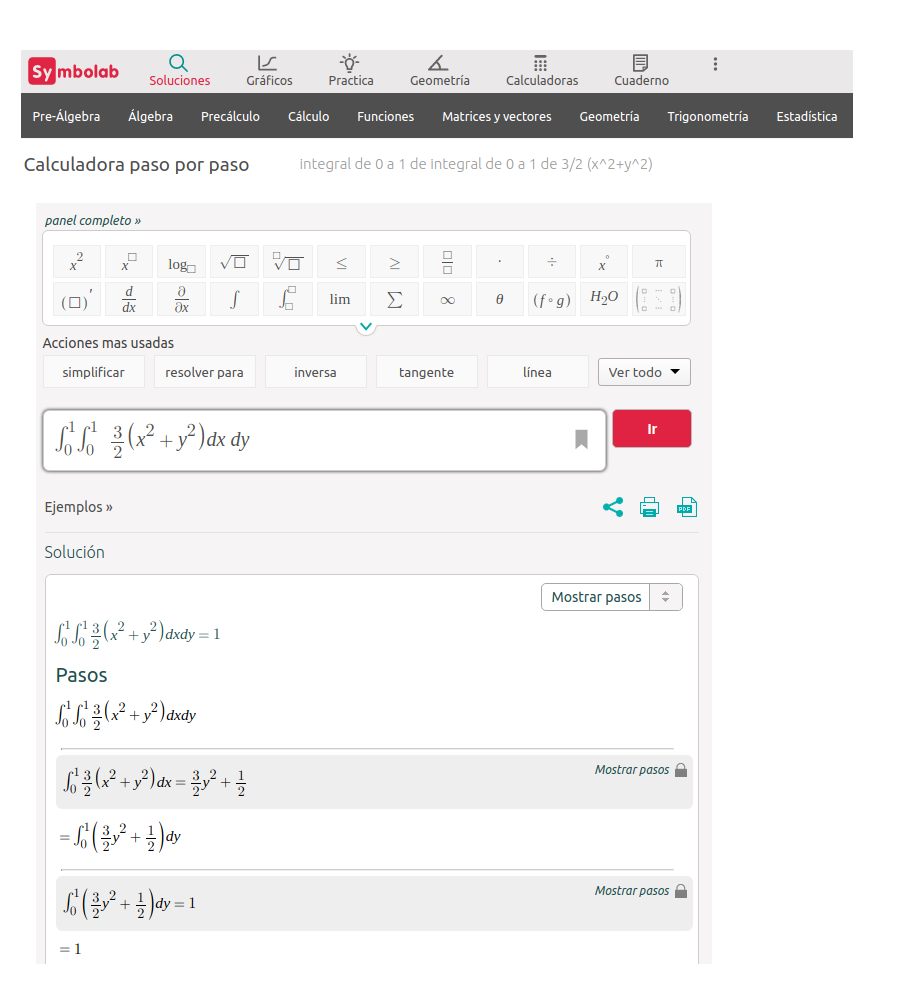

```{r setup, include=FALSE}
knitr::opts_chunk$set(echo = TRUE)
library(tidyverse)


```


# **Caso Discreto-Discreto**

<br/><br/>

### **Ejemplo 1**

El número de veces que falla una máquina $X$ con $R_{X}=\{1,2,3\}$ durante un dia y el número de veces en que el operario requiere llamar al técnico para su arreglo esta dado por $Y$ con $R_{Y}=\{1,2,3\}$. Su función de probabilidad conjunta para $X,Y$ está dada por :

|    |        |       |  $x$ |      |
|:--:|:------:|:-----:|:----:|:----:|
|    |$f(x,y)$| 1     |  2   |  3   |
|$y$ |  1     | 0.05  | 0.05 | 0.10 |
|    |  2     | 0.050 | 0.10 | 0.35 |
|    |  3     | 0     | 0.20 | 0.10 |


Función de distribución de probabilidad conjunta

```{r}
fxy=matrix(c(0.05,0.05,0,0.05,0.10,0.20,0.10,0.35,0.10), ncol=3 )
fxy
sum(fxy)
```

<br/><br/>

### **Funciones distribución marginales**

```{r}
fxy=matrix(c(0.05,0.05,0,0.05,0.10,0.20,0.10,0.35,0.10), ncol=3 )
fxy=addmargins(fxy,c(1,2))
colnames(fxy)=c("1","2","3","h(y)")
rownames(fxy)=c("1","2","3","g(x)")
fxy
```


### **Representación gráfica de $f(x,y)$**

Para construir la gráfica de X y Y debemos crear los vectores

|      |      |      |      |      |      |      |      |      |      |
|:----:|:----:|:----:|:----:|:----:|:----:|:----:|:----:|:----:|:----:|
|x     | 0    |     0|     0|     1|     1|     1|     2|     2|     2|
|y     | 0    |     1|     2|     0|     1|     2|     0|     1|     2|
|fxy   |  0.15|  0.05|     0|     0|  0.20|  0.35|     0|  0.10|  0.15|


```{r}
x=0:2
y=0:2
x=rep(x,each=3)
y=rep(y,3)
fxy=c(0.15,0.05,0, 0,0.20,0.35, 0,0.10,0.15)

plot3D::scatter3D(x, y, fxy,
          colvar = NULL, 
          col = "blue",
          pch = 19, cex = 1.5,
          phi = 20, theta = 60,  
          zlab="f(xy)", xlab="x", ylab="y",
          bty = "b2",
          col.panel ="steelblue",
          col.grid = "darkblue",
          add_lines=TRUE)


```

### **Funciones de distribución marginal**

```{r}
fxy=matrix(c(0.05,0.05,0,0.05,0.10,0.20,0.10,0.35,0.10), ncol=3 )
fxy=addmargins(fxy,c(1,2))
colnames(fxy)=c("1","2","3","h(y)")
rownames(fxy)=c("1","2","3","g(x)")
fxy
```


### **Covarianza y Correlación**

```{r, warning=FALSE, message=FALSE}
x=c(0,1,2) 
y=c(0,1,2)
fxy=matrix(c(0.15,0.05,0,0,0.20,0.35,0,0.10,0.15), ncol=3 )

fxy=addmargins(fxy,c(1,2))
colnames(fxy)=c("1","2","3","h(y)")
rownames(fxy)=c("1","2","3","g(x)")

fxy=as.table(fxy)
gx=fxy[,4]
hy=fxy[4,]


Ex=sum(x*gx)
Ex2=sum(x^2*gx)
Vx=Ex2-(Ex)^2

Ey=sum(y*hy)
Ey2=sum(y^2*hy)
Vy=Ey2-(Ey)^2

x=rep(x,each=3)
y=rep(y,3)
fxy=c(0.15,0.05,0,0,0.20,0.35,0,0.10,0.15)
Exy=sum(x*y*fxy)
CovXY=Exy-Ex*Ey
Rho=CovXY/sqrt(Vx*Vy)


```

```{r, warning=FALSE, message=FALSE, echo=FALSE}

cat("E(X) = ", Ex, "\n")
cat("E(X2) = ", Ex2, "\n")
cat("V(X) = ", Vx, "\n")
cat("E(Y) = ", Ey, "\n")
cat("E(Y2) = ", Ey2, "\n")
cat("V(Y) = ", Vy, "\n")

cat("E(XY) = ", Exy, "\n")
cat("Cov(XY) = ", CovXY, "\n")
cat("Rho = ", Rho, "\n")
```


<br/><br/><br/>

# **Caso Continuo-continuo**

<br/><br/>

**Ejemplo 2**


Una empresa prestadora se servicios a domicilio tienen dos lineas telefónicas para que los clientes puedan realizar sus pedidos. Sea X y Y la proporción del tiempo en que las lineas se encuentran ocupadas. La función de densidad conjunta que modela $f(x,y)$ esta dada por:

$$f(x,y) = \left \{ \begin{matrix} \dfrac{3}{2}(x^{2}+y^{2}) & \mbox{ } 0 \leq x \leq 1\\ 
                                     & \mbox{ } 0 \leq y \leq 1 \\
                                     &\\
                                   0 & \mbox{ en otro caso }\end{matrix}\right.  $$
<br/><br/>

Inicialmente se verifica la condición :

 $\displaystyle\int_{0}^{1} \displaystyle\int_{0}^{1} \dfrac{3}{2}(x^{2}+y^{2}) \:dx \:dy  = 1$
 


```{r}
library(cubature) 
fxy <- function(x) { 3/2*(x[1]^2 + x[2]^2)} # 
adaptIntegrate(fxy, lowerLimit = c(0, 0), upperLimit = c(1, 1))
```

basado en : http://homepages.math.uic.edu/~jyang06/stat401/handouts/handout8.pdf


<br/><br/>

Ahora su representación gráfica

```{r}
x=seq(0,1,length=20)
y=seq(0,1,length=20)
fxy=function(x,y){3/2*(x^2+y^2)}
z=outer(x, y, fxy)
persp(x,y,z,theta = 30, phi = 30,expand=0.5, col = "orange",
      xlab = "x", ylab ="y", zlab = "f(x,y)",
      main=" ", col.main="blue")

```

Nota: basada en : https://estadistica-dma.ulpgc.es/cursoR4ULPGC/9e-grafPersp.html

<br/><br/>

### **Otras alternativas**

<br/>


<br/>


